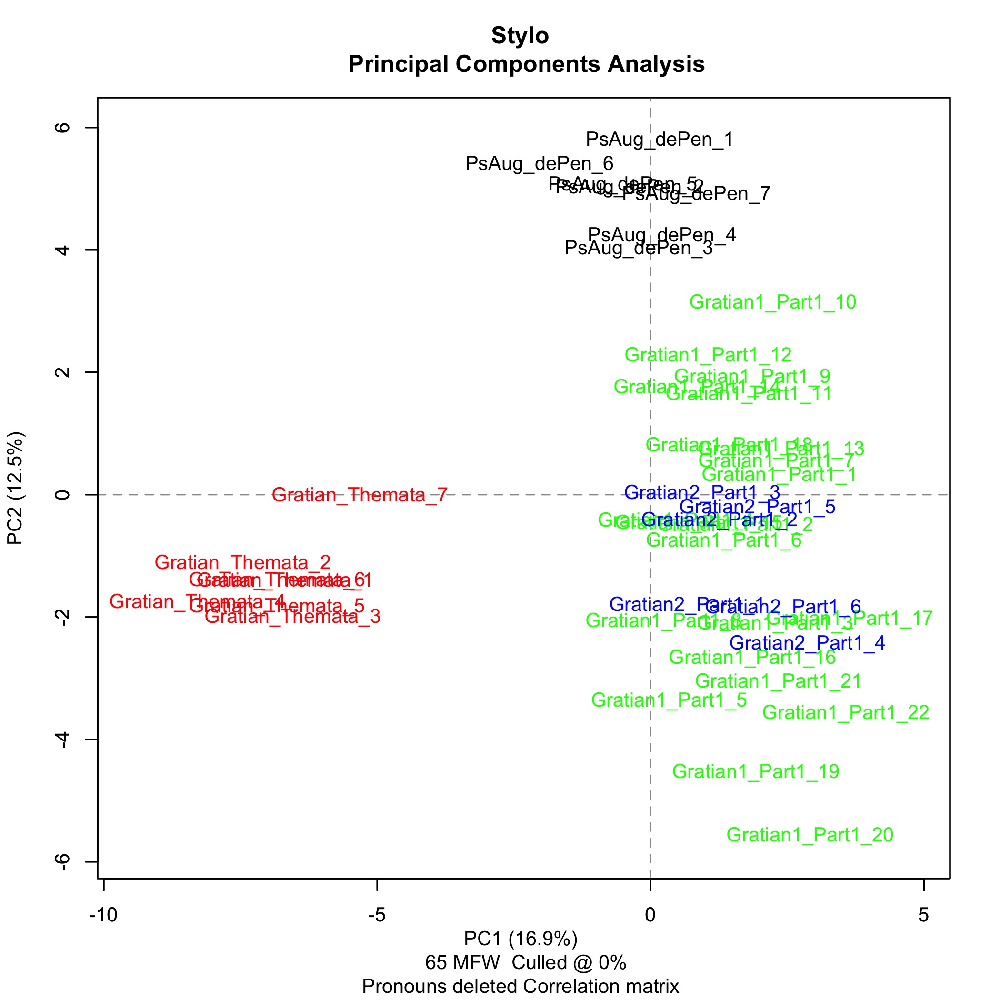

## Origin of the Project

The most significant finding of my dissertation is that
the author who wrote the thirty-six case statements introducing the
hypothetical cases that make up the second part of Gratian's
*Decretum* is very unlikely to have been the same person as the
author who wrote the *dicta* in the first recension of the *Decretum*.
The statistical method used to make this determination takes the
frequencies of common function words like prepositions and conjunctions
in a sample of text as the basis for assigning probable authorship,
and will be explained in considerable detail in Chapter 4.

I did not start work on this project thinking that the authorship
of the case statements was in any way a research problem. I assumed
that by definition the author of the case statements was one and
the same person as the author of the first-recension *dicta*. It
is therefore worth explaining in some detail how I came to write a
PhD dissertation about a completely unexpected finding that I was
not looking for in the first place.

I worked in information technology as a system administrator and
manager for most of the twenty-three years after I graduated from
UC San Diego in 1984 with an undergraduate degree in History.
Stanley Chodorow had been the advisor for my undergraduate senior
thesis on the role of the cardinals in the thirteenth and fourteenth
centuries, and I knew that he had written a book about Gratian's
*Decretum*.[@chodorow_ecclesiology_1972] I was therefore aware of
Gratian in a general sort of way, although the only use I made of
the *Decretum* in connection with my thesis was to consult Emil
Friedberg's 1879 edition for the Latin text of Nicholas II's 1059
decree on papal elections (D.23 c.1).

Chodorow urged me to use computer-aided typesetting for the
project, and in this way I acquired a then-unusual skill that led
directly to my IT career. In the mid to late 80s I went on to take
most of the required courses for the undergraduate Computer Science
major at UC San Diego (e.g., Data Structures, Compiler Construction,
Operating Systems) although I did not enroll in a degree program.
During my professional career, I was never primarily a programmer,
but from time to time my job responsibilities did include programming
projects in C and Perl, and ultimately Java servlet-based web
applications.

In October 2003, quite by accident, I became aware of Anders Winroth's
*The Making of Gratian's Decretum*.[@winroth_making_2000] I had
done a Google search for Chodorow, looking for his contact information,
and found his review of Winroth's book in *The English Historical
Review*.[@chodorow_review_2003] From the review I learned that
Winroth had identified five twelfth-century manuscripts as a first,
and more coherent, recension of the *Decretum*. In addition, I
became aware of Winroth's claim that two different authors, Gratian
1 and Gratian 2, were responsible for the first and second recensions.
It was clear to me that there had been a revolution in Gratian
studies. My wife Carol gave me the book for Christmas 2003 with the
inscription "I'm sure you'll gulp this one down within 24 hours."
I did. Some years later, Anders thanked her for buying a copy: "I'm
sure I did something very useful with the money".

From September 2007 to May 2009, I was a student in the History of
Christianity MAR program at Yale Divinity School. Among the courses
I took was a one on Latin Paleography that Richard and Mary Rouse
of UCLA taught in the Beinecke Rare Book and Manuscript Library in
Spring 2009. Although I had a general interest in applying my
computing background to my academic work, I do not think I had heard
of Digital Humanities as an academic discipline before I graduated
from YDS, at least not by that name.

In October 2009, David Ganz (then of King's College, London) suggested
that I compare two texts of the *Capitulare Carisiacense* (873) in
Beinecke MS 413. At first, I did not think of this as a digital
project; it was simply a transcription exercise of the kind the
Rouses had taught me to do. But within a month, I had created a
custom text-encoding format for my transcriptions and written a
prototype textual difference visualizer in Perl to compare them.
A January 2010 meeting with Barbara Shailor on the Beinecke 413
project was the occasion for the first use I can find in my own
notes of the term *Digital Humanities*.

In August 2010, I started the PhD program in the Medieval and
Byzantine Studies Program at The Catholic University of America in
Washington, DC. I went to CUA specifically to work with Ken Pennington
on Gratian's *Decretum*. Even before moving from New Haven to
Washington, I had participated in Winroth's class on law in Medieval
Europe at Yale, and once at CUA, I took Pennington's classes on
canon and Roman law, and (twice) his sources seminar. From 2010
through 2012, then, I thoroughly immersed myself in the scholarly
debates surrounding Gratian and the *Decretum* with considerable
intellectual interest but also a certain level of personal discomfort
at being unable to reconcile the contradictory positions staked out
by Pennington and Winroth.

Pennington and his students Melodie Harris Eichbauer and Atria A.
Larson argued that the Sankt Gallen 673 (Sg) manuscript represented,
at however many removes, an earlier version of the *Decretum* than
Winroth's first recension; that a single author, Gratian, compiled
and wrote both the first and second recensions of the *Decretum*;
and for an early date, in the 1130s, for the first recension. Winroth
and his student John Wei argued that Sg was a relatively uninteresting
abbreviation of a first recension manuscript with some second
recension interpolations; that two different authors, Gratian 1 and
Gratian 2, compiled and wrote the first and second recensions; and
for a late date, around 1140, for the first recension.[^eichbauer]

In a January 2011 advising conversation, Jennifer Davis suggested
that, given my professional background, it would be strategically
advantageous for the purpose of whatever academic career I might
hope to have to position myself as a Digital Humanities specialist.
In the summer of 2010, I had taught myself to write Python web
applications on the Google App Engine platform (learning Python was
incidental to learning GAE, which is what I was really interested
in), so in the first half of 2011, I developed Ingobert, a Python/GAE
web application to visualize textual differences in Beinecke 413,
in connection with an independent study project supervised by
Pennington and Davis.[^ingobert] Largely on the strength of the Ingobert
project, Neil Fraistat of the University of Maryland hired me as a
graduate assistant at the Maryland Institute for Technology in the
Humanities (MITH) to work as a Scala/Lift programmer on the Active
OCR project.[^4]

I finished my PhD comprehensive examinations in October 2012 and
advanced to candidacy in January 2013. I had not yet made a definite
decision to pursue a dissertation project with a Digital Humanities
component, but audited Matt Kirschenbaum's graduate Introduction
to Digital Humanities course at the University of Maryland in Spring
2013, with the idea that an overview of the field might suggest a
potential project.

My first step was to obtain an electronic version of the *Decretum*
text. In the mid- to late-1980s, Timothy Reuter and Gabriel Silagi
edited the *Wortkonkordanz zum Decretum Gratiani*, a computer-generated
concordance in the tradition of Father Roberto Busa's *Index
Thomisticus*, for the Monumenta Germaniae Historica (MGH) in
Munich.[@reuter_wortkonkordanz_1990] As part of the project, the
MGH undertook to scan, correct, and encode in the now-obsolete and
non-tree-structured Oxford Concordance Program (OCP) format the
1879 Friedberg edition of the *Decretum*. In spring 2013, Winroth
and Lou Burnard of the Oxford Text Archive (OTA) each provided me
with a copy of the Reuter and Silagi e-text. The two copies, however,
differed in many places, and I had to go through a process similar
to preparing a critical edition to restore the e-text to a state
as close as possible to what I though the editors intended. I then
began to experiment with writing Python programs that used regular
expressions to extract textual features of interest. The fact that
the OCP e-text format is not tree-structured the way XML is---textual
features have start tags but not end tags---makes it extremely
difficult to parse, so this was a slow process.

My initial focus in the first half of 2013 was on the use of David
Mimno's MALLET (MAchine Learning for LanguagE Toolkit) to topic
model *dicta* and canon texts from the first and second recensions
of Gratian's *Decretum* as a way to identify new topics added in
the second recension. The model was Pennington's observation that
most passages in the *Decretum* dealing with the legal status of
Jews, particularly those dealing with forced conversion, were
introduced only in the second recension.[^6] My goal was to see
whether MALLET could surface more such topics, by topic
modeling the first and second parts of the vulgate *Decretum*, topic
modeling the first recension, and seeing what topics were left when
the first recension topics were subtracted from the vulgate topics.
While simple in concept, this proved prohibitively difficult in
practice.[^7]

In July 2013, I was working at MITH, and following the DH 2013
conference at University of Nebraska-Lincoln
out of general interest rather than any sense
that it might be relevant to my decision regarding a dissertation
topic. One presentation in particular caught my attention: "Stylometry
and the Complex Authorship in Hildegard of Bingen’s Oeuvre" by Mike
Kestemont, Sara Moens, and Jeroen Deploige. Their work was later
published as a paper, but the conference website had an unusually
detailed abstract, and a video was made available as part of the
presentation.[^8]

The applicability of Kestemont's methodology to the intractable
problem of the authorship of the *Decretum* was immediately obvious
to me; it seemed to finally offer a way past endless debates based
on indirect evidence about whether there had been one Gratian or
two. I would extract the first- and second-recension *dicta*, those
parts of the text of the *Decretum* thought to have actually been
written (depending on whether one accepted Pennington's or Winroth's
argument) by Gratian or by Gratian 1 and Gratian 2,[^9] and run the
same kind of analysis that Kestemont had run for Hildegard of Bingen
and Guibert of Gembloux. I expected the results to provide an
unambiguous answer, sufficiently compelling to both Pennington and
Winroth to settle the debate either way, as to whether there had
been one or two authors.

In August and September of 2013, I replicated the working software environment
with which Kestemont had obtained his Hildegard results, installing
R, R Studio, and the stylometry for R package that Kestemont had
written with Maciej Eder and Jan Rybicki.[@stylo] I started extracting text
samples from Reuter and Silagi’s e-text of the Friedberg edition
of the *Decretum*. The fact that the e-text was encoded in the
obsolete (and not tree-structured) Oxford Concordance Program format
made this an extremely difficult and time-consuming process. In
fact, the only parts of the e-text that could both be easily
extracted using Python regular expressions and, once extracted,
quickly verified to be correct were the case statements. This made
the case statements an obvious first choice for a test sample,
although my ultimate goal was to compare only the first- and
second-recension *dicta*.

Next, I needed a distraction text presumably not written by Gratian.
For that purpose, I chose extracts from the pseudo-Augustinian *De
vera et falsa penitentia* quoted extensively by Gratian in his *de
Penitentia*, a treatise on penance inserted at C.33 q.3 in the
second part of the *Decretum*.
In the interest of getting fast results, I used the ```vi``` text
editor to hand-edit the excepts directly out of the Reuter and
Silagi e-text. With the case statements and the *De vera* extracts
in hand, I now had enough in the way of text samples to verify that
I had installed and configured R, R Studio, and stylo correctly. I
have to admit that I was somewhat disappointed that the results of
the first test were exactly what I should have expected: the case
statements and the excerpts from *De vera* formed distinct clusters
**[reproduce!]**, indicating that they were written by two different
individual authors. As *De vera* is an anonymous work that predated
the *Decretum* by no more than a decade or so, and because Gratian
was one of the earliest authors to quote extensively from it (although
not the earliest, as I mistakenly believed at the time), I thought
it would make an excellent dissertation topic if it could be shown that
Gratian had forged *De vera*.

Having confirmed that my test environment could correctly distinguish
the authorship of the case statements from that of the pseudo-Augustinian
excerpts from *De vera*, I moved on to the much slower process of
hand-editing text samples of the first- and second-recension *dicta*
from the Reuter and Silagi e-text.[^10]

By the second week of September 2013, I had edited the first- and
second-recension *dicta* for the first part of the *Decretum*
(D.1-101).

When I ran stylo on the sample, however, I got neither of the two
results I had expected: either a tight clustering of all *dicta*
(first- and second-recension as well as case statements) indicating
a single author and confirming all of Pennington’s arguments for
the unity of Gratian, or alternatively, a bimodal distribution
confirming Winroth’s arguments for Gratian 1 and Gratian 2. Instead,
these preliminary results seemed to suggest that the first recension
*dicta* had many authors, perhaps one of whom went on to write the
second recension *dicta*. **[See Figure 1.]**



When I present my work at conferences, I adopt Newton’s position
that "I frame no hypotheses", and do not offer a story that might
explain these results. Instead, I wait for someone to ask, and
someone always does, before offering a likely story (“conjectural
novella” to use Pennington’s description).

The JPEG image that stylo output struck me immediately and with
considerable force as an indirect projection of the hidden inner
structure of the *Decretum*, and as telling a very particular story
about the earliest origins of Gratian’s text, and by extension,
about the moment that the school started to evolve into the faculty
(leading to the university as we recognize it).

This suggested that the eponymous Gratian who gave his name to the
entire project may not have been directly responsible for more than
3,600 out of the 435,000 words of the *Decretum* as we know it.
Instead, using the case statements as a stepping-off point (syllabus),
he expounded the canons to his students from a 3,600-word list of
questions and his material sources, in the form of a small pile of
books on a table.

## Outline of Chapters

(0) Introduction, (1) Background, (2) The *Decretum*, (3) Gratian,\
(4) Stylometry, (5) Next steps.

## Note on Translations

I have, wherever possible, supplied for each Latin passage quoted
the corresponding passage from a published English translation.[^11]
In cases where no such translation was available, or I considered
the available translation seriously misleading, I have supplied my
own translation, indicated with the notation (trans. PLE).
**Acknowledge Atria A. Larson.**

[^eichbauer]: See @eichbauer_gratians_2013 for a good recent overview
of these debates.

[^ingobert]: Ingobert was named after the Carolingian scribe of the
Bible of San Paolo fuori le Mura. Some scholars have suggested that
he was responsible for Beinecke 413; the script is certainly similar
to his. The Ingobert project is still under active development: see
my GitHub [Ingobert2](https://github.com/decretist/Ingobert2)
repository for the source code of the current version of the Python
web application ported to the Django platform.

[^4]: NEH ODH Grant number:
[HD-51568-12](https://securegrants.neh.gov/publicquery/main.aspx?f=1&gn=HD-51568-12)

[^6]: @pennington_laws_2013; and @pennington_gratian_2014.

[^7]: This project was attractive to Pennington because although
the results would be obtained computationally, they could be verified
by someone doing a close reading of the text of the *Decretum*.
There were three insurmountable barriers to carrying out the project
as originally conceived: the time required to prepare the necessary
text samples; the difficulty in determining the number of topics
to look for (a necessary precondition for unsupervised topic modeling);
and the fact that there was no obvious way to subtract topics.

    While a stylometric analysis for authorship attribution requires
    only the *dicta* (*ante*, *post* and *init.*) thought to have
    been written by Gratian himself, a topic can be present in any
    text in the *Decretum*, inscriptions and canons as well as
    rubrics and *dicta*. It took six weeks---twice---just to prepare
    a proxy text for the first-recension *dicta*. (In late Summer
    2015 I discovered quality anomalies in the *dicta* samples I
    had hand-edited in Fall 2013, so in Fall 2015, I regenerated
    the *dicta* samples from scratch by rigorously cross-checking
    all of the hand-edited *dicta* against a data set automatically
    generated using Python regular expressions until no differences
    remained between the two sets of samples.) There is about four
    times as much text by word count in the canons as there is in
    the *dicta*, so I estimated that it would take just under six
    person-months to prepare a proxy text for the first-recension canons.

    The Latent Dirichlet Allocation (LDA) algorithm that MALLET
    uses to generate topic models has to be provided with an exact
    number of topics to look for. In February 2014, I carried out
    a preliminary experiment to obtain a rough estimate of the
    number of topics in the *Decretum*, inspired by the metaphor
    of focusing a telescope. I took the second-recension *dicta* and
    repeatedly ran MALLET on them, looking for values of the number
    of topics at which Pennington's topic on the legal status of
    Jews came into focus. **Pennington's topic started appearing
    somewhere over 200 topics.**

[^8]: [@kestemont_collaborative_2015].
[Abstract](http://dh2013.unl.edu/abstracts/ab-126.html).
[Video](https://vimeo.com/70881172).

[^9]: To the extent that there is some one person we can point to
as corresponding to our idea of "Gratian," it's the author of the
first-recension *dicta*. "The *dicta* in Gratian's *Decretum* bring
the reader closer to its author than any other part of the text."
[@winroth_making_2000, 187]. **Is there anything else that can be
used to support this point in "The men behind the 'Decretum'",
pp.175-192?**

[^10]: For the purpose of comparing the first- and second-recension
*dicta*, I define the first-recension *dicta* as the *dicta* (*ante*
and *post*, but not *init.*) in the first and second parts of the
Friedberg edition of the *Decretum* to which I apply the transformations
defined by Winroth’s appendix. I define the second-recension *dicta*
as the *dicta* (*ante* and *post*, but not *init.*) in the first
and second parts of Friedberg remaining after the proxy first-recension text
generated by applying the Winroth transformations has been subtracted.

[^11]: @jansen_medieval_2009; @somerville_prefaces_1998; and
@thompson_treatise_1993 have been particularly helpful resources
in this regard.

