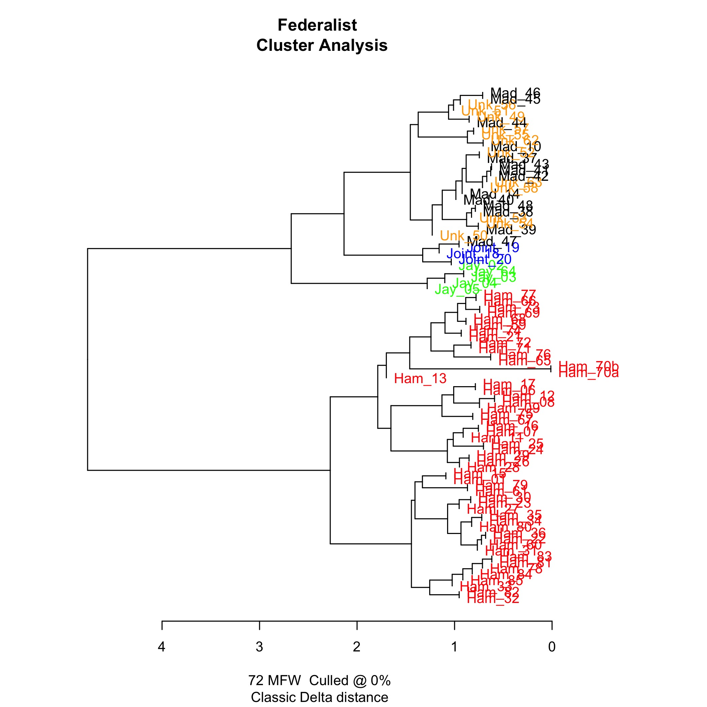

### The Federalist (Hamilton and Madison)

Stylometric analysis of the frequency of functions words for the
purpose of attributing authorship has had a number of notable
successes. The validity of this approach for textual scholarship
was firmly established by the work of Frederick Mosteller and David
L. Wallace on the *Federalist Papers*. The authorship of 12 of the
*Federalist Papers*, 49-57 and 62-63, had been disputed since the
early 19th century, with competing claims advanced on behalf of
Alexander Hamilton and James Madison.[^d] In 1944, Douglass Adair, using
traditional scholarly methods, settled the dispute largely to the
satisfaction of early American historians, determining that Madison
was the author of all 12 of the disputed numbers.[^a] In 1964,
Mosteller and Wallace confirmed Adair's findings by conducting a
stylometric analysis of the frequencies of 70 function words to
compare the 12 disputed numbers with numbers securely attributed
to Hamilton and Madison.[@mosteller_inference_1964]

### De Doctrina Christiana (Milton)

The manuscript of *De Doctrina Christiana* was discovered in November
1823 by Robert Lemon the elder, Deputy Keeper of His Majesty's State
Papers in a 'press' (cupboard) in the Old State Paper Office in the
Middle Treasury Gallery in Whitehall.[^b] The manuscript was
attributed by Lemon to Milton.[^c] The discovery and attribution
of the manuscript generated enough public interest that Home Secretary
Robert Peel was asked, and answered, questions about the printing
arrangements in the House of Commons in March 1824 [@campbell_milton_2007,
1, 5]. The attribution was challenged by William Hunter in 1991.
[@campbell_milton_2007, 1]

[^a]: @adair_authorship_1944a and @adair_authorship_1944b.

[^b]: For attempts to attribute authorship of *De Doctrina Christiana*
using stylometry, see: @campbell_provenance_1997; @rumrich_stylometry_2002;
and @campbell_milton_2007.

[^c]: On what grounds?

[^d]: @mosteller_inference_1964, 14. See also @adair_authorship_1944a, 104.
