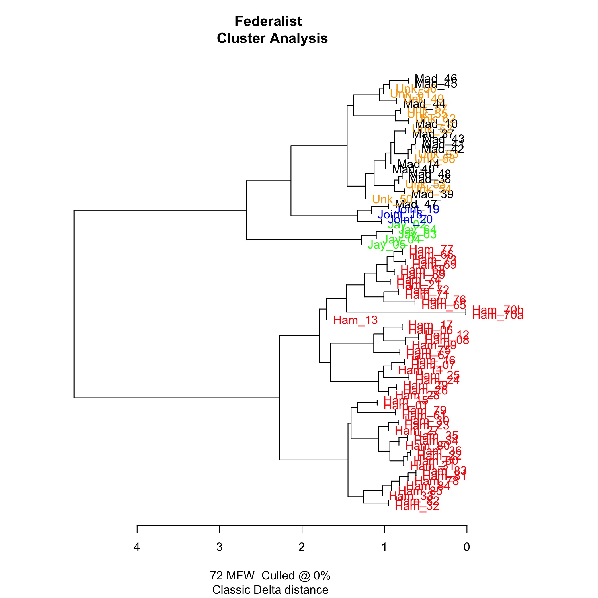
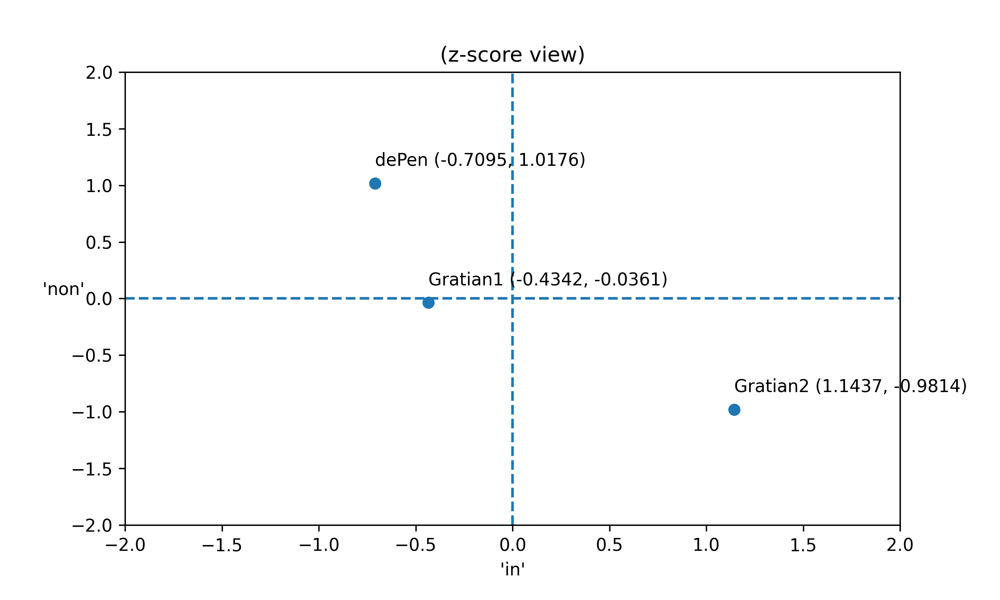
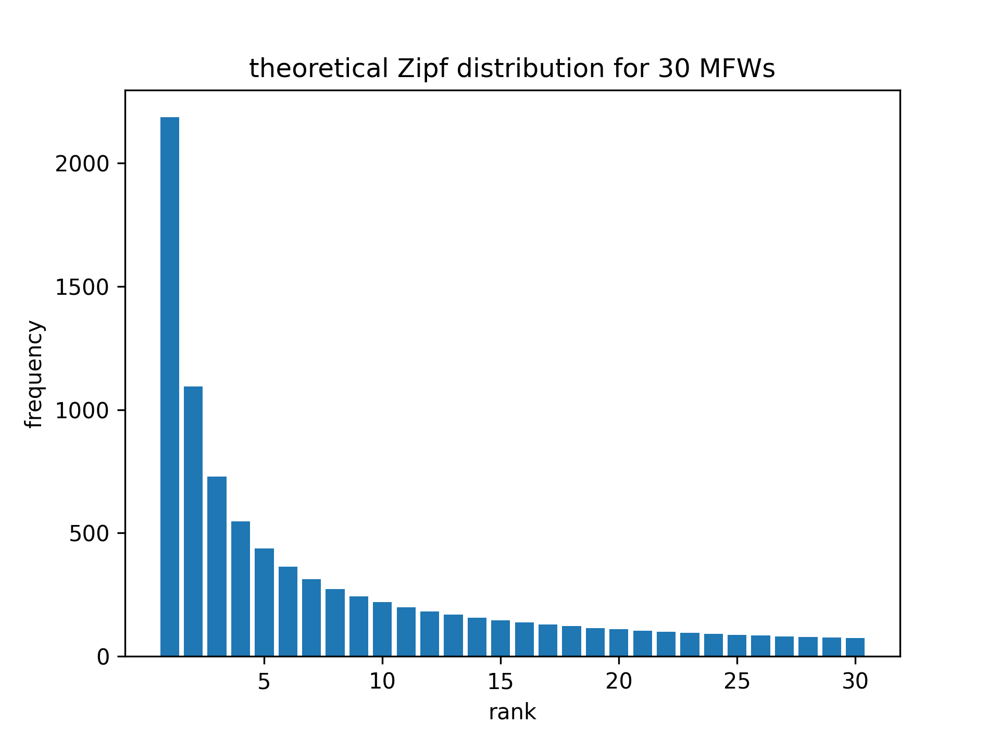
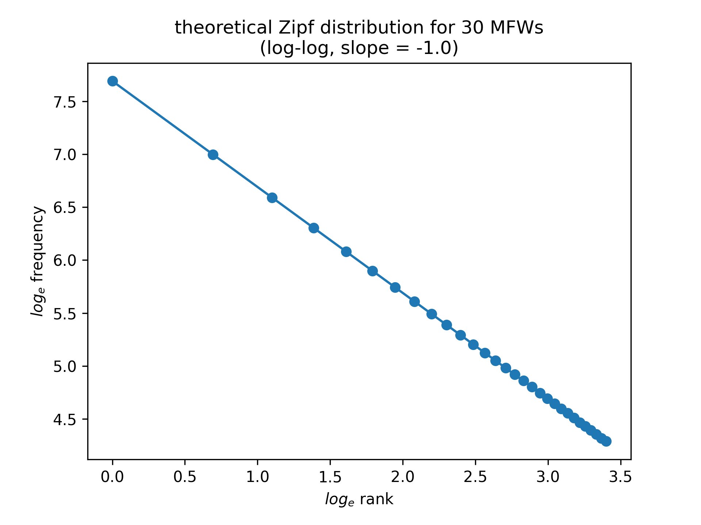
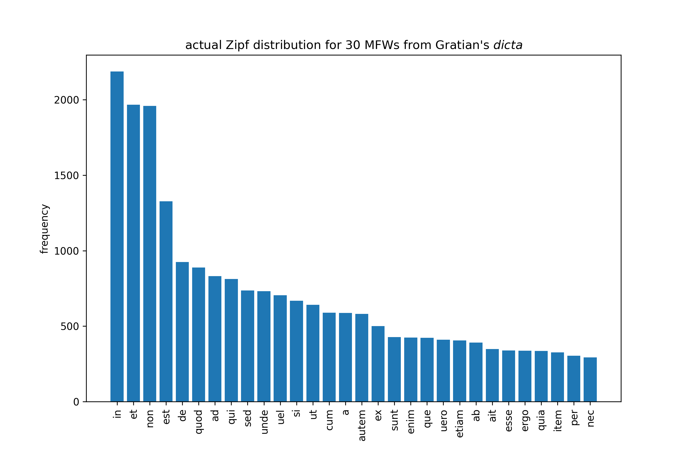
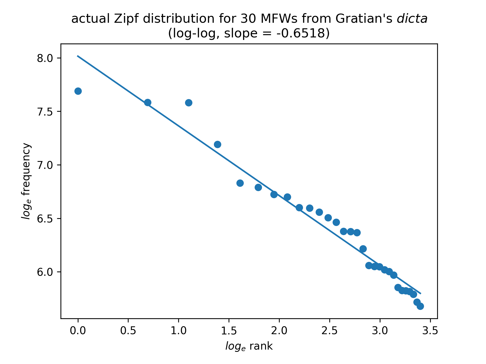
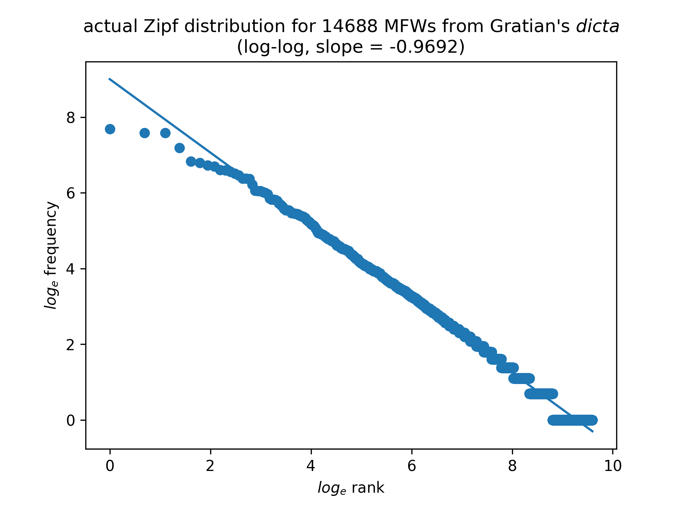
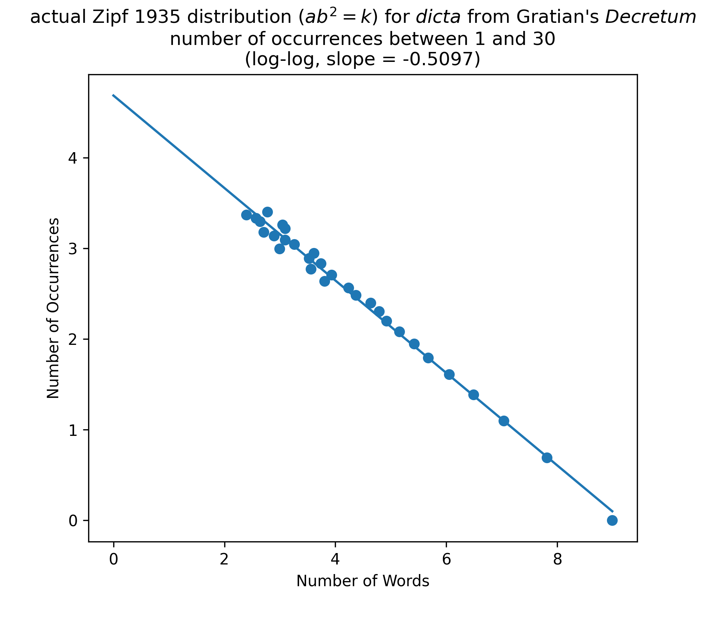

The contemporary audience for Gratian's *Decretum* seems to have
been reasonably satisfied that a single author was responsible for
the collection as they knew it, even if they knew so little about
the historical Gratian that they felt the need to retroactively
provide a largely fictional backstory for the eponymous author.
Modern students of Gratian, on the other hand, have been willing
to entertain the possibility that the *Decretum*, at least in its
final most widely-circulated form, was the product of collective
authorship. Stephan Kuttner, as the first item on his 1984 agenda
for Gratian studies, asked:

> was [the *Concordia discordantium canonum*] drafted and completed
in one grandiose thrust, or did the original version go through
successive redactions? And if the latter, was it Gratian himself,
or Gratian with his disciples, or an early generation of canonists
after him, who completed the final recension which from the mid-twelfth
century on was used in the schools and in adjudging
cases?[@kuttner_research_1990, 10]

Anders Winroth's 1996 discovery of the first recension of the
*Decretum* provided a convincing answer to the first part of Kuttner's
question: the original *did* go through successive redactions. Winroth
used the name Gratian 1 to refer to the compiler or compilers of
the first recension, and Gratian 2 to refer to the compiler or
compilers of the second recension. He then reformulated the second
part of Kuttner's question by asking whether Gratian 1 was the same
person as Gratian 2. Winroth's answer to the question posed in this
form, that Gratian 2 was *not* the same person as Gratian 1, has been
the focus of vigorous but so far inconclusive scholarly debate over
the last twenty years. Much of the debate has focused on competing
evaluations of the Sankt Gallen Stiftsbibliothek 673 (Sg) manuscript
of the *Decretum*, and more recently on secondary evidence such as
a twelfth-century Siena necrology in which the name Gratian appears.

It does not appear that the debate over the authorship of the
*Decretum* can be settled on the basis of the currently available
evidence. The goal of my dissertation project has been to find new
evidence relevant to the question of the authorship the *Decretum*
as it has been posed by both Kuttner and Winroth, by using computational
stylometric methods to analyze the authorship of the *dicta*
traditionally attributed personally to Gratian.

### Preliminary observations

Stylometry is the measurement of style. "Style is a property of
texts constituted by an ensemble of formal features which can be
observed quantitatively or qualitatively." [@herrmann_revisiting_2015,
44] While style has both qualitative and quantitative aspects,
stylometry is concerned only with quantitative aspects of style.
One well-established use of stylometry is to attribute authorship.
And for the purpose of authorship attribution, the formal linguistic
features that stylometry measures are the frequencies of occurrence
of common words.

Linguists draw a distinction between function words and content
words. The more frequently a word occurs in a language, the more
likely it is to be a function word, and the less likely it is to
be a content word. Function words are words like prepositions and
conjunctions. Content words are words like adjectives, nouns, and
verbs. Function words convey meaning by their use in grammatical
structure. The Latin conjunction "*sed*" does not mean anything by
itself, but rather it places two words or grammatical constructs
into an adversative relationship with each other.

Another way of thinking about the distinction is to note that in a
given language, function words constitute a closed class, while
content words constitute an open class. Language-speaking communities
can and do make up new adjectives, nouns, verbs all the time; content
words are therefore an open class that can be added to at will. But
new prepositions and conjunctions are almost never added to a
language, and their usage changes very slowly over time, if it
changes at all, and function words are therefore, for all practical
purposes, a closed, finite, class.

Evidence from experimental psychology suggests that both authors
and readers process function words at a subconscious level.
[@kestemont_function_2014] The frequency with which a given author
uses particular function words is therefore considered to be more
or less invariant, making it a reliable authorial signature.

**Some stylometric techniques use only function words, while others
use common words generally, without regard to whether they are
function or content words, but in either case function words are
disproportionately important to stylometric analysis because of
their observed frequency.**

### The Federalist (Hamilton and Madison)

Stylometric analysis of the frequencies of common words for the
purpose of attributing authorship has had a number of notable
successes. The validity of this approach for textual scholarship
was firmly established by the work of Frederick Mosteller and David
L. Wallace on the *Federalist Papers*. The authorship of 12 of the
*Federalist Papers*, 49-57 and 62-63, had been disputed since the
early 19th century, with competing claims advanced on behalf of
Alexander Hamilton and James Madison.[^5] In 1944, Douglass Adair,
using traditional scholarly methods, settled the dispute largely
to the satisfaction of early American historians, determining that
Madison was the author of all 12 of the disputed numbers.[^6] In
1964, Mosteller and Wallace confirmed Adair's findings by conducting
a stylometric analysis of the frequencies of 70 function words to
compare the 12 disputed numbers with numbers securely attributed
to Hamilton and Madison.[@mosteller_inference_1964]



### Definition of first- and second-recension *dicta*

**Abstract: In the absence of good modern critical editions for the
first and second recensions of the *Decretum*, a proxy for the first
recension is created by applying the variants recorded in Winroth's
appendix as transformations to Friedberg's text. The proxy for the
first recension is then subtracted from Friedberg's text, leaving text
from the second recension as the difference. The text samples from
the first and second recensions of the *Decretum* that provide the
basis for authorship attribution are build up by iteratively appending
short units of text (the individual first- and second-recension
*dicta*) that are non-contiguous in the original context of the
*Decretum*.**

Many of the examples in this chapter will distinguish between first-
and second-recension *dicta*, so this is an appropriate point at
which to introduce an explicit definition for the way in which those
terms will be used in the following discussion. Because almost every
word in the first-recension *dicta* corresponds to a word in the
second-recension *dicta*, we could consider the first-recension
*dicta* to be a subset of the second-recension *dicta*, and conversely,
we could consider the second-recension *dicta* to be a superset of
the first-recension *dicta*. While true enough from a commonsensical
point of view, this is not a useful definition for the kinds of
questions we would like to be able ask and answer, such as whether
Gratian 1, the author of the first-recension *dicta*, is the same
person as Gratian 2, the author of the second-recension *dicta*.

Instead, for the purpose of the following analyses, the second-recension
*dicta* are defined as the ordered set of every word from the *dicta*
in the text of Friedberg's 1879 edition of Gratian's *Decretum* for
which there is not a one-to-one correspondence to a word in the
first-recension *dicta* as defined by Anders Winroth's appendix
"The Contents of the First Recension of Gratian's
*Decretum*".[@winroth_making_2000, 197-227] An alternative restatement
would be to define the second-recension *dicta* as the difference
left by subtracting all of the words of the first-recension *dicta*
as defined by Winroth's appendix from the text in the Friedberg
edition. This definition is implemented by passing sequentially
through the *dicta* and applying the following three rules:

+ If a *dictum* is listed in Winroth's appendix as being in the
first recension of the *Decretum*, and as not having been added to
or changed in the second recension, the text for that *dictum* is
included in the first recension sample. This rule is applied on a
per-*dictum* basis.

+ If a *dictum* is in the text of the Friedberg edition, and is not
listed in Winroth's appendix as being in the first recension, in
either unmodified or modified form, the text for that *dictum* is
included in the second recension sample. This rule is applied on a
per-*dictum* basis.

+ If a *dictum* is listed Winroth's appendix as being in the first
recension, but as having been added to or changed in the second
recension, those words indicated by the appendix are included in
the first recension sample, while those words in the text of Friedberg
not corresponding to the words indicated by the appendix are included
in the second recension sample. This rule is applied on a word-by-word
basis.

Take D.54 d.p.c.23 as an example. The complete text of the *dictum*
as it appears in the Friedberg edition (column 214) is:

> *Ecce, quomodo serui ad clericatum ualeant assumi, uel quomodo
non admittantur. Liberti quoque non sunt promouendi ad clerum, nisi
ab obsequiis sui patroni fuerint absoluti. Unde in Concilio
Eliberitano:*

Winroth's appendix indicates that only the first sentence of the
*dictum* appears in the first recension:

d.p.c. 23: **1** *Ecce quomodo serui* – **2** *quomodo non
admittantur.*[^8]

Therefore, "*Ecce, quomodo serui ad clericatum ualeant assumi, uel
quomodo non admittantur.*" is included in the first recension text
sample, and "*Liberti quoque non sunt promouendi ad clerum, nisi
ab obsequiis sui patroni fuerint absoluti. Unde in Concilio
Eliberitano:*" is included in the second recension text sample.

Note that the individual *dicta* are too short for direct analysis
by the techniques discussed in this chapter.[^9] The smallest unit of
Latin prose for which computational stylometry works is about 2,500
words.[@eder_does_2015, 171] The longest first-recension *dictum*
(*de Pen*. D.1 d.p.c.87) is 1,591 words, and the longest second-recension
*dictum* (C.7 q.1 d.p.c.48) is 692 words. As a result, first and
second recension samples long enough for analysis have to be created
by rolling up or concatenating the first and second recension *dicta*
as they occur sequentially but discontinuously throughout the
*Decretum*.

Both the text of Friedberg's 1879 edition of Gratian's *Decretum*
and Winroth's appendix are potentially open to criticism. Although
modern scholars admire Friedberg's learning and energy --- the 1879
edition of the *Decretum* was only one of many such projects that
he undertook --- his editorial standards were those of 140 years
ago. In particular, Friedberg's selection of eight unrepresentative
German manuscripts as the basis for his edition, and his particular
reliance on two of them --- Köln Erzbischöfliche Diözesan- und
Dombibliothek 127 (Ka) and 128 (Kb) --- are seen today as serious
deficiencies.[^11]

Winroth himself acknowledged the provisional nature of his
appendix.[^12] Furthermore, Pennington has pointed out that although
Winroth's appendix includes D.100 d.a.c.1, D.100 c.1, and D.101
d.p.c.1, in the Paris (P), Florence (Fd), and Barcelona (Bc)
manuscripts, the text of the first recension ends with D.99
c.1.[@pennington_biography_2014, 685]

Nevertheless, in the absence of a critical edition for the first
recension, applying the variants recorded in Winroth's appendix as
a set of transformations to the text of Friedberg's edition to
generate a stand-in or proxy for the text of the first recension
is a workable approach.[^14] This method is well-theorized in a
Digital Humanities context as an example of "deformance." The term,
proposed by Lisa Samuels and Jerome McGann in "Deformance and
Interpretation" (1999), conflates the words "deformation" and
"performance", and describes a process through which a text is
transformed by the application of a series of deformances to generate
a "paratext". [@samuels_deformance_1999] The paratext is different
from the original text, but defined by the deformances through which
it was generated from it, and can be analyzed for otherwise unavailable
insights into the original text.

The methodology for producing the text samples used in this project
involves multiple stages of deformance. Starting with Friedberg's
1879 edition of Gratian's *Decretum* as the text, Winroth's appendix,
which compactly encodes first-recension variants with respect to
Friedberg, is used as a program (literally, as will be seen in the
section on corpus preparation below) for deforming Friedberg's text
to produce the first paratext, the proxy first recension *dicta*.
The first paratext is then used as the basis for a second deformation,
by which the first paratext is subtracted from Friedberg's text to
create the second paratext representing second recension additions
and changes to the *dicta*.

The approach of deriving all of the text samples used in this study
using only Friedberg's text and the first-recension variants recorded
in Winroth's appendix as sources has one final argument in its
favor, which is that it enables reproducibility. Reliance on publicly
available data means that those who wish to reproduce these results
are not dependent on private decisions about the content of the
text samples.

Depending on the nature of the analysis we wish to conduct, we may
choose to either include or exclude the *dicta* from *de Penitentia*.
Including the *dicta* from *de Penitentia*., there are 897 *dicta*
represented in the first-recension text sample and 419 represented
in the second-recension sample. Of those, 65 *dicta* are represented
in both the first- and second-recension samples. Excluding the
*dicta* from *de Penitentia*., there are 836 first-recension and
398 second-recension *dicta*, of which 61 *dicta* are represented
in both samples.

### Corpus preparation

The most important and time-consuming aspect of any digital humanities
project is corpus preparation. The availability of a suitable corpus
of electronic texts is a baseline requirement for carrying out
stylometric analysis. The ideal textual basis for a project of this
nature would be a set of electronic texts of good modern critical
editions of both the first and second recensions of Gratian’s
*Decretum*, following consistent orthographic conventions, and
adhering to a widely-accepted encoding standard such as the XML
Text Encoding Initiative (TEI P5) format. The Mellon Foundation-supported
effort directed by Anders Winroth to edit the first recension is
ongoing, but work on Winroth's edition in progress had not reached
a sufficiently advanced state of completion for it to be used within
the time frame available for my project.[^16]

As a result, this investigation depends for both the first and the
second recension on the electronic text of the Friedberg edition
that Timothy Reuter and Gabriel Silagi used to produce the
*Wortkonkordanz zum Decretum Gratiani* for the
MGH.[@reuter_wortkonkordanz_1990] Anders Winroth and Lou Burnard
of the Oxford Text Archive (OTA) provided copies of the MGH e-text
separately. The copies differed significantly, and the e-text had
to be reconstructed through an editorial process quite similar to
preparing a critical edition to restore it to a state as close as
possible to what Reuter and Silagi presumably intended.

In 1946, Father Roberto Busa, SJ (d. 2011), began work on what
ultimately became the *Index Thomisticus*, a concordance of the
works of St Thomas Aquinas. In 1949, Father Busa secured crucial
support from Thomas J. Watson of IBM, allowing concordance generation
to be carried out by means of electro-mechanical and later electronic
computers operating on punch-card data. The *Index Thomisticus* is
recognized today as the first important humanities computing project,
and figures prominently in origin stories for digital humanities
as a discipline.[^18] The success of Father Busa's project inspired
a number of imitators, as well as the development of specialized
software and data formats to support such efforts. Reuter and
Silagi's *Wortkonkordanz* was probably the last major Busa-style
concordance. For this reason, the MGH e-text of the Friedberg edition
was encoded in the obsolete Oxford Concordance Program (OCP) format.

The MGH e-text introduced a small number of textual errors in
addition to those it inherited from printed version of Friedberg's
edition. The table below lists all currently known errors in the
MGH e-text:[^19]

| Citation      |   Column | Error                                         | Correction                                                        |
|:--------------|---------:|:----------------------------------------------|:------------------------------------------------------------------|
| D.6 d.p.c.3   |       11 | quantam ad moralem intelligentiam             | quantum ad moralem intelligentiam                                 |
| D.23 c.2      |       79 |                                               | carnis passione, mortuus uera corporis sui morte, resurrexit uera |
| D.54 d.p.c.22 |      214 | Quid autem serui ecclesiarum                  | Quod autem serui ecclesiarum                                      |
| C.2 q.6 c.41  |      483 | contra sententiam restitutionem inpetraverit  | contra sententiam restitutionem inpetrauerit                      |
| C.4 d.init.   |      536 | a communione ait remouendus                   | a communione sit remouendus                                       |
| C.4 d.init.   |      536 | in episcoporum indicio                        | in episcoporum iudicio                                            |
| C.7 d.init.   |      566 | Quidam longa inualetudinem grauatus episcopus | Quidam longa inualetudine grauatus episcopus                      |

The error in D.23 c.2 is particularly noteworthy. Contrary to the
widespread belief that the MGH e-text was created by scanning a
physical copy of the Friedberg edition using optical character
recognition (OCR) technology and then correcting the results, it
is the product of keyboard transcription. Conclusively, the e-text
contains at least one instance of homeoteleuton. The following fours
lines from the text of D.23 c.2 in the Friedberg edition (column
79):

> *Patre et Spiritu sancto omnium creaturarum; qui passus sit pro
salute nostra uera carnis **passione, mortuus uera corporis sui
morte, resurrexit uera carnis** suae receptione et uera animae
resumptione, in qua ueniat iudicare*

were transcribed as the following three lines in the e-text:

> *Patre et Spiritu sancto omnium creaturarum; qui passus sit pro
salute nostra uera carnis suae receptione et uera animae resumptione,
in qua ueniat iudicare*

skipping over the words "*passione, mortuus uera corporis sui morte,
resurrexit uera carnis*."[^20]

Notwithstanding its textual flaws and the highly specialized and
outdated requirements that constrained the choice of file format,
the MGH e-text remains a useful tool for the study of Gratian's
*Decretum*.[@winroth_uncovering_1997]

The deformance algorithm used to generate the paratexts described
in the previous section on the definition of the first- and
second-recension *dicta* was implemented in the form of a 201-line
Python program. The program reads the MGH e-text of the Friedberg
edition, and parses it to extract the *dicta*. The Oxford Concordance
Program (OCP) format in which the e-text is encoded is extremely
difficult to parse because it is not tree-structured---it has start
tags for textual elements such as canons and *dicta*, cases and
distinctions, but not (unlike XML) end tags.[@hockey_history_2004]
The extraction engine captures every element of text between a
*dictum* start tag (`<T A>` or `<T P>`) and the start tag for the
next element that can possibly follow a *dictum*:

```python
import re

f = open('edF.txt', 'r')
file = f.read()
# (?<=...) positive lookbehind assertion.
dicta = re.findall('(?:\<T [AP]\>|(?<=\<T [AP]\>))(.*?)'    # dictum starts with dictum ante or dictum post tag.
    '(?:'                   # non-capturing group.
        '\<1 [CD][CP]?\>|'  # dictum ends with major division,
        '\<2 \d{1,3}\>|'    # or number of major division,
        '\<3 \d{1,2}\>|'    # or number of question,
        '\<4 \d{1,3}\>|'    # or number of canon,
        '\<P 1\>|'          # or Palea,
        '\<T [AIPRT]\>'      # or inscription or text tag.
    ')', file, re.S)        # re.S (re.DOTALL) makes '.' special character match any character including newline.
```

The extracted *dicta* require considerable scrubbing before they
can be used. Here, for example, is what D.54 d.p.c.23 looks like
in its raw state:

```python
[' -Gratian.+ Ecce, quomodo serui ad clericatum ualeant assumi,\n
uel quomodo non admittantur. Liberti quoque non sunt promouendi\n
ad clerum, nisi ab obsequiis sui patroni fuerint absoluti.\n
Unde in Concilio Eliberitano: -[c. 80.]+\n']
```

Each *dictum* is then processed into an item (key-value pair) in a
Python dictionary:

```python
{'D.54 d.p.c.23': 'Ecce, quomodo serui ad clericatum ualeant assumi, uel quomodo non admittantur. Liberti quoque non sunt promouendi ad clerum, nisi ab obsequiis sui patroni fuerint absoluti. Unde in Concilio Eliberitano:'}
```

The first recension variants from the Friedberg edition recorded
in Winroth's appendix are then encoded as a list of dictionaries
in which the `'pattern'` item is the variant represented as a Python
regular expression:

```python
[{'key': 'D.54 d.p.c.23', 'pattern': '(Ecce, quomodo serui.*?quomodo non admittantur\.)'}]
```

Finally, the deformance engine uses the variants encoded as regular
expression patterns to generate the first and second paratexts
corresponding the first- and second-recension *dicta*. For each
*dictum*, the text matching the pattern is inserted into a dictionary
representing the first recension paratext; then the text resulting
when the text matching the pattern is replaced by the null string
`''` is inserted into a dictionary representing the second
recension paratext:

```python
import re

dictionary_1r = {} # first recension paratext
dictionary_2r = {} # second recension paratext
dictionary_Fr = {'D.54 d.p.c.23': 'Ecce, quomodo serui ad clericatum ualeant assumi, uel quomodo non admittantur. Liberti quoque non sunt promouendi ad clerum, nisi ab obsequiis sui patroni fuerint absoluti. Unde in Concilio Eliberitano:'}
keysandpatterns = [{'key': 'D.54 d.p.c.23', 'pattern': '(Ecce, quomodo serui.*?quomodo non admittantur\.)'}]
for i in range (len(keysandpatterns)):
    key = keysandpatterns[i]['key']
    pattern = keysandpatterns[i]['pattern']
    result = re.search(pattern, dictionary_Fr[key])
    dictionary_1r[key] = result.group(1)
    dictionary_2r[key] = re.sub(pattern, '', dictionary_Fr[key])
```

Here is the resulting first recension paratext:

```python
{'D.54 d.p.c.23': 'Ecce, quomodo serui ad clericatum ualeant assumi, uel quomodo non admittantur.'}
```
and the corresponding second recension paratext:

```python
{'D.54 d.p.c.23': 'Liberti quoque non sunt promouendi ad clerum, nisi ab obsequiis sui patroni fuerint absoluti. Unde in Concilio Eliberitano:'}
```

### Simplified two-dimensional visualization

Visualizing data from the *dicta* in a simplified two-dimensional
form is a useful first step toward understanding how stylometric
analysis works in practice. For the purpose of the following
discussion, the *dicta* will be divided into four samples:

+ the hypothetical case statements (*dicta initiales* or *themata*) that introduce the thirty-six cases in Part II of the *Decretum*,
+ the first-recension *dicta* from Parts I and II of the *Decretum*,
+ the first- and second-recension *dicta* from *de Penitentia*, and
+ the second-recension *dicta* from Parts I and II of the *Decretum*.

In the following code, tables, and plots, these four samples will
be labelled Gratian0, Gratian1, dePen, and Gratian2. The Gratian1
and Gratian2 samples, representing the first- and second-recension
*dicta* from Parts I and II of the *Decretum*, were generated
according to the procedure detailed in the preceding section on
corpus preparation.

Although it is theoretically possible to split the text of the
hypothetical case statements (*themata*) and the *dicta* from *de
Penitentia* into separate first- and second-recension samples
following the same procedure used to produce the Gratian1 and
Gratian2 samples, as a practical matter it is not useful to do so.
The only case statement (*thema*) for which Winroth's appendix notes
a textual difference is C.19 d.init.[@winroth_making_2000, 216] The
first-recension version of the text of C.19 d.init. omits a 13-word
clause added to the second recension version, seemingly for the
purpose of piling up descriptive detail. (*unus relicta propria
ecclesia eo inuito, alter dimissa regulari canonica cenobio se
contulit*). Gratian0, the sample containing the cases statements,
is therefore made up of 99.6% first-recension text. Similarly, the
number of words added to the *dicta* in *de Penitentia* between the
first and second recensions is relatively minimal, 556 words out
of a total of 10,081 words; dePen, the sample containing the *dicta*
from *de Penitentia*, is therefore made up of 94.5% first-recension
text.

In addition to plotting a two-dimensional visualization of word
frequency data from the *dicta*, this section will set the stage
for a subsequent one, which introduces an authorship attribution
technique known as Burrows's Delta. Burrows's algorithm calculates
a metric for the distance between a sample of unknown authorship
with a corpus of samples of known authorship. In that discussion,
Gratian0, the sample containing the hypothetical case statements
(*themata*), will be treated as the sample of unknown authorship.
Gratian1, dePen, and Gratian2, the samples containing the first-recension
*dicta*, the first- and second-recension *dicta* from *de Penitentia*,
and the second-recension *dicta*, will be treated as the corpus of
samples of known authorship. Therefore, the values for means and
standard deviations that provide the basis of comparison between
the unattributed sample and the attributed corpus have to be
calculated without taking the values from Gratian0 into account.

The demonstration of Burrows's Delta will make a point of the fact
that the technique can be used at a higher number of dimensions
(n > 3) than can be visualized in graphical form. Word frequency
data for the four most frequent words (MFWs) will therefore be
collected from the start, even though the data for the third- and
fourth-most frequent words will not be used in this section.

First, identify the four most frequent words in the comparison text
samples, Gratian1, dePen, and Gratian2:

```python
import re

def get_tokens(filename):
    '''open text file and return list of tokens'''
    # text = open(filename, 'r').read().lower()
    f = open(filename, 'r') # open file
    text = f.read() # read file
    text = text.lower() # lower-case text
    tokens = [word for word in re.split('\W', text) if word != ''] # remove punctuation
    return tokens

def get_features(samples):
    tokens = []
    for sample in samples:
        tokens += get_tokens('../corpus/' + sample + '.txt')
    types = list(set(tokens)) # create unordered list of unique words
    tmp = dict.fromkeys(types, 0) # create temporary dictionary, initialize counts to 0
    for token in tokens: tmp[token] += 1 # count words
    # re-order words in temporary dictionary numerically by descending frequency
    # re-order words with same frequency alphabetically
    features = { 
        key: value for key, value in sorted(tmp.items(),
        key = lambda item: (-item[1], item[0]))
    }
    return features

samples = ['Gratian1', 'dePen', 'Gratian2']
features = get_features(samples)
list(features.keys())[:4] # 4 most frequent words (MFWs)
```

The four most frequent words in the three comparison samples Gratian1,
dePen, and Gratian2---the samples treated as being of known
authorship---are *in*, *non*, *et*, and *est*. The selection of
samples makes a difference to the order. Were Gratian0, the sample
treated as being of unknown authorship, to be included, the four
most frequent words would be *in*, *et*, *non*, and *est*. (The
rank reversal between the second- and third-most frequent words is
a result of the fact that *non* occurs quite infrequently in Gratian0;
see the table below.) After identifying the four most frequent words
in the three comparison samples, next, count the numbers of occurrences
of those words in each of the samples:[^24]

```python
import pandas as pd

def get_counts(features, samples):
    columns = {}
    for sample in samples:
        columns[sample] = []
        tmp = get_features([sample])
        for feature in features:
            columns[sample].append(tmp.get(feature, 0))
    return pd.DataFrame(columns, index = features)

mfws = list(features.keys())[:4] # 4 most frequent words (MFWs)
unknown = 'Gratian0'
counts = get_counts(mfws, [unknown] + samples)
```

|     |   Gratian0 |   Gratian1 |   dePen |   Gratian2 |
|:----|-----------:|-----------:|--------:|-----------:|
| in  |         74 |       1450 |     252 |        411 |
| non |         24 |       1360 |     270 |        306 |
| et  |         70 |       1293 |     260 |        345 |
| est |         13 |        965 |     182 |        167 |

After determining the number of occurrences of the MFWs, next,
determine the length (total word count) for each of the samples:

```python
def get_lengths(samples):
    filenames = ['../corpus/' + sample + '.txt' for sample in samples]
    lengths = {}
    for i in range(len(samples)):
       lengths[samples[i]] = len(get_tokens(filenames[i]))
    return pd.DataFrame(lengths, index = ['words'])

lengths = get_lengths([unknown] + samples)
```

|       |   Gratian0 |   Gratian1 |   dePen |   Gratian2 |
|:------|-----------:|-----------:|--------:|-----------:|
| words |       3605 |      56713 |   10081 |      14255 |

Finally, divide the number of occurrences of the MFWs in the samples
by the sample length and multiply the quotient by 1,000 to determine
the normalized frequency of occurrence per 1,000 words for each of
the MFWs in each of the samples:

```python
frequencies = (counts / lengths.values) * 1000
```

|     |   Gratian0 |   Gratian1 |   dePen |   Gratian2 |
|:----|-----------:|-----------:|--------:|-----------:|
| in  |    20.5270 |    25.5673 | 24.9975 |    28.8320 |
| non |     6.6574 |    23.9804 | 26.7831 |    21.4662 |
| et  |    19.4175 |    22.7990 | 25.7911 |    24.2020 |
| est |     3.6061 |    17.0155 | 18.0538 |    11.7152 |

*In* is the most frequently occurring word in the *dicta*. There
are 1,450 occurrences of *in* out of 56,713 words in the first-recension
*dicta* (25.5673 occurrences per 1,000 words), 252 occurrences of
*in* out of 10,081 words in the *dicta* from *de Penitentia* (24.9975
per 1,000), and 411 occurrences of *in* out of 14,255 words in the
second-recension *dicta* (28.8320 per 1,000). It is more convenient
to characterize word frequencies in units of occurrences per 1,000
words than percentage, since at that scale most of the values we
are concerned with are greater than 1.0. The overall mean frequency
of occurrence of *in* for the combined *dicta* from the first
recension, *de Penitentia*, and the second recension is therefore
2,113 occurrences out of 81,049 words or 26.0706 per 1,000. It is
common, however, for authorship attribution algorithms to use the
mean of the mean frequencies of occurrence for each of the samples
rather than the overall mean frequency of occurrence in the corpus
made up of all of the samples. The motivation for using the mean
of means for the individual samples rather than the overall mean
frequency of occurrence is to ensure that largest sample does not
dominate the result. The value for the mean frequency of occurrence
of *in* that will be required at subsequent stages of this
demonstration, then, is the mean of 25.5673, 24.9975, and 28.8320,
or 26.4656 occurrences per 1,000.

*Non* is the second most frequently occurring word in the *dicta*.
There are 1,360 occurrences of *non* out of 56,713 words in the
first-recension *dicta* (23.9804 occurrences per 1,000 words), 270
occurrences of *non* out of 10,081 words in the *dicta* from *de
Penitentia* (26.7831 per 1,000), and 306 occurrences of *non* out
of 14,255 words in the second-recension *dicta* (21.4662 per 1,000).
The overall mean frequency of occurrence of *non* for the combined
*dicta* from the first recension, *de Penitentia*, and the second
recension is therefore 1,936 occurrences out of 81,049 words or
23.8868 per 1,000. The mean of the mean frequencies of occurrence
of *non* for each of the samples is the mean of 23.9804, 26.7831,
and 21.4662, or 24.0765 occurrences per 1,000.

Comparing the frequencies of occurrence of *in* and *non* in the
two outlying samples, dePen and Gratian2, reveals unexpectedly large
variations for such common words. (Large variations would be less
surprising with uncommon words for which small differences in number
could result in a large difference in percentage.) *In* occurs 15.3%
more frequently in Gratian2 than in dePen, and 13.3% less frequently
in dePen than in Gratian2. *Non* occurs 24.8% more frequently in
dePen than in Gratian2, and 19.9% less frequently in Gratian2 than
in dePen. Even compared to the mean, *non*, for example, occurs
11.2% more frequently in dePen and 10.8% less frequently in Gratian2
than the mean of means. It is clear then that against an overall
background of "orderliness" (Zipf) in the word-frequency distribution,
individual samples can display striking and potentially significant
levels of variation.

Word count and sample length data were collected and used to calculate
frequencies for Gratian0 above, but those values will not be used
in this section. Disregard the Gratian0 column, and use only the
columns corresponding to the three comparison samples, Gratian1,
dePen, and Gratian2, to calculate the means for the values in each
of the rows in the frequency table representing the four most
frequent words:

```python
means = frequencies[samples].mean(axis = 1).to_frame('mean')
```

|     |   Gratian1 |   dePen |   Gratian2 |    mean |
|:----|-----------:|--------:|-----------:|--------:|
| in  |    25.5673 | 24.9975 |    28.8320 | 26.4656 |
| non |    23.9804 | 26.7831 |    21.4662 | 24.0765 |
| et  |    22.7990 | 25.7911 |    24.2020 | 24.2640 |
| est |    17.0155 | 18.0538 |    11.7152 | 15.5948 |

We can graph the number of occurrences of *in* and *non* per 1,000
words in the *dicta*, with the frequency of *in* plotted along the
horizontal x-axis, and the frequency of *non* plotted along the
vertical y-axis, to produce a simplified visualization of the total
variation between the three samples. Means are provided for context:
the vertical dashed line represents the mean of means for the
horizontal (*in*) axis, and the horizontal dashed line represents
the mean of means for the vertical (*non*) axis.

![Figure 0a updated 14 May 2020[^25]](PNGs/Figure_0a.png)

Figure 0a introduces several conventions common to two-dimensional
graphical representations of word frequency data that readers will
encounter repeatedly throughout this chapter. The feature (in this
case the frequency of occurrence of the word *in*) that explains
more of the variation between the samples is plotted along the
horizontal x-axis, while the feature (in this case the frequency
of occurrence of the word *non*) that explains less of the variation
between the samples is plotted along the vertical y-axis. Although
this plot, produced by the Matplotlib Python two-dimensional plotting
library, is rectangular and the axes are approximately to scale,
many of the figures in this chapter were generated using stylo, an
R package for stylometric analysis, which outputs square plots.
Regardless of appearance, however, readers should bear in mind that
the area plotted is always wider than it is tall, that is, that it
displays greater variation between samples horizontally along the
x-axis than it does vertically along the y-axis.

Figure 0a plots the values for the first-recension *dicta*, the
second-recension *dicta*, the *dicta* from *de Penitentia*, the
second-recension *dicta*, and (labelled Gratian1, dePen, and Gratian2
respectively), as well as the means (indicated by the dashed lines),
for the frequencies of *in* and *non* per 1,000 words. It is more
statistically meaningful, however, to measure and plot the differences
between values and means in units of standard deviations rather
than frequency per 1,000 words. The difference of a value from the
mean divided by standard deviation is referred to as the value's
z-score. A value that has a difference of one standard deviation
from the mean is said to have a z-score of 1.0 or -1.0 depending
on whether the value is greater or lesser than the mean. The formula
used to calculate the sample standard deviation is:

$s=\sqrt{\frac{1}{N - 1}\sum_{i=1}^N(x_i-\bar{x})^2}$

The formula is slightly daunting notationally, but it is not difficult
to use it to calculate the desired results. The example immediately
below shows all of the intermediate steps involved in using the
formula to compute the sample standard deviation of the frequency
of occurrence of the word *in* in the Gratian1, dePen, and Gratian2
samples. (The motivated reader can use a calculator to repeat the
process for the frequency of occurrence of the word *non*.) Remember
that for the purpose of calculating sample standard deviation, the
value of the mean ($\bar{x}$) is **not** the overall mean frequency
of occurrence of the word *in* across all of the samples, but the
mean of the frequencies for each of the samples individually (the
mean of means).

First, calculate the squared deviations from the mean of means for
the frequency of *in* in the first-recension *dicta* (Gratian1):

$(x_1-\bar{x})^2 = (25.5673 - 26.4656)^2 = (-0.8983)^2 = 0.8069$,

for the frequency of *in* in the *dicta* from *de Penitentia* (dePen):

$(x_2-\bar{x})^2 = (24.9975 - 26.4656)^2 = (-1.4681)^2 = 2.1553$,

and for the frequency of *in* in the second-recension *dicta* (Gratian2):

$(x_3-\bar{x})^2 = (28.8320 - 26.4656)^2 = (2.3664)^2 = 5.5998$.

Then, as indicated by the summation operator $\sum$, sum the three
squared deviations from the mean of means, divide the sum by their
number ($N = 3$) minus one, and take the square root of the quotient:

$s =
\sqrt{\frac{1}{2}(0.8069 + 2.1553 + 5.5998)} =
\sqrt{\frac{1}{2}(8.5620)} =
\sqrt{4.2810} =
2.0691$

The units of s are the same as those used to calculate the mean,
in this case, the frequency of occurrence of a word per 1,000 words.

Once again disregarding the Gratian0 column of the frequencies
table, calculate the standard deviations for the rest of the rows
representing the four most frequent words, using only the values
in the columns corresponding to the three comparison samples, and
the means computed from them:

```python
standard_deviations = frequencies[samples].std(axis = 1).to_frame('std')
```

|     |   Gratian1 |   dePen |   Gratian2 |    mean |    std |
|:----|-----------:|--------:|-----------:|--------:|-------:|
| in  |    25.5673 | 24.9975 |    28.8320 | 26.4656 | 2.0691 |
| non |    23.9804 | 26.7831 |    21.4662 | 24.0765 | 2.6598 |
| et  |    22.7990 | 25.7911 |    24.2020 | 24.2640 | 1.4970 |
| est |    17.0155 | 18.0538 |    11.7152 | 15.5948 | 3.3997 |

As noted above, the definition of a value's z-score is the difference
of that value from the mean divided by the standard deviation. A
z-score can be calculated for a value even if that value was not
used to determine the mean and standard deviation to be used. That
means that z-scores can be calculated for word frequencies in the
unattributed sample Gratian0 using the means and standard deviations
calculated using the corresponding word frequencies in the attributed
samples Gratian1, dePen, and Gratian2. Just as word frequencies
were calculated for Gratian0 above, z-scores will be calculated for
Gratian0 here, which will be used in the next section to determine
the value of Burrows's Delta. The formula used to calculate the
z-score is:

$z=\frac{x - \bar{x}}{s}$

For the frequency of *in* in the case statements or *themata* (Gratian0):

$z =
\frac{x - \bar{x}}{s} =
\frac{20.5270 - 26.4656}{2.0691} =
\frac{-5.9386}{2.0691} =
-2.8702$,

for the frequency of *in* in the first-recension *dicta* (Gratian1):

$z =
\frac{x - \bar{x}}{s} =
\frac{25.5673 - 26.4656}{2.0691} =
\frac{-0.8983}{2.0691} =
-0.4342$,

for the frequency of *in* in the *dicta* from *de Penitentia* (dePen):

$z =
\frac{x - \bar{x}}{s} =
\frac{24.9975 - 26.4656}{2.0691} =
\frac{-1.4681}{2.0691} =
-0.7095$,

and for the frequency of *in* in the second-recension *dicta* (Gratian2):

$z =
\frac{x - \bar{x}}{s} =
\frac{28.8320 - 26.4656}{2.0691} =
\frac{2.3664}{2.0691} =
1.1437$.

(Because both the numerator and the denominator of the formula for
calculating z-scores have units of frequency of occurrence per 1,000
words, z is a dimensionless number.)

Calculate the z-scores for the remaining most frequent words, and
then plot the coordinates of the attributed samples Gratian1, dePen,
and Gratian2:

```python
z_scores = (frequencies - means.values) / standard_deviations.values
```

|     |   Gratian0 |   Gratian1 |   dePen |   Gratian2 |
|:----|-----------:|-----------:|--------:|-----------:|
| in  |    -2.8702 |    -0.4342 | -0.7095 |     1.1437 |
| non |    -6.5491 |    -0.0361 |  1.0176 |    -0.9814 |
| et  |    -3.2375 |    -0.9786 |  1.0201 |    -0.0414 |
| est |    -3.5264 |     0.4179 |  0.7233 |    -1.1412 |



Labels on the axes of Figure 0b refer to standard deviations (values
of z) away from the mean of means (represented by the dashed lines).

Figures 0a and 0b represents the axes as orthogonal (perpendicular)
to one another. Although doing so is acceptable as a first-order
approximation in a simplified representation of this kind, plotting
the values along orthogonal axes invokes an implicit assumption
that the word frequencies (in this case, of *in* and *non*) are
completely independent of one another, i.e., that there is no
correlation or covariance relationship between the words' frequency
of occurrence in the samples. This is not necessarily the case, and
an advanced technique introduced below, principal component analysis
(PCA), handles this problem in a more mathematically sophisticated
way.

Now, we are obviously not going to make an attribution of authorship
based on the frequencies of only two function words. Increasing the
number of function words for which one collects frequency data
increases the accuracy of stylometric analysis, up to a point. There
is, however, a limit to the marginal value of each additional word
included in an analysis, for two reasons. The first reason is that
the frequency of each word in a corpus of text tails off inversely
as the word's rank, a relationship (approximately) described by the
equation r × f = C. (The rank of the most frequent word is defined
as 1, that of the second most frequent word as 2, and so on.) As a
consequence, assuming words are weighted in proportion to their
frequency of occurrence in the corpus, every marginal word has less
value as evidence than the word before it. Some stylometric techniques,
such as Burrows's Delta, weight each word from a corpus of texts
equally, but such choices need to be made with an informed awareness
of the trade-offs involved. The second reason is that every marginal
word is less likely to be a function word, and more likely to be a
content word. Twenty-four out of the thirty most frequent words
from Gratian's *dicta* are function words potentially suitable for
use in stylometric analysis, but only 64 out of the 250 most frequent
words.

### Zipf's law

The observed empirical relationship that word frequencies in a
corpus of text tail off inversely as the rank is known as Zipf’s
law, after American quantitative linguist George Kingsley Zipf
(d.1950). Though he does not seem to have claimed discovery, Zipf
published the first extended discussions of the phenomenon.[^26]
**The rank-frequency distribution of words in a corpus of any
language is not merely a curiosity, but rather provides a general
background of what Zipf characterized as "orderliness" against which
variations in frequency of occurrence of individual words are both
detectable and meaningful. Thus it is worthwhile to discuss theoretical
predictions about the rank-frequency distribution of words in a
corpus, and to demonstrate that Gratian's *dicta* display the
expected orderliness of word distribution.**

If the words in a corpus of text are rank-ordered from most to least
frequent, Zipf’s laws posits that, as a first-order approximation,
the frequency of the Nth word will be 1/N times that of the most
frequent word.[^27] In other words, the theoretical Zipf distribution
predicts that the frequency of the second most frequent word in a
corpus of text should be one half that of the most frequent word,
the frequency of the third most frequent word should be one third
that of the most frequent word, and so on. (See Figure Za below.)



Zipf tried several different approaches to the quantitative analysis
of the distribution of words in corpora. His initial attempt, in
1935, sought to characterize the orderliness of word distributions
by the relationship between the number of occurrences of a word,
*b*, and the number of words *a*, a relationship Zipf expressed as
$ab^2 = k$. For example, in Gratian's *dicta* there are 8,028 words
(*a*) for which there is 1 (*b*) occurrence, 2,462 words (*a*) for
which there are 2 (*b*) occurrences, 1,135 words (*a*) for which
there are 3 (*b*) occurrences, and 660 words (*a*) for which there
are 4 (*b*) occurrences. Plugging these values for *a* and *b* into
the formula $ab^2 = k$ yields 8,028, 9,848, 10,215, and 10,560
respectively as values for the "constant" *k*. As the number of
occurrences *b* increases, values of *k* for Gratian's *dicta*
remain fairly stable, mostly falling between 10,000 and 11,000.

|   b |    a |   $b^2$ |     k |
|----:|-----:|--------:|------:|
|   1 | 8028 |       1 |  8028 |
|   2 | 2462 |       4 |  9848 |
|   3 | 1135 |       9 | 10215 |
|   4 |  660 |      16 | 10560 |
|   5 |  423 |      25 | 10575 |
|   6 |  290 |      36 | 10440 |
|   7 |  225 |      49 | 11025 |
|   8 |  173 |      64 | 11072 |

As this example suggests, the explanatory power of the formula $ab^2
= k$ to characterize a word distribution is greatest for words that
have a low number of occurrences. Zipf ultimately judged the formula
$ab^2 = k$ to be a less than satisfactory model for the full spectrum
of word distribution in a corpus, in part because it implied
fractional values of *a* for the most frequent words.[^28] Zipf had
a vivid awareness, ahead of its time for the pre-digital age in
which he lived, of the fact that the variables in the formulas by
which he sought to express these relationships represent discrete
rather than continuous quantities.[^29] **Zipf also noted that value
of the exponent of b is likely to differ from 2 depending on the
size of the corpus [@zipf_psycho-biology_1935, 43]**

Zipf's final attempt, in 1949, to give a quantitative account of
the distribution of words in a corpus characterized the distribution
in terms of rank and frequency as r × f = C. Values for the constant
C differ between corpora, depending, among other things, on corpus
size. As an example, the theoretical Zipf distribution plotted in
Figures Za and Zb has been scaled to facilitate direct comparison
with actual data from Gratian's *dicta* plotted in Figures Zc and
Zd. In all four plots, the first data point has a rank of 1 and a
frequency of 2187, corresponding to the 2,187 occurrences of the
most frequent word *in* in the *dicta*. This scaling is equivalent
to setting the value of C to 2187, and letting r × f = 2187.

Both the $ab^2 = k$ and r × f = C interpretations of Zipf's law can
be restated with greater mathematical generality by noting that if
the variables are plotted logarithmically, their relationships are
linear, with the slope determined by the power (exponent) relationships
involved. In the equation $ab^2 = k$, the number of occurrences *b*
varies inversely as the square root of the number of words *a* (as
$\frac{1}{\sqrt{a}}$ , or equivalently as *a* ^-1/2^). The relationship
of the logarithm of the number of occurrences to the number of words
is linear, with a slope of -1/2 corresponding to the exponent (-1/2)
of the number of words. (See Figure Zy in the appendix at the end
of this section for actual data from Gratian's *dicta* for values
of *b* [Number of Occurrences] from 1 to 30. The actual slope is
-0.5097, quite close to the predicted theoretical value of -0.5.)

Similarly, in the equation r × f = C, the frequency *f* varies
inversely as the rank *r* (as 1/r, or equivalently as *r* ^-1^).
The relationship of the logarithm of frequency to the logarithm of
rank is linear, with a slope of -1 corresponding to the exponent
(-1) of the rank. (See Figure Zb below.) Note that the base of the
logarithms does not matter, as long as the bases are the same for
both axes. Regardless of whether we take base *e* (natural) or base
10 logarithms of rank and frequency, for example, the slopes will
be the same: -1.0 for the theoretical Zipf distribution of word
frequencies in Figure Zb, and -0.6518 for the actual frequencies
of the thirty most frequent words in Gratian's *dicta* in Figure
Zd.



Figure Zc below plots the actual rank-frequency distribution of the
thirty most frequent words (MFWs) in Gratian's *dicta*: *in* (2187),
*et* (1968), *non* (1960), *est* (1327), *de* (925), *quod* (888),
*ad* (832), *qui* (812), *sed* (736), *unde* (732), *uel* (705),
*si* (669), *ut* (641), *cum* (589), *a* (588), *autem* (582), *ex*
(501), *sunt* (428), *enim* (424), *que* (423), *uero* (411), *etiam*
(405), *ab* (391), *ait* (349), *esse* (339), *ergo* (338), *quia*
(336), *item* (327), *per* (304), *nec* (293).



Zipf used word frequencies hand-tabulated from James Joyce's *Ulysses*
as the data set for his exploration of the rank-frequency relationship,
and it turns out that for English, the r × f = C formulation holds
up reasonably well.[^31] The rank-frequency relationship does not
on first inspection appear to hold up as well for Gratian's Latin
as it does for Joyce's English, since the frequencies for the thirty
most frequent words of the *dicta* do not drop off quite as sharply
as the r × f = C formulation of Zipf's law would predict. The
frequency of *et*, the second most frequent word in Gratian's *dicta*
is 0.8999 times that of *in*, the most frequent word, rather than
0.5 as Zipf's law would predict; and the frequency of *non*, the
third most frequent word, is 0.8962 rather than 0.3333.

Plotting the data from Figure Zc on logarithmic axes and performing
least-squares linear regression analysis lets us calculate the
slope, -0.6518, for the rank-frequency tail-off of the thirty most
frequent words from Gratian's *dicta*.[^32] (See Figure Zd below.)
Transposing that result back into the linear (as opposed to
logarithmic) frame of reference used in Figure Zc, the expression
1/r ^0.6518^ yields a better (though not perfect) fit to the actual
rank-frequency data.



### Zipf's law (appendix)





![Figure Zz updated 27 May 2020[^33]](PNGs/Figure_Zz.png)

### Burrows's Delta

The examples presented in the previous section are suggestive of
ways in which differences between the frequencies of occurrence of
common words in samples from a corpus of texts can be quantified
in statistically meaningful units (standard deviations or values
of z) and combined to represent the distance between those samples.
This technique is, however, of limited value so long as we are
restricted to the two, or at most three, dimensions the human mind
is capable of visualizing. In 2001, John F. Burrows (d.2019) of the
University of Newcastle, Australia, proposed a generalization that
gets around the limitation on the number of features to two or three
by averaging z-score distance measurements of word frequency data
for any number of features. This has the effect of collapsing
distance measurements in an arbitrary number of dimensions into a
single metric. Burrows called this metric the Delta, and it is now
generally referred to as Burrows's Delta ($\Delta_B$).[^34] Expositions
of Burrows's Delta sometime fail to make a clear enough distinction
between the metric $\Delta_B$ and the authorship attribution
methodology in which Burrows applied it. The metric is not the
methodology.

Attempts to attribute authorship are typically undertaken in scenarios
where there is a large (enough) number of texts securely attributable
to a known author, and a text, or at most a small number of texts,
of unknown authorship. The attempt is then made to attribute the
unknown text to one of the known authors, or to rule out such an
attribution. Take the *Federalist* as an example. There are numbers
of the *Federalist* of disputed or unknown attribution, a small and
well-defined number of candidates for authorship---Hamilton, Jay,
Madison---to whom those numbers might be attributed, and securely
attributed samples from each of the candidates, conveniently enough
from the same work.

Burrows's methodology assumes just such a scenario. He began by
identifying the most frequent words (MFWs) in the corpus of comparison
texts securely attributed to known authors. In Burrows's published
descriptions of his methodology, he typically used all of the 30
most frequent words in the corpus of attributed comparison texts
without distinguishing between function and content words. He then
tabulated the number of occurrences of the most frequent words in
each of the sample texts in the comparison corpus and normalized
their frequency of occurrence as a percentage. Burrows then used
the frequency data collected from the comparison texts to calculate
a mean frequency of occurrence and sample standard deviation for
each of the MFWs or features.

It is important to emphasize that the mean frequency of feature
occurrence calculated at this stage of Burrows's algorithm and
subsequently used to calculate the sample standard deviation for
each feature is **not** the overall mean frequency across the corpus
of attributed comparison text samples. Instead, the comparison
corpus feature mean is calculated by averaging the normalized
(percentage) frequency for each feature across all of the text
samples in the attributed comparison corpus, without concern for
differences in size (word count) between the samples. To refer back
to the example presented in the previous section as part of the
two-dimensional visualization demonstration, we did **not** use the
**overall** mean frequency of *in* across the three samples Gratian1,
dePen, and Gratian2, (2,113 occurrences out of 81,049 words or
26.0706 per 1,000), but rather the mean of the normalized frequencies
of *in* for each of the samples (the mean of 25.5673, 24.9975, and
28.8320, or 26.4656 occurrences per 1,000). **(mean of means)**

After calculating the mean of means and sample standard deviation
for each of the features (MFWs), Burrows then converted the normalized
(percentage) frequencies of occurrence for each feature in each
sample in the comparison corpus to z-scores by subtracting the mean
of means from the frequency and dividing the positive or negative
difference by the standard deviation for the feature. At this point,
Burrows turned his attention to the unattributed text, tabulating
all occurrences of the 30 MFWs for which data had been collected
from the comparison texts, then normalizing the word counts by
converting them to percentage frequencies of occurrence. Burrows
then converted the normalized frequencies for each feature in the
unattributed test sample to z-scores based on the values for the
mean of means and sample standard deviation derived from the feature
frequencies in the attributed comparison corpus samples.

With these preliminaries out of the way, Burrows then calculated
the value of the Delta by taking the average (arithmetic mean) of
the absolute value of the differences between the z-score for a
given feature (MFW) for the unattributed test sample and each of
the comparison samples in the corpus of attributed texts. In Burrows's
interpretation, the comparison test sample from the attributed
corpus with the lowest Delta with respect to the unattributed test
sample was most likely to share a common author with it.

It is not possible to apply Burrow's methodology in the case of the
*dicta* from Gratian's *Decretum* without modification. As the
survey in Chapter 3 above indicated, near-contemporaries knew next
to nothing about Gratian. Perhaps most notably, although Gratian
was thought to have been a teacher, no one in the generation following
made an unambiguous claim to have been his student. There are no
other writings securely, or even insecurely, attributed to him.
Fortunately, Burrows's Delta can be readily adapted to the particular
situation in which we find ourselves, where there are no other texts
attributed to Gratian with which we can compare, for example, the
hypothetical case statements (*themata*) or second-recension *dicta*.

Although other distance methods of authorship attribution have been
proposed since,[@evert_understanding_2017] Burrows's Delta is widely
accepted in the scholarly literature of the field of computational
linguistics, and it will therefore be used as the basis for the
demonstrations in this section.

The first experiment will be a comparison of four subcorpora,
Gratian0 (the hypothetical case statements or *themata*), Gratian1
(the first-recension *dicta* excluding the *dicta* from *de
Penitentia*), dePen (first- and second-recension *dicta* from *de
Penitentia*), and Gratian2 (the second-recension *dicta* excluding
the *dicta* from *de Penitentia*), using the frequencies of occurrence
of the four most frequent words (MFWs) in Gratian's *dicta* as the
basis for comparison. We will hypothesize that the subcorpus
containing the hypothetical case statements (*themata*) is the work
of an unknown author, and will treat the other three subcorpora as
making up a corpus of works by a known author. Using four subcorpora
and four features, where every feature analyzed is represented in
a different dimension, demonstrates that z-score distance methods
can be extended to cases in which the number of dimensions is greater
than three. It also has the advantage of making the solution compact
enough to allow readers to follow along and reassure themselves of
the mathematical validity of all of the intermediate steps leading
to the final result.

The first experiment resumes directly where the two-dimensional
visualization demonstration left off, so all of the function
definitions and variable values in force at the conclusion of that
demonstration are still valid. In particular, this experiment
inherits the z-scores for all of the four most frequent words (MFWs).
While we disregarded the data for the third and fourth most frequent
words (*et* and *est*) for the purpose of the visualization
demonstration, they will be fully taken into account here. (Remember
that the values for mean and standard deviations used to derive the
z-scores were calculated without reference to the Gratian0 sample
here being treated as the unknown).

First, split the z-scores into two new dataframes, one for the test
sample Gratian0, assumed for the purpose of this experiment to be
the work of an unknown author:

```python
test = z_scores[[unknown]]
```

|     |   Gratian0 |
|:----|-----------:|
| in  |    -2.8702 |
| non |    -6.5491 |
| et  |    -3.2375 |
| est |    -3.5264 |

the other for the comparison samples Gratian1, dePen, and Gratian2,
assumed for the purpose of this experiment to represent the work
of known authors:

```python
corpus = z_scores[samples]
```

|     |   Gratian1 |   dePen |   Gratian2 |
|:----|-----------:|--------:|-----------:|
| in  |    -0.4342 | -0.7095 |     1.1437 |
| non |    -0.0361 |  1.0176 |    -0.9814 |
| et  |    -0.9786 |  1.0201 |    -0.0414 |
| est |     0.4179 |  0.7233 |    -1.1412 |

The formula used to calculate Burrows's Delta is:

$\Delta_B = \frac{1}{N}\sum_{i = 1}^N|z_i(t) - z_i(c)|$

It is easiest to deal with the formula in two steps, first evaluating
the expression $|z_i(t) - z_i(c)|$. Note that because we take the
absolute value of the result, the order of operands on either side
of the subtraction operator '-' does not matter. For each of the
three columns (Gratian1, dePen, and Gratian2) in the *corpus*
dataframe, subtract the z-score in each row from the z-score in the
same row of the *test* (Gratian0) dataframe, take the absolute
value, and record the result in the corresponding column and row
of the *differences* dataframe. For example, the z-score for *non*
in *test* (Gratian0) is -6.5491, the z-score for *non* in the
Gratian1 column of *corpus* is -0.0361, so the absolute value of
the difference recorded in the *non* row of the Gratian1 column of
*differences* would be 6.5130.

```python
differences = (test.values - corpus).abs()
```

|     |   Gratian1 |   dePen |   Gratian2 |
|:----|-----------:|--------:|-----------:|
| in  |     2.436  |  2.1606 |     4.0139 |
| non |     6.513  |  7.5667 |     5.5677 |
| et  |     2.2589 |  4.2576 |     3.1961 |
| est |     3.9443 |  4.2497 |     2.3852 |

Given the layout of the *differences* dataframe in which we have
stored the intermediate results, the part of the formula we deferred
dealing with ($\frac{1}{N}\sum_{i = 1}^N$) is simply a notationally
exact way of indicating that we are to take the average (arithmetic
mean) of the values in each of the columns, and record the resulting
value of $\Delta_B$ in the corresponding column of the *deltas*
dataframe.

The seemingly simple act of taking the arithmetic mean (average)
of the z-score distances between the samples for each feature has
an interesting and non-intuitive implication. It was mentioned in
passing in the previous section on visualization that plotting the
z-score coordinates of word frequencies invokes the tacit assumption
that the axes are in fact perpendicular to one another, an assumption
that is at least potentially open to challenge. Burrows's Delta
generalizes this assumption into an arbitrary number of dimension.
The scholarly literature on authorship attribution methods describes
distance metrics such as Burrows's Delta as measuring 'Manhattan
Distance'. The analogy is to walking or driving from a starting
to an ending point through a space in which the street have been
laid out at right angles to one another, like Manhattan.

```python
row = (differences.mean(axis = 0)).to_frame(unknown).transpose()
```

|          |   Gratian1 |   dePen |   Gratian2 |
|:---------|-----------:|--------:|-----------:|
| Gratian0 |      3.788 |  4.5586 |     3.7907 |

The Gratian1 subcorpus is just slightly closer than the Gratian2
subcorpus to the unknown Gratian0 test case, with values of Delta
for both rounding to 3.79. A candidate is defined as being *closest*
to the unknown when it has the lowest mean of the absolute values
of the differences between the z-scores for the unknown and the
candidate.But as Burrows pointed out, one candidate will always
have the lowest $\Delta_B$, so that in itself is not enough to make
or to rule out an attribution of authorship. We will need further
information before we can provide any kind of interpretation for
the result. The most we can say based on this result is that the
hypothetical case statements are less likely to have been written
by the author of the *dicta* in *de Penitentia* than by the authors
of either the first- or second-recension *dicta*.

The second experiment is a variation on the first, in which a
3881-word sample made up of seven extended passages from the
pseudo-Augustinian *De vera et falsa penitentia* quoted by Gratian
in *de Penitentia* are substituted for the 3605-word sample containing
the hypothetical case statements.[^36] As noted in Chapter 0 above,
Gratian can be said with a high degree of confidence **not** to be
the author of *De vera et falsa penitentia*. The authors are strongly
distinguished by their choice of post-positive conjunctions: Gratian
has a preference for *autem*, while pseudo-Augustine has an even
stronger preference for *enim*. Substituting the pseudo-Augustinian
sample in place of the case statements demonstrates the kinds of
results to be expected from Burrows's Delta in a situation in
which an attribution of authorship can reasonably be ruled out.

|       |   Gratian1 |   dePen |   Gratian2 |
|:------|-----------:|--------:|-----------:|
| psAug |     2.6456 |  1.7373 |     3.4318 |

The third experiment extends the first by treating each of the
subcorpora, Gratian0, Gratian1, dePen, and Gratian2 sequentially
as the work of an unknown author, and the other three subcorpora
as constituting a corpus of works by a known author. This is an
attempt to demonstrate the adaptation of Burrows's technique in a
circumstance in which there are no securely attributed comparison
texts outside of the corpus, and in which there is some reason to
suspect that there are multiple authors at work within the corpus.

```python
# author candidates, e.g. Gratian 1, the Master of Penance, Gratian 2, etc.
candidates = ['Gratian0', 'Gratian1', 'dePen', 'Gratian2']
deltas = pd.DataFrame(columns = candidates)
limit = 4 # 4 most frequent words (MFWs)
for candidate in candidates:
    unknown = candidate
    samples = candidates[:]
    samples.remove(unknown)
    features = get_features(samples)
    mfws = list(features.keys())[:limit]
    counts = get_counts(mfws, [unknown] + samples)
    lengths = get_lengths([unknown] + samples)
    frequencies = (counts / lengths.values) * 1000
    means = frequencies[samples].mean(axis = 1).to_frame('mean')
    standard_deviations = frequencies[samples].std(axis = 1).to_frame('std')
    z_scores = (frequencies - means.values) / standard_deviations.values
    test = z_scores[[unknown]]
    corpus = z_scores[samples]
    differences = (test.values - corpus).abs()
    row = (differences.mean(axis = 0)).to_frame(unknown).transpose()
    deltas = deltas.append(row)
```

|          |   Gratian0 |   Gratian1 |    dePen |   Gratian2 |
|:---------|-----------:|-----------:|---------:|-----------:|
| Gratian0 |   nan      |     3.788  |   4.5586 |     3.7907 |
| Gratian1 |     1.4361 |   nan      |   0.3628 |     0.5453 |
| dePen    |     1.9873 |     0.4515 | nan      |     0.7673 |
| Gratian2 |     1.7185 |     0.6278 |   0.7905 |   nan      |

Considering the results of the first three experiments together,
we can start to form some very preliminary conclusions. Based on
the values for $\Delta_B$ in the table above, the most likely
attribution is that the first-recension *dicta* (Gratian1) and the
*dicta* from *de Penitentia* (dePen) have the same author. It is
less likely that the first-recension *dicta* (Gratian1) and the
second-recension *dicta* (Gratian2) have the same author. It is
less likely still that the *dicta* from *de Penitentia* and the
second-recension *dicta* have the same author. It is much less
likely that the case statements (Gratian0) have the same author as
either the first- (Gratian1) or second-recension (Gratian2) *dicta*.
Finally, the least likely attribution is that the case statements
(Gratian0) have the same author as the *dicta* from *de Penitentia*.

---

The fourth and final experiment will compare the thirty most frequent
words (MFWs) across fourteen subcorpora: cases (C.1-36 d.init.),
laws (D.1-20 R1 *dicta*), orders1 (D.21-80 R1 *dicta*), orders2
(D.81-101 R1 *dicta*), simony (C.1 R1 *dicta*), procedure (C.2-6
R1 *dicta*), other1 (C.7-10 R1 *dicta*), other2 (C.11-15 R1 *dicta*),
monastic (C.16-20 R1 *dicta*), other3 (C.21-22 R1 *dicta*), heresy
(C.23-26 R1 *dicta*), marriage (C.27-36 R1 *dicta*), penance (R1
and R2 *dicta* from *de Penitentia*), and second (all R2 *dicta*,
excluding those from *de Penitentia*).[^37] For each of the fourteen
subcorpora, we will hypothesize each subcorpus in turn to be the
work of an unknown author, and will treat the other thirteen
subcorpora as composing a corpus of works by a known author. The
scale of the fourth experiment is similar to that of the experiments
carried out by John Burrows and David Hoover, the pioneers of the
technique, but makes it impractical to show intermediate results
at every step in the process.

|           |    cases |     laws |   orders1 |   orders2 |   simony |   procedure |   other1 |
|:----------|---------:|---------:|----------:|----------:|---------:|------------:|---------:|
| cases     | nan      |   2.2765 |    1.9247 |    2.0252 |   1.9637 |      1.9545 |   1.5714 |
| laws      |   2.141  | nan      |    1.249  |    1.502  |   1.4633 |      1.3147 |   1.4223 |
| orders1   |   1.6184 |   1.0949 |  nan      |    1.1223 |   0.9685 |      0.8843 |   1.0499 |
| orders2   |   1.8982 |   1.5244 |    1.2686 |  nan      |   1.382  |      1.684  |   1.4149 |
| simony    |   1.6667 |   1.3491 |    0.9772 |    1.2195 | nan      |      0.8878 |   1.1304 |
| procedure |   1.6187 |   1.1991 |    0.892  |    1.5095 |   0.8789 |    nan      |   1.079  |
| other1    |   1.3353 |   1.3    |    1.0619 |    1.2722 |   1.1383 |      1.0753 | nan      |
| other2    |   1.9416 |   1.3233 |    1.0913 |    1.6291 |   1.1386 |      1.109  |   1.2963 |
| monastic  |   1.4555 |   1.0451 |    0.8554 |    1.2676 |   1.0114 |      0.7986 |   0.93   |
| other3    |   2.0705 |   1.3388 |    1.289  |    1.5146 |   1.1997 |      1.1057 |   1.3497 |
| heresy    |   1.5177 |   1.031  |    0.7772 |    1.2182 |   0.5544 |      0.595  |   0.9485 |
| marriage  |   1.5448 |   1.0263 |    0.9848 |    1.265  |   0.884  |      0.9667 |   1.0494 |
| penance   |   1.5371 |   1.4473 |    0.7478 |    1.4005 |   0.9024 |      0.8781 |   1.3077 |
| second    |   1.374  |   1.0852 |    0.7764 |    1.1717 |   1.0623 |      0.9634 |   0.7971 |

|           |   other2 |   monastic |   other3 |   heresy |   marriage |   penance |   second |
|:----------|---------:|-----------:|---------:|---------:|-----------:|----------:|---------:|
| cases     |   2.2782 |     1.7622 |   2.3628 |   1.8717 |     1.8923 |    1.8589 |   1.6334 |
| laws      |   1.4369 |     1.1931 |   1.4345 |   1.1875 |     1.1924 |    1.6218 |   1.2323 |
| orders1   |   1.1109 |     0.8693 |   1.2397 |   0.8267 |     1.0124 |    0.7505 |   0.7777 |
| orders2   |   1.6873 |     1.4492 |   1.6208 |   1.4198 |     1.4526 |    1.5523 |   1.3195 |
| simony    |   1.1287 |     1.0413 |   1.1711 |   0.59   |     0.9166 |    0.9059 |   1.0863 |
| procedure |   1.1223 |     0.821  |   1.0726 |   0.6569 |     0.9993 |    0.8818 |   0.9852 |
| other1    |   1.2792 |     0.9649 |   1.3054 |   0.996  |     1.0853 |    1.3272 |   0.8152 |
| other2    | nan      |     0.7979 |   1.0346 |   1.0592 |     0.654  |    0.8633 |   1.0961 |
| monastic  |   0.7429 |   nan      |   1.0578 |   0.7602 |     0.6611 |    0.7999 |   0.7799 |
| other3    |   0.9505 |     1.1229 | nan      |   1.1209 |     0.7121 |    1.1521 |   1.3067 |
| heresy    |   0.9839 |     0.7672 |   1.1395 | nan      |     0.7783 |    0.6756 |   0.8484 |
| marriage  |   0.6126 |     0.6577 |   0.6552 |   0.7672 |   nan      |    0.7974 |   0.8676 |
| penance   |   0.9152 |     0.8101 |   1.0992 |   0.7609 |     0.8146 |  nan      |   0.9026 |
| second    |   1.0674 |     0.7861 |   1.2408 |   0.877  |     0.8796 |    0.8927 | nan      |

[^5]: @mosteller_inference_1964, 14. See also @adair_authorship_1944a, 104.

[^6]: @adair_authorship_1944a and @adair_authorship_1944b.

[^8]: @winroth_making_2000, 201. The numbers 1 and 2 refer to line
numbers relative to the first line of the *dictum*, as opposed to
the first line of the column, in the print version of the Friedberg
edition.

[^9]: **This paragraph may have to be moved to a separate section
explaining the rationale for the various roll-ups of the *dicta*
used in the following analyses, e.g., Gratian0, Gratian1, dePen,
Gratian2, etc.**

[^11]: @winroth_making_2000, 9-11. See also @kuttner_gratiani_1948
(Latin), and -@kuttner_research_1990, 10, 21-22, which mentions the
deficiency of Friedberg's edition without offering a detailed
critique.

[^12]: "The list is based on a collation of *incipits* and
*explicits* of every canon and *dictum* in the first recension. Differences
within the texts may very well have been overlooked, and minor differences
have not normally been registered." @winroth_making_2000, 197.

[^14]: **Anders, my understanding is that you took a similar approach
when you created the baseline text for the edition in progress of
the first recension (although you adopted a set of orthographic
conventions different from Friedberg's in the resulting text).**

[^16]: As of the most recent, 22 April 2019, version, eight case
statements (for cases 1-3, 9, 15, 24, 30, and 34) appear to have a
complete critical apparatus. An addition six case statements (for
cases 4-7, 10, and 11) have an incomplete critical apparatus that
records variant readings from Fd only. The critical apparatus for
the case statement for case 35 records a single variant reading
from Aa. The remaining 21 case statements (for cases 8, 12-14,
16-23, 25-29, 31-33, and 36) have no critical apparatus at all.

    **Update for 5 October 2019 version of the edition in progress.
    The case statement are used as the example here because they
    are the focus of my dissertation.**

[^18]: [@hockey_history_2004, 4-6]. The highest honor in the field
of Digital Humanities is the Roberto Busa Prize, awarded by the
Alliance of Digital Humanities Organizations (ADHO). A notable past
recipient of the Busa Prize is John Burrows, who first introduced
the fundamental stylometric technique now known as Burrows's Delta
in a lecture he delivered on the occasion of receiving the award
in 2001.

[^19]: Data current as of 23 May 2020. For more recent error reports,
see the list I maintain for the Stephan Kuttner Institute on
[GitHub](https://github.com/StephanKuttnerInstitute/FriedbergBugs/blob/master/bug-reports.csv).
Thanks to Anders Winroth for reporting the errors in D.6 d.p.c.3
(6 October 2019) and D.23 c.2 (23 August 2019).

[^20]: Thanks to Anders Winroth for bringing the instance of
homeoteleuton at D.23 c.2 in the MGH e-text to my attention (August
23, 2019). Clemens Radl of the MGH confirmed to Winroth that the
e-text was typed.

[^24]: Much of the analysis from this point forward will take advantage
of the specialized capabilities of a Python software library called
pandas. The name pandas is not a reference to the charismatic animal,
but an acronym derived from the term "panel data." The package is
widely used in the field of data science, and provides a dataframe
abstraction that represents two-dimensional numerical word-frequency
data in a much more natural way than native Python data structure
like lists and dictionaries do. The pandas dataframe abstraction
can be thought of as a close analog to the Excel spreadsheets that
were such a ubiquitous feature of John Burrows's and David Hoover's
early experiments in stylometry.

[^25]: The actual generation of Figure 0a was deferred until after
the sample standard deviations for *in* and *non* per 1,000 words
had been calculated below. Framing the dimensions of the plot to
twice the standard deviation from the mean along both axes improves
graphical layout and readability.

[^26]: @zipf_psycho-biology_1935, 39-48; and @zipf_human_1949, 73-131.
Zipf referred to the relationship as "the law of diminishing returns
of words" (1949). He expressed the relationship as $ab^2 = k$ (1935)
and r × f = C (1949).

[^27]: **In Digital Humanities courses, 1/N is typically presented
*as* Zipf's law. The reductionist 1/N representation of the
rank-frequency relationship is misleading insofar as it ignores
scaling considerations, and elides the discrete rather than continuous
nature of the variables representing rank and frequency.**

[^28]: "Hence the $ab^2 = k$ relationship is valid only for the
less frequently occurring words which, however, represent the greater
part of the vocabulary in use, though not always a great majority
of the occurrences." ... "It is perhaps worth pointing out that the
$ab^2 = k$ relationship which appears valid for the frequency
distribution of the less frequent words would demand fractional
words when applied to the speech-elements of highest occurrence,
such as *the* in English." @zipf_psycho-biology_1935, 42-43.

[^29]: Zipf used the term "integrality" to describe the discrete,
discontinuous, nature of frequency and rank. @zipf_human_1949, 31,
35.

[^31]: "we have found a clearcut correlation between the number of
different words in the *Ulysses* and the frequency of their usage,
in the sense that they approximate the simple equation of an
equilateral hyperbola: r × f = C in which *r* refers to the word's
rank in the *Ulysses* and *f* to its frequency of occurrence (as
we ignore for the present the size of C)." @zipf_human_1949, 24.
See @zipf_human_1949, 23-52, for Zipf's extended discussion of the
rank-frequency distribution of words in Joyce's *Ulysses*.

[^32]: $m = \frac{\sum{x_iy_i - n\bar{xy}}}{\sum{x_i^2 - n\bar{x}^2}}$
or:

    ~~~ {.python}
    def regression_slope(data_points):
        n = len(data_points)
        x_values, y_values = zip(*data_points)
        x_bar = statistics.mean(x_values)
        y_bar = statistics.mean(y_values)
        xy_sum = 0
        x_squared_sum = 0
        for i in range(n):
            xy_sum += x_values[i] * y_values[i]
            x_squared_sum += x_values[i] ** 2
        return (xy_sum - n * x_bar * y_bar) / (x_squared_sum - n * x_bar ** 2)
    ~~~

[^33]: The vertical bands toward the upper-left hand corner of the
plot---which also appear in Zipf's 1935 figures---require some
interpretation. There can be a range of values for numbers of
occurrence (b) for which only one value for number of words (a) has
that number of occurrence. There are 62 cases in the *dicta* from
Gratian's *Decretum* in which only a single word (a = 1) has a given
number of occurrences (b). For example, only one word, *potest*,
has 143 occurrences, and only one word, *in*, has 2,187 occurrences.
The upper-left-most vertical band represents all 62 of the words
for which only a single word (a = 1) has a particular value for the
number of occurrences (b). Similarly, the next vertical band to the
right represents all of the words for which only two words (a = 2)
have particular values for the number of occurrences (b).

[^34]: @burrows_questions_2003; and -@burrows_delta_2002.

[^36]: *de Penitentia* D.1 c.88 (R1), D.3 c.42 (R1), D.3 c.49 (R1),
D.5 c.1 (R1), D.6 c.1 (R1), and D.7 c.6 (R1). These seven extended
passages average 554.4 words in length. **See edF 1.XXXV, for a
complete list of passages from *De vera et falsa penitentia* quoted
in the *Decretum*. Explain rationale for omitting certain passages:
D.25 c.5 (R2 or Palea), *de Penitentia* D.3 c.4.5 (what Friedberg
means by 4.5 in this context is unclear), D.3 c.45 (R2). Acknowledge
Karen Teresa Wagner, *De vera et falsa penitentia : an edition and
study*, 1995.**

[^37]: The division of the first-recension (R1) *dicta* into twelve
sections follows the division of Gratian's *Decretum* proposed by
Alfred Beyer in -@beyer_lokale_1998, 17-18.

