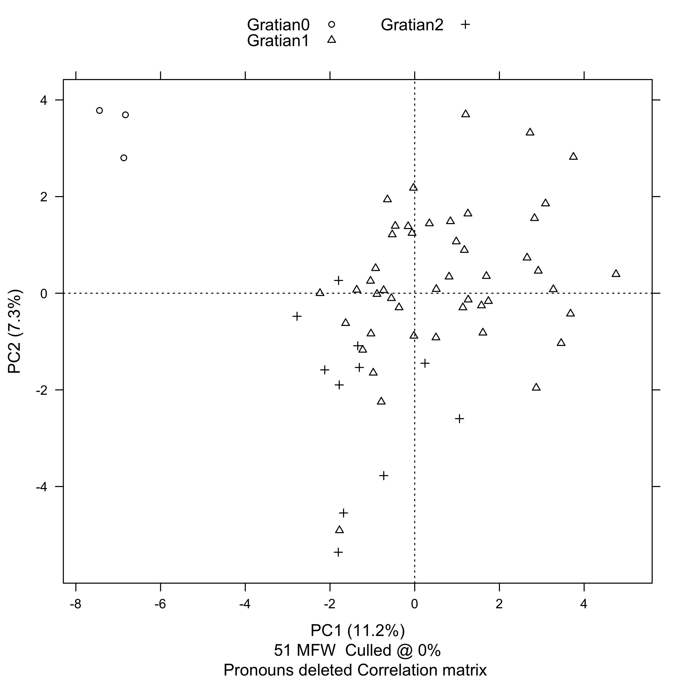
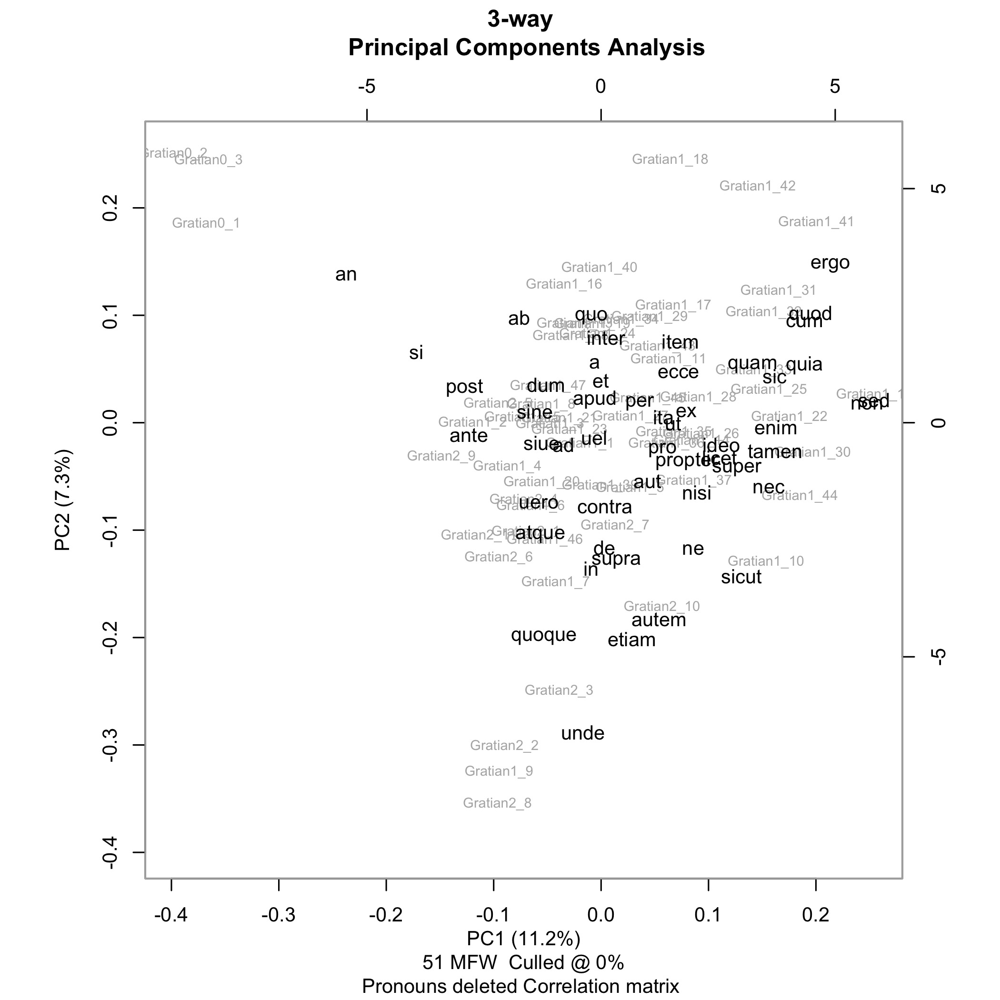
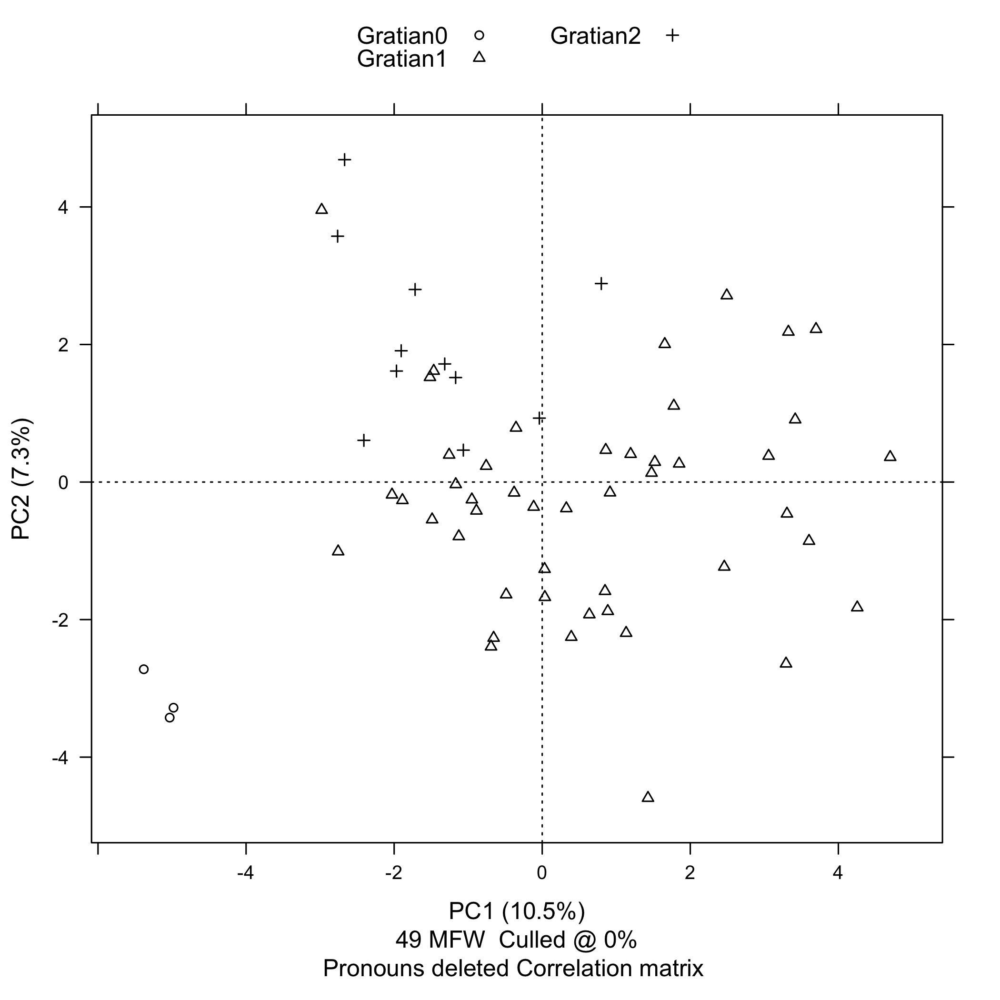
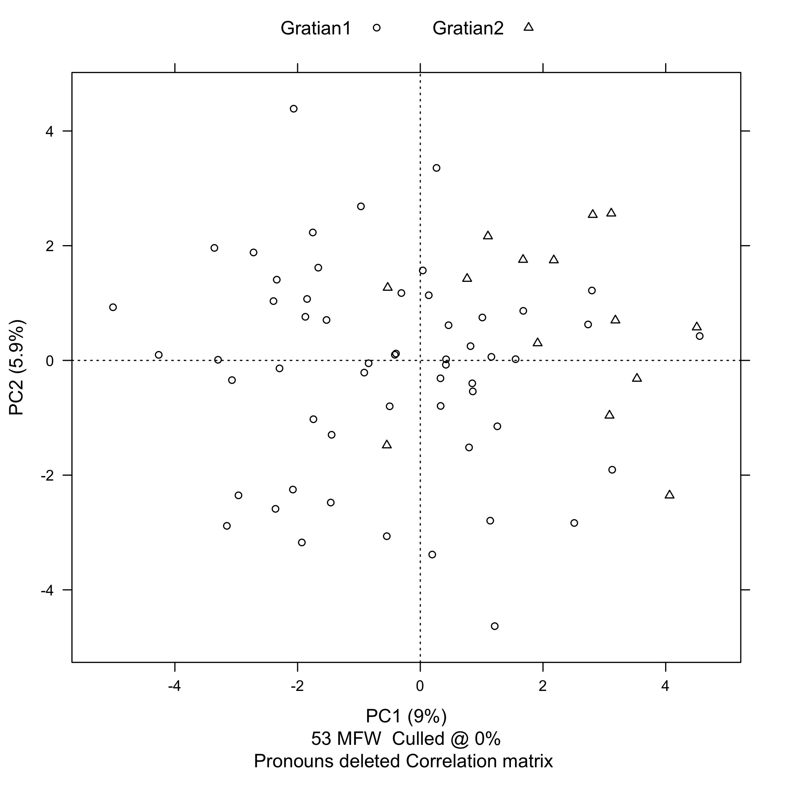
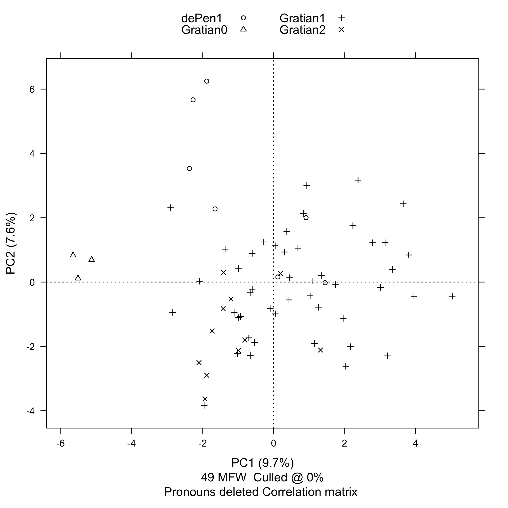

Twenty years ago, Anders Winroth announced his discovery of the
first recension of Gratian's *Decretum* at the Tenth International
Congress of Medieval Canon Law in Syracuse, New York. One of the
most important questions raised by that discovery is whether Gratian
1, the compiler of the first recension was the same person as Gratian
2, the compiler of the second recension. It does not appear that
the debate over authorship can be settled using currently available
evidence. The goal of my project is to find new evidence for the
authorship of case statements and *dicta* in Gratian's *Decretum*
using computational methods.[^1]

[^1]: An earlier version of this paper, "Can Stylometry Provide New
Evidence about the Identity of Gratian 1 and Gratian 2?", was
presented to a session on Canon Law in the Twelfth and Thirteenth
Centuries at the *Rem non novam nec insolitam aggredimur* conference
and grand opening of the Stephan Kuttner Institute of Medieval Canon
Law at Yale Law School, May 21-22, 2015.

First I'm going to discuss in general terms the use of stylometry
for authorship attribution. Then, I'm going to discuss the methodology
and the software that I am using for this project. Finally, I am
going to show the results of stylometric analysis of the case
statements, the first-recension *dicta*, and the second-recension
*dicta* (first without, then with, the *dicta* from *de Penitentia*),
and discuss some possible interpretations of those results.

Stylometry is the measurement of style. "Style is a property of
texts constituted by an ensemble of formal features which can be
observed quantitatively or qualitatively." [@herrmann_revisiting_2015,
44] While style has both qualitative and quantitative aspects,
stylometry is concerned only with quantitative aspects of style.
One well-established use of stylometry is to attribute authorship.
And for the purpose of authorship attribution, the formal linguistic
features that stylometry measures are the frequencies of occurrence
of function words.

Linguists draw a distinction between function words and content
words. Function words are words like prepositions and conjunctions.
Content words are words like adjectives, nouns, and verbs. Function
words convey meaning by their use in grammatical structure. The
Latin conjunction "*sed*" doesn't mean anything by itself, but
rather it places two words or grammatical constructs into an
adversative relationship with each other.

Here's another way of thinking about the distinction: function words
are closed-class words and content words are open-class words.
Language-speaking communities can and do make up new adjectives and
nouns and verbs all the time; so content words are an open class
that can be added to at will. But new prepositions and conjunctions
are almost never added to a language, and they change very slowly
over time, if they change at all, and are therefore, for all practical
purposes, a closed, finite, class. In theory, that means that you
ought to be able to make a list of every function word in a language,
although in practice, that's not easy to do.

Evidence from experimental psychology suggests that both authors
and readers process function words at an unconscious level.
[@kestemont_function_2014] The frequency with which a given author
uses particular function words is therefore considered to be more
or less invariant, making it a reliable authorial signature.

Stylometric analysis of the frequency of functions words for the
purpose of attributing authorship has had a number of notable
successes. The validity of this approach for textual scholarship
was firmly established by the work of Frederick Mosteller and David
L. Wallace on the *Federalist Papers*. The authorship of 11 of the
*Federalist Papers* had been disputed since the early 19th century,
with competing claims advanced on behalf of Alexander Hamilton and
James Madison. In 1944, Douglass Adair, using traditional scholarly
methods, settled the dispute largely to the satisfaction of early
American historians, determining that Madison was the author of all
11 of the disputed numbers.[^4] In
1964, Mosteller and Wallace confirmed Adair's findings by conducting
a stylometric analysis of the frequencies of 70 function words to
compare the 11 disputed numbers with numbers securely attributed
to Hamilton and Madison.[@mosteller_inference_1964]

[^4]: @adair_authorship_1944a and @adair_authorship_1944b.

Let's take a first look at how this kind of stylometric analysis
works in practice with some actual data from the first- and
second-recension *dicta*, excluding the *dicta* from *de Penitentia*.[^6]
"*In*" is the most frequently occurring word in the *dicta*. There
are 1,450 occurrences of "*in*" out of 56,713 words in the
first-recension *dicta* (2.56%). There are 411 occurrences of "*in*"
out of 14,255 words in the second-recension *dicta* (2.88%). "*In*"
therefore occurs 13% more frequently in the second-recension *dicta*
than it does in the first-recension *dicta*.

"*Non*" is the second most frequently occurring word in the *dicta*.
There are 1,360 occurrences of "*non*" in the first-recension *dicta*
(2.40%). There are 306 occurrences of "*non*" in the second-recension
*dicta* (2.15%). "*Non*" therefore occurs 12% more frequently in
the first-recension *dicta* than in the second-recension *dicta*.

[^6]: Including the *dicta* from *de Penitentia* skews the results
of this analysis significantly. **Changes come overwhelmingly from
first-recension *de Pen.* *dicta* (9525 words) vs. second-recension
*de Pen.* *dicta* (556 words).**

    "*In*" is the most frequently occurring word in the *dicta*.
    There are 1,682 occurrences of "in" out of 66,238 words in the
    first-recension *dicta* (2.54%). There are 431 occurrences of
    "in" out of 14,811 words in the second-recension *dicta* (2.91%).
    "*In*" therefore occurs 14.6% more frequently in the second-recension
    *dicta* than it does in the first-recension *dicta*.

    "Non" is the second most frequently occurring word in the
    *dicta*. There are 1,622 occurrences of "non" in the first-recension
    *dicta* (2.45%). There are 314 occurrences of "non" in the
    second-recension *dicta* (2.12%). "Non" therefore occurs 15.5%
    more frequently in the first-recension *dicta* than in the
    second-recension *dicta*.

13% for "*in*" and 12% for "*non*" are significant variations for
such common words---it's not like we're talking about low-frequency
words where a small difference in the count can make for a big
difference in percentage.

We could graph the number of occurrences of "*in*" and "*non*" per
100 words of the two samples (from the first- and second-recension
*dicta*), with the percentage frequency of "*in*" on the horizontal
axis, and the percentage frequency of "*non*" on the vertical axis,
and we would have an extremely simplistic visualization of the total
variation between the two samples. Now, we are obviously not going
to make an attribution of authorship based on the frequencies of
only two function words.

Increasing the number of function words one collects data for
increases the accuracy of the stylometric analysis (up to a point).
But it also introduces a new problem. We were able to represent our
stylometric analysis of the frequency of "*in*" and "*non*" in the
samples from the first- and second-recension *dicta* on a two-dimensional
graph. But there will be as many dimensions on the graph as there
are function words for which we collect data. And because human
beings are not good at visualizing quantitative data in more than
three dimensions, we need to find a way to reduce the number of
dimensions. This is where the technique of principle component
analysis, or PCA, becomes useful.^[For a general introduction to
the use of principal component analysis (PCA) in literary stylometric
analysis, see @craig_stylistic_2004 and Chapter 6 "Style" in
@jockers_macroanalysis_2013.]

PCA first combines as many of the raw dimensions as possible into
synthetic components on the basis of strong correlations, either
positive or negative. For example, going back to the data on the
frequencies of "*in*" and "*non*" in the first- and second-recension
*dicta*, the two dimensions of the graph could be collapsed into a
single component that could be thought of as representing the
probability that "*in*" will, and that "*non*" will *not*, occur
in a given sample. (And this is, in fact, what the software that
I'm using for this project does.)

Finally, PCA displays the two components that contribute the most
to the total variation between the samples, and graphically arranges
the samples according to their probability relative to those two
components.

An important (and time-consuming) aspect of any project of this
nature is corpus preparation. A baseline requirement for carrying
out stylometric analysis is the availability of an electronic text.
Ideally, I would be working with electronic texts of good critical
editions of both the first and second recensions of Gratian's
*Decretum*, following consistent orthographic conventions, and
encoded in a standard format like TEI P5 XML. The Mellon
Foundation-supported project, directed by Anders Winroth, to edit
the first recension is making good progress, but is not yet complete
enough for me to use on this project. So, I am working with the
electronic text of the Friedberg edition that Timothy Reuter and
Gabriel Silagi used to produce the *Wortkonkordanz zum Decretum
Gratiani* for the MGH. [@reuter_wortkonkordanz_1990] The MGH e-text
is encoded in the obsolete Oxford Concordance Program format.

Anders Winroth and Lou Burnard of the Oxford Text Archive (OTA)
each provided me with copies of the MGH e-text. The copies differed,
and I went through an exercise not unlike preparing a critical
edition to restore the e-text to the state that Reuter and Silagi
intended.

I generated the sample text for the first-recension *dicta* by
extracting from the MGH e-text of the Friedberg edition all of the
*dicta* listed by Winroth in the appendix of *The Making of Gratian's
Decretum*, and by applying the changes to the *dicta* that differed
between the first and second recensions. [@winroth_making_2000,
197-227] I generated the sample text for the second-recension *dicta*
by starting with all the *dicta* in parts 1 and 2 of the Friedberg
edition, and then taking away every word that appeared in the
first-recension *dicta*. For the case statements, I simply used the
text from the vulgate *Decretum* as it appears in the Friedberg
edition.

Because stylometric analysis for authorship attribution depends on
the frequencies of prepositions and conjunctions, it is important
to include enclitics substituting for conjunctions. Every word in
the samples with a -*que* ending that is actually an enclitic, and
not just part of the word, has been mapped to the word plus the
pseudo-conjunction "xque".[^10]

[^10]: In the case statements, 1st-, and 2nd-recension *dicta* from
Gratian's *Decretum*, there are 747 occurrences of 79 unique words
ending in -*que*. (This does not count 423 occurrences of the word
'*que*' itself.) Of those, 498 are occurrences of 19 unique words
from Schinke's 54-word pass list, while 249 occurrences of 60 unique
words are not. It is from these 249 words that, according to Schinke,
the -*que* ending should be detached as an enclitic.

    However, the 249 words include 72 occurrences of 17 unique words
    ending with the adverbial enclitics -*cumque* or -*cunque*,
    from which the -*que* ending should not be detached. The 249
    words also include a further 149 occurrences of 21 unique false
    positives:

    cumque, eque (aeque), namque, pleraque, plerique, plerisque,
    plerumque, quinque, unamquamque, unaqueque, unicuique,
    uniuscuiusque, unumquemque, unusquisque, usquequaque, utramque,
    utraque, utrique, utrisque, utriusque, utrumque.

    This leaves only 28 occurrences of 22 unique words from which
    the -*que* ending should actually be detached as an enclitic.

    False positives over-represent the frequency of occurrence of
    the '-*que*’ enclitic as a conjunction by an order of magnitude.
    Including all false positives makes 'xque' the 37th most frequent
    word in the sample, while excluding them makes it the 376th
    most frequent word. There are 55 occurrences of the word
    '*namque*', the most frequently occurring false positive.
    Detaching the '-*que*' ending from '*namque*' overstates the
    frequency of '*nam*', making what is actually the 480th most
    frequent word appear to be the 130th, while making '*namque*',
    which is actually the 176th most frequent word in the samples
    when false positives are excluded, disappear from the list
    altogether.

Now that we have the preliminaries out of the way, we can take a
look at the results. I used the stylo R package to generate all of
the plots that I'm going to show you today. [@stylo] R is a statistical
programming language. [@R] Mike Kestemont, Maciej Eder, and Jan
Rybicki of the Computational Stylistics Group developed the package,
and Mike Kestemont in particular has been very generous in his
technical advice for this project.

Here is the plot of a three-way comparison between the case statements,
the first-recension *dicta*, and the second-recension *dicta*,
excluding the *dicta* from *de Penitentia*. The case statements are
red, the first-recension *dicta* are green, and the second-recension
*dicta* are blue. Each of the texts has been divided into 1200-words
samples. Principal component 1, along the horizontal axis is 11.2%.
Principal component 2, along the vertical axis is 7.3%. That is,
PC1 explains 11.2% of the total variation between the samples, and
PC2 explains 7.3% of the total variation between the samples. This
is good: as a general rule, we want to see a value for PC1 greater
than 10% and we want to see a value for PC2 greater than 5%. The
most striking feature of this plot is the fact that the case
statements are so far away from the *dicta*, and the next step is
to take a look at which function words are producing that effect.

Turning on a stylo option called "feature loadings" lets us see how
strongly particular words influence the placement of text samples
along the PC1 and PC2 axes. The documentation calls this the feature's
"discriminative strength." For example, we see that "*sed*" and
"*non*" are way out on the right of the PC1 axis, while "*unde*"
is way down at the bottom of the PC2 axis.

Remember that in our first experiment with counting function words,
"*non*", the second most common word in the samples, was strongly
associated with the first-recension *dicta*. Here we see "*non*"
on the far right, and in fact the samples from the first-recension
*dicta* (but not from the second-recension *dicta*) tend to spread
out to the right. Note also that "*in*", the most common word in
the samples, is actually pretty close to the middle. So, it's not
so much that the second-recension *dicta* have more occurrences of
"*in*", it's that the first-recension *dicta* have fewer.

What is really interesting here is that "*an*" and "*si*" cluster
with the case statements, "*an*" very strongly, "*si*" somewhat
less so. This makes sense because indirect questions dominate the
language of the case statements. It is a question of genre. So the
next step in the stylometric analysis is to control for genre by
removing the question words "*an*" and "*si*" from the list of
function words.

We've now reached the final stage of the three-way comparison between
the case statements, the first-recension *dicta*, and the
second-recension *dicta*. We are now using the 49 most frequent
words on our function list instead of the 51 most frequent words,
having commented out "*an*" and "*si*". And even without "*an*" and
"*si*", PC1 still explains 10.5% of the total variation between the
samples, down slightly from 11.2%. PC2 still explains 7.3% of the
total variation between the samples. So, even controlling for genre,
the distance between the case statements and the *dicta*---both
first- and second-recension---is still quite striking.

To turn to the other interesting aspect of the three-way comparison,
you'll note that the second-recension *dicta* in blue cluster
strongly to the upper-left quadrant. Now, Mike Witmore, a member
of my dissertation committee who isn't an insider with respect to
debates about Gratian's *Decretum*, but is very experienced in the
use of stylometry with the plays of Shakespeare, was somewhat
optimistic on the basis of this evidence that the first- and
second-recension *dicta* might be statistically distinguishable.

So, in an attempt to take a closer look at the *dicta* by themselves,
I removed the case statements and ran a two-way comparison of
1000-word samples of just the first- and second-recension *dicta*,
again, excluding the *dicta* from *de Penitentia*. (Stylo changes
the color assignments depending on the number of samples, so in
this plot the first-recension *dicta* are red and the second-recension
*dicta* are green.) And the results are ambiguous. The PC1 axis is
9%, somewhat under the 10% threshold we would like to see. Also,
although we see the second-recension *dicta* clustering mostly to
the right of the PC1 axis, the two sets of samples are not separated
as cleanly as we'd like to see, and certainly nowhere near as cleanly
as the case statements were from the *dicta*.

All of the slides we've seen so far exclude the *dicta* from *de
Penitentia*, so before moving on to my conclusion, I do want to
quickly show you what the results look like when we include the
first-recension *dicta* from *de Pen.* (there are not enough words
in the second-recension *dicta* in *de Pen.* to be statistically
significant---9,525 vs. 556). Many scholars have observed that
*dicta* and canons are poorly separated in *de Pen.* I believe that
the unusual dispersion of the samples that you see in this plot is
a result of that feature.

## Conclusion

Principal component analysis (PCA) of the frequencies of function
words (prepositions and conjunctions) in the texts strongly suggests
that the author of the case statements was not the same person as
the authors of either the first- or second-recension *dicta*. PCA
also suggests (less strongly) that the first- and second-recension
*dicta* were not the work of either one or two authors, but are
more likely to have been the product of collaborative authorship.

On Monday, Anders presented a sketch of what a stemma for the first
recension might look like. It suggested that the textual transmission
was far more complicated than we may have imagined (or at least may
have hoped for). The results I've presented here today suggest that
the question of authorship is potentially as complicated as the
question of transmission. I believe that there is enough evidence
at least to question assumptions of monolithic authorships (of
either the one Gratian or two Gratians variety). If we cannot
satisfactorily answer the question "was there one Gratian or were
there two?" it is probably because that is not the right question
to ask.

