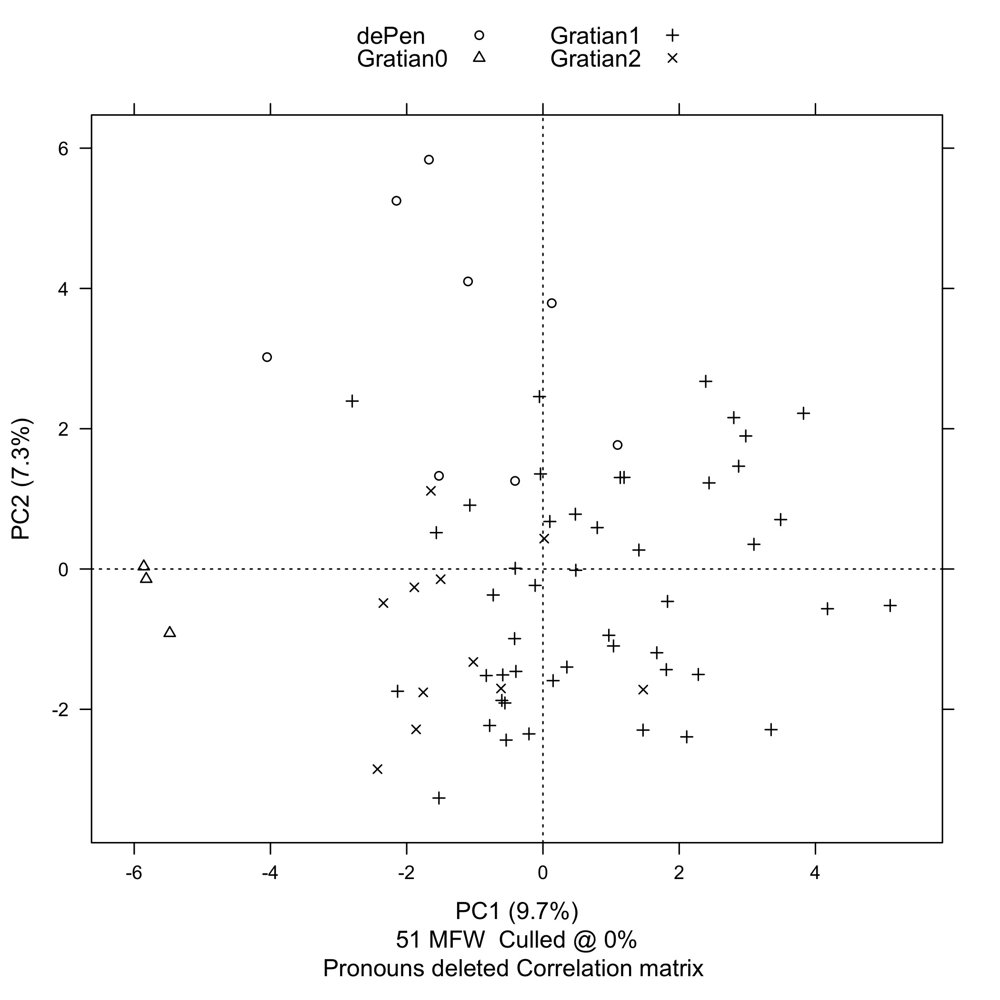

Techniques such as Burrow's and Argamon's Delta (measuring Manhattan
and Euclidean distance respectively), which collapse vector distance
data for an arbitrary number of features or dimensions into a single
scalar value interpreted as a nearest-neighbor classification metric,
are one way of reducing feature distances to a tractable form.
Principal component analysis (PCA) is an alternative to Delta metrics
that projects vector distance information for numbers of features
greater than three into a two- or three- dimensional space for
convenient visualization. PCA therefore has the advantage that it
entails less loss of information than the Delta class of techniques
that reduce data for all dimensions to a single metric.[^pca1]

PCA first combines as many of the raw dimensions as possible into
synthetic components on the basis of strong correlations, either
positive or negative. For example, referring back to Figures 0a and
0b in the two-dimensional visualization section above, the two
dimensions of the plot could be collapsed into a single axis or
component that can be thought of as representing the frequency with
which *in* does, and *non* does *not*, occur in a given sample.
The effect would be to reconfigure the plots in such a way that the
samples representing the *dicta* from *de Penitentia* (dePen), the
first-recension *dicta* (Gratian1), and the second-recension *dicta*
(Gratian2) would be placed from left to right along a single
horizontal axis. PCA then displays the two components that contribute
the most to the total variation between the samples, and graphically
arranges the samples according to their probability relative to
those two components.[^pca2]

I used the Stylometry with R (stylo) package for computational text
analysis developed by Maciej Eder, Jan Rybicki, and Mike Kestemont
of the Computational Stylistics Group to generate all of the PCA
plots in this section.[@stylo] R is a statistically-oriented
programming language.[@R] In addition to his being one of the lead
developers of the stylo R package, Kestemont is a researcher whose
stylometric analysis of two visionary texts of Hildegard of Bingen
was a useful example for this project.[^pca5]

Stylometric analysis for the purpose of authorship attribution rests
on the frequencies of occurrence of function words including
conjunctions. It is therefore essential to properly account for the
frequencies of enclitics endings representing conjunctions. Each
word in the samples ending with -*que* where the ending represents
an enclitic being used as a conjunction and is not simply part of
the word has been mapped to a two-word sequence consisting of the
word plus the pseudo-conjunction *xque*.[^pca6] Other Latin enclitic
endings such as -*ne* and -*ve* occur infrequently enough in the
samples that they can be disregarded for the purpose of pseudo-conjunction
mapping.

Figure 1 below shows the PCA plot generated by a four-way comparison
of the same samples used in the demonstration of Burrows's Delta
in the previous section: the hypothetical case statements or *themata*
(Gratian0)[^pca7], the first-recension *dicta* excluding the *dicta*
from *de Penitentia* (Gratian1), first- and second-recension *dicta*
from *de Penitentia* (dePen), and the second-recension *dicta*
excluding the *dicta* from *de Penitentia* (Gratian2). The case
statements are magenta (△), the first-recension *dicta* are green
(+), the *dicta* from *de Penitentia* are blue (○), and the
second-recension *dicta* are red (×). Each of the texts has been
divided into 1200-words samples. Principal component 1 along the
horizontal axis is 10.3%. Principal component 2 along the vertical
axis is 7.2%. That is, PC1 explains 10.3% of the total variation
between the samples, and PC2 explains 7.2% of the total variation
between the samples. This is good: as a general rule, we want to
see a value for PC1 greater than 10% and we want to see a value for
PC2 greater than 5%. The most visually striking aspect of this plot
is the fact that the case statements are so far away from the
*dicta*, and the next step is to take a look at which features
produce that effect.

```
------------------------------------------------
features (e.g. frequent words) actually analyzed
------------------------------------------------

  [1]  in       et       non      de       quod     ad       sed      uel
  [9]  unde     si       ut       a        autem    cum      ex       enim
 [17]  uero     etiam    ab       ergo     quia     item     per      nec
 [25]  an       sicut    ita      nisi     tamen    pro      quam     sic
 [33]  quo      sine     aut      licet    post     contra   siue     quoque
 [41]  ante     ne       inter    super    atque    dum      apud     postea
 [49]  ideo     propter  ecce     quomodo
```


Turning on the stylo feature loadings option lets us see how strongly
particular words influence the placement of text samples along the
PC1 and PC2 axes; this is called the feature's discriminative
strength. (See Figure 2 below.) For example, *sed* and *non* are
located toward the right (positive) end of the PC1 axis, while *an*
and *si* are located toward the left (negative) end of the PC1 axis.
Similarly, *uel* and *uero* are located toward the upper (positive)
end of the PC2 axis, while *quomodo* is located toward the lower
(negative) end of the PC2 axis. As we will see immediately below,
*an* and *si* are closely associated with the hypothetical case
statements (*themata*), while *quomodo* is closely associated with
the first- and second-recesion *dicta* from *de Penitentia*.


In the initial function word counting experiment, *non*, the second
most common word in the samples, was strongly associated with the
first-recension *dicta*.[^ple1] In Figure 2, *non* appears far to the
right, and in fact the samples from the first-recension *dicta*,
but not those from the second-recension *dicta*, tend to spread out
to the right. Note however that *in*, the most common word in the
samples, is fairly close to the middle. To the extent then that
*in* is more strongly associated with the second-recension than the
first-recension *dicta*, it is a result of the fact that the word
occurs less frequently in the first-recension *dicta* rather than
that it occurs more frequently in the second-recension *dicta*.

The most visually striking feature of the function loadings plot
in Figure 2 is the degree to which *an* and *si* cluster with the
case statements, *an* very strongly so, *si* somewhat less strongly.
This makes intuitive sense because indirect questions dominate the
language of the case statements. It is a question of genre. There
are two possible ways in which we might go about controlling for
the vocabulary characteristic of the question genre in
the *themata*: by editing the Gratian0 sample to remove the passages
containing indirect questions from each of the case statements, and
by editing the list of function words used by stylo to conduct the
analysis to exclude individual words characteristic of indirect
questions.

The case statements all follow a very regular formal pattern. They
are introduced by a hypothetical narrative that is followed by an
enumeration of the questions that Gratian wants to investigate.
C.27 d.init. (chosen for this purpose because it is the shortest
case statement) demonstrates the pattern:

> *Quidam uotum castitatis habens desponsauit sibi uxorem; illa
priori condicioni renuncians, transtulit se ad alium, et nupsit
illi; ille, cui prius desponsata fuerat, repetit eam. Hic primum
queritur, an coniugium possit esse inter uouentes? Secundo, an
liceat, sponsae a sponso recedere, et alii nubere?*[^pca8]

The transition between the narrative section and the enumeration
of questions is clearly signalled in each of the case statements
by the use of one of a small number of formulaic markers, of which
*Hic primum queritur* is the most common.[^pca9]

The results, however, of running principal component analysis (PCA)
after removing the enumerated questions from the cases statements
(all other samples remaining unchanged) are inconclusive, with PC1
under 10% for both the three- and four-way comparisons. (See Figures
4 and 5 below.) This probably because at 1,618 words, the Gratian0
*sine questionibus* sample is too far under the approximately
2,500-word minimum recommended for analysis of Latin prose.

The remaining alternative is to edit the list of function words used
by stylo to conduct its analysis so that it excludes individual words
characteristic of indirect questions, starting with the words *an*
and *si* suggested by the stylo feature loadings.

The frequency of occurrence of the word *an* in the Gratian0 sample
representing the thirty-six hypothetical case statements (*themata*)
is a remarkably high 39.1123 occurrences per 1,000 words. By way
of comparison, the mean frequency of occurrence of *an* across the
three samples representing the first-recension *dicta* excluding
*de Penitentia* (Gratian1), the first- and second-recension *dicta*
from *de Penitentia* (dePen), and the second recension *dicta*
(Gratian2) is 1.3815 occurrences per 1,000 words with a sample
standard deviation of 0.5011. The frequency of occurrence of *an*
in the Gratian0 sample is therefore 75.2996 standard deviations
away from the mean frequency of occurrence of the same word in the
Gratian1, dePen, and Gratian2 samples. The frequency of occurrence
of the word *si* in the Gratian0 sample, on the other hand, is
14.4244 occurrences per 1,000 words. Given that the mean frequency
of occurrence of *si* across the Gratian1, dePen, and Gratian2
samples is 9.2665 occurrences per 1,000 words and that the sample
standard deviation is 2.6245, the frequency of occurrence of *si*
in the Gratian0 sample is far less of an outlier at 1.9653 standard
deviations away from the mean than *an* was.

**[Revised/Updated down to here!!!]**

**[Remove *an*, leave *si* in!!!]**

We've now reached the final stage of the three-way comparison between
the case statements, the first-recension *dicta*, and the
second-recension *dicta*. We are now using the 49 most frequent
words on our function list instead of the 51 most frequent words,
having commented out *an* and *si*. And even without *an* and
*si*, PC1 still explains 10.5% of the total variation between the
samples, down slightly from 11.2%. PC2 still explains 7.3% of the
total variation between the samples. So, even controlling for genre,
the distance between the case statements and the *dicta*---both
first- and second-recension---is still quite striking.

```
------------------------------------------------
features (e.g. frequent words) actually analyzed
------------------------------------------------

  [1]  in       et       non      de       quod     ad       sed      uel
  [9]  unde     si       ut       a        autem    cum      ex       enim
 [17]  uero     etiam    ab       ergo     quia     item     per      nec
 [25]  sicut    ita      nisi     tamen    pro      quam     sic      quo
 [33]  sine     aut      licet    post     contra   siue     quoque   ante
 [41]  ne       inter    super    atque    dum      apud     postea   ideo
 [49]  propter  ecce     quomodo
```



---

To turn to the other interesting aspect of the three-way comparison,
you'll note that the second-recension *dicta* in blue cluster
strongly to the upper-left quadrant. Now, Mike Witmore, a member
of my dissertation committee who isn't an insider with respect to
debates about Gratian's *Decretum*, but is very experienced in the
use of stylometry with the plays of Shakespeare, was somewhat
optimistic on the basis of this evidence that the first- and
second-recension *dicta* might be statistically distinguishable.


So, in an attempt to take a closer look at the *dicta* by themselves,
I removed the case statements and ran a two-way comparison of
1000-word samples of just the first- and second-recension *dicta*,
again, excluding the *dicta* from *de Penitentia*. (Stylo changes
the color assignments depending on the number of samples, so in
this plot the first-recension *dicta* are red and the second-recension
*dicta* are green.) And the results are ambiguous. The PC1 axis is
9%, somewhat under the 10% threshold we would like to see. Also,
although we see the second-recension *dicta* clustering mostly to
the right of the PC1 axis, the two sets of samples are not separated
as cleanly as we'd like to see, and certainly nowhere near as cleanly
as the case statements were from the *dicta*.


All of the slides we've seen so far exclude the *dicta* from *de
Penitentia*, so before moving on to my conclusion, I do want to
quickly show you what the results look like when we include the
first-recension *dicta* from *de Pen.* (there are not enough words
in the second-recension *dicta* in *de Pen.* to be statistically
significant---9,525 vs. 556). Many scholars have observed that
*dicta* and canons are poorly separated in *de Pen.* I believe that
the unusual dispersion of the samples that you see in this plot is
a result of that feature.

## Conclusion

Principal component analysis (PCA) of the frequencies of function
words (prepositions and conjunctions) in the texts strongly suggests
that the author of the case statements was not the same person as
the authors of either the first- or second-recension *dicta*. PCA
also suggests (less strongly) that the first- and second-recension
*dicta* were not the work of either one or two authors, but are
more likely to have been the product of collaborative authorship.

On Monday, Anders presented a sketch of what a stemma for the first
recension might look like. It suggested that the textual transmission
was far more complicated than we may have imagined (or at least may
have hoped for). The results I've presented here today suggest that
the question of authorship is potentially as complicated as the
question of transmission. I believe that there is enough evidence
at least to question assumptions of monolithic authorships (of
either the one Gratian or two Gratians variety). If we cannot
satisfactorily answer the question "was there one Gratian or were
there two?" it is probably because that is not the right question
to ask.

### Temporary appendix

**[Update Figures 4 and 5 to use the same samples as the other PCA
plots in this section!!!]**


[^pca1]: Earlier versions of this section were presented as conference
papers. "Can Stylometry Provide New Evidence about the Identity of
Gratian 1 and Gratian 2?", was presented to the session on Canon
Law in the Twelfth and Thirteenth Centuries at the *Rem non novam
nec insolitam aggredimur* conference and grand opening of the Stephan
Kuttner Institute of Medieval Canon Law at Yale Law School, May
21-22, 2015. [Greta Austin, Thomas Bisson, Uta-Renate Blumenthal,
Bruce Brasington, Melodie Eichbauer, Richard Helmholz, Eric Knibbs,
Peter Landau, Kenneth Pennington, Edward Peters (University of
Pennsylvania), Robert Somerville, and Anders Winroth.] "New evidence
for the authorship of case statements and *dicta* in Gratian's
*Decretum*" was presented to the Classical Sources III session at
the Fifteenth International Congress of Medieval Canon Law (ICMCL)
at Université Paris II Panthéon-Assas, July 17-23, 2016. [Gero
Dolezalek, Anders Winroth (session chair).]

[^pca2]: For a general introduction to the use of principal component
analysis (PCA) in literary stylometric analysis, see @craig_stylistic_2004
and Chapter 6 "Style" in @jockers_macroanalysis_2013.

[^pca5]: See @kestemont_abstract_2013; and @kestemont_collaborative_2015.
Kestemont was very generous in his technical advice during the early
stages of this project.

[^pca6]: Following the example of @kestemont_collaborative_2015 [205]:
"To automatically isolate the clitic, we have stripped the
suffix ('x*que*') from every word that did not occur in a list of
words proposed by Schinke *et al*. (1996, p. 180-1)."

    The list of words appears in @schinke_stemming_1996. Schinke's
    article was published in a hard-to-find journal. The article
    is frequently referenced (55 citations in Google Scholar as of
    18 March 2021), but I was unable to obtain a copy. My information
    about Schinke's stemming algorithm and pass list comes indirectly
    via @porter_schinke_nodate.

    In the case statements, 1st-, and 2nd-recension *dicta* from
    Gratian's *Decretum*, there are 747 occurrences of 79 unique
    words ending in -*que*. (This does not count 423 occurrences
    of the word *que* itself.) Of those, 498 are occurrences of 19
    unique words from Schinke's 54-word pass list, while 249
    occurrences of 60 unique words are not. It is from these 249
    words that, according to Schinke, the -*que* ending should be
    detached as an enclitic.

    However, the 249 words include 72 occurrences of 17 unique words
    ending with the adverbial enclitics -*cumque* or -*cunque*,
    from which the -*que* ending should not be detached. The 249
    words also include a further 149 occurrences of 21 unique false
    positives:

    cumque, eque (aeque), namque, pleraque, plerique, plerisque,
    plerumque, quinque, unamquamque, unaqueque, unicuique,
    uniuscuiusque, unumquemque, unusquisque, usquequaque, utramque,
    utraque, utrique, utrisque, utriusque, utrumque.

    This leaves only 28 occurrences of 22 unique words from which
    the -*que* ending should actually be detached as an enclitic.

    False positives over-represent the frequency of occurrence of
    the -*que* enclitic as a conjunction by an order of magnitude.
    Including all false positives makes *xque* the 37th most frequent
    word in the sample, while excluding them makes it the 376th
    most frequent word. There are 55 occurrences of the word
    *namque*, the most frequently occurring false positive.
    Detaching the -*que* ending from *namque* overstates the
    frequency of *nam*, making what is actually the 480th most
    frequent word appear to be the 130th, while making *namque*,
    which is actually the 176th most frequent word in the samples
    when false positives are excluded, disappear from the list
    altogether.

[^pca7]: As noted in the previous two-dimensional visualization
section, the Gratian0 sample containing the hypothetical case
statements or *themata* includes a thirteen-word clause added to
C.19 d.init. between the first and second recensions of the *Decretum*.
None of the wordlists used to perform principal component analysis
include any of those thirteen words, so using the text of C.19
d.init. found in the Friedberg edition rather than a proxy
first-recension version of the text has no effect on the outcome
of any of the tests performed in this section.

[^pca8]: A man having [made] a vow of chastity betrothed a wife to
himself; she, renouncing her previous agreement, gave herself to
another and married him; he to whom she had been first betrothed
tried to get her back. Here it is first asked whether there is able
to be a marriage between those vowing? Second, whether someone
betrothed is allowed to abandon the person to whom they are betrothed
and to marry another?

[^pca9]: The formulaic transition markers used in the hypothetical
case statements are: *Hic primum queritur* (15), *Queritur* (8),
*Modo primum queritur* (3), *Nunc primum queritur* (3), *Primo
queritur* (2), *Primum queritur* (2), *Hic primo queritur* (1),
*Modo queritur* (1), *Queritur autem* (1).

[^ple1]: **PLE**: This is true if only the first- and second-recension
*dicta* are counted. If the case statements, the first- and
second-recension *dicta*, and the *dicta* from *de Penitentia* are
counted, *in* is the most frequent word, *et* is the second most
frequent word, and *non* is the third most frequent word.
