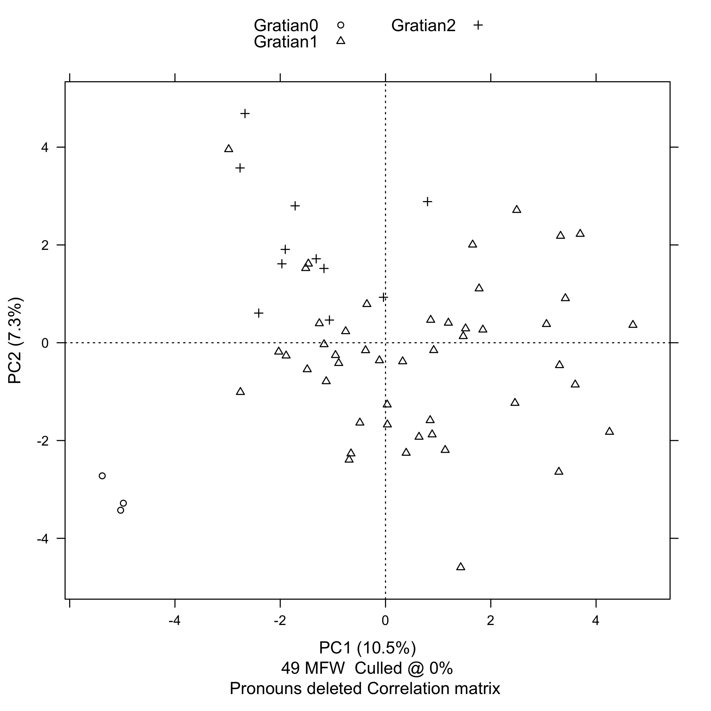
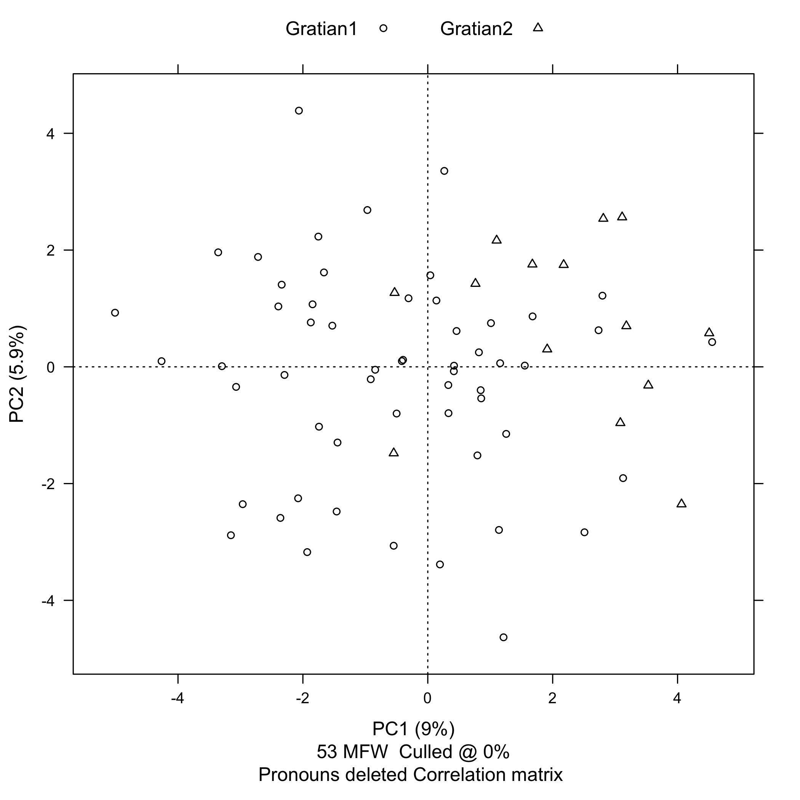

But increasing the number of function words also introduces a new
problem. We were able to represent our stylometric analysis of the
frequency of *in* and *non* in the samples from the first- and
second-recension *dicta* on a two-dimensional graph. But there will
be as many dimensions on the graph as there are function words for
which we collect data. And because human beings are not good at
visualizing quantitative data in more than three dimensions, we
need to find a way to reduce the number of dimensions. This is where
the technique of principal component analysis, or PCA, becomes
useful.[^16]

PCA first combines as many of the raw dimensions as possible into
synthetic components on the basis of strong correlations, either
positive or negative. For example, going back to the data on the
frequencies of *in* and *non* in the first- and second-recension
*dicta*, the two dimensions of the graph could be collapsed into a
single component that could be thought of as representing the
probability that *in* will, and that *non* will *not*, occur
in a given sample. (And this is, in fact, what the software that
I'm using for this project does.)

Finally, PCA displays the two components that contribute the most
to the total variation between the samples, and graphically arranges
the samples according to their probability relative to those two
components.

For the case statements, I simply used the text from the vulgate
*Decretum* as it appears in the Friedberg edition.[^19]

Because stylometric analysis for authorship attribution depends on
the frequencies of prepositions and conjunctions, it is important
to include enclitics substituting for conjunctions. Every word in
the samples with a -*que* ending that is actually an enclitic, and
not just part of the word, has been mapped to the word plus the
pseudo-conjunction *xque*.[^20]

Now that we have the preliminaries out of the way, we can take a
look at the results. I used the stylo R package to generate all of
the plots that I'm going to show you today. [@stylo] R is a statistical
programming language. [@R] Mike Kestemont, Maciej Eder, and Jan
Rybicki of the Computational Stylistics Group developed the package,
and Mike Kestemont in particular has been very generous in his
technical advice for this project.


```
------------------------------------------------
features (e.g. frequent words) actually analyzed
------------------------------------------------

  [1]  in       et       non      de       quod     ad       sed      uel
  [9]  unde     si       ut       a        autem    cum      ex       enim
 [17]  uero     etiam    ab       ergo     quia     item     per      nec
 [25]  an       sicut    ita      nisi     tamen    pro      quam     sic
 [33]  quo      sine     aut      licet    post     contra   siue     quoque
 [41]  ante     ne       inter    super    atque    dum      apud     postea
 [49]  ideo     propter  ecce     quomodo
```

Here is the plot of a three-way comparison between the case statements,
the first-recension *dicta*, and the second-recension *dicta*,
excluding the *dicta* from *de Penitentia*. The case statements are
red, the first-recension *dicta* are green, and the second-recension
*dicta* are blue. Each of the texts has been divided into 1200-words
samples. Principal component 1, along the horizontal axis is 11.2%.
Principal component 2, along the vertical axis is 7.3%. That is,
PC1 explains 11.2% of the total variation between the samples, and
PC2 explains 7.3% of the total variation between the samples. This
is good: as a general rule, we want to see a value for PC1 greater
than 10% and we want to see a value for PC2 greater than 5%. The
most striking feature of this plot is the fact that the case
statements are so far away from the *dicta*, and the next step is
to take a look at which function words are producing that effect.


Turning on the stylo feature loadings option lets us see how strongly
particular words influence the placement of text samples along the
PC1 and PC2 axes. This is called the feature's discriminative
strength. For example, we see that *sed* and *non* are way out on
the right of the PC1 axis, while *unde* is way down at the bottom
of the PC2 axis.

Remember that in our first experiment with counting function words,
*non*, the second most common word in the samples, was strongly
associated with the first-recension *dicta*. Here we see *non*
on the far right, and in fact the samples from the first-recension
*dicta* (but not from the second-recension *dicta*) tend to spread
out to the right. Note also that *in*, the most common word in
the samples, is actually pretty close to the middle. So, it's not
so much that the second-recension *dicta* have more occurrences of
*in*, it's that the first-recension *dicta* have fewer.

What is really interesting here is that *an* and *si* cluster
with the case statements, *an* very strongly, *si* somewhat
less so. This makes sense because indirect questions dominate the
language of the case statements. It is a question of genre. So the
next step in the stylometric analysis is to control for genre by
removing the question words *an* and *si* from the list of
function words.



We've now reached the final stage of the three-way comparison between
the case statements, the first-recension *dicta*, and the
second-recension *dicta*. We are now using the 49 most frequent
words on our function list instead of the 51 most frequent words,
having commented out *an* and *si*. And even without *an* and
*si*, PC1 still explains 10.5% of the total variation between the
samples, down slightly from 11.2%. PC2 still explains 7.3% of the
total variation between the samples. So, even controlling for genre,
the distance between the case statements and the *dicta*---both
first- and second-recension---is still quite striking.


To turn to the other interesting aspect of the three-way comparison,
you'll note that the second-recension *dicta* in blue cluster
strongly to the upper-left quadrant. Now, Mike Witmore, a member
of my dissertation committee who isn't an insider with respect to
debates about Gratian's *Decretum*, but is very experienced in the
use of stylometry with the plays of Shakespeare, was somewhat
optimistic on the basis of this evidence that the first- and
second-recension *dicta* might be statistically distinguishable.



So, in an attempt to take a closer look at the *dicta* by themselves,
I removed the case statements and ran a two-way comparison of
1000-word samples of just the first- and second-recension *dicta*,
again, excluding the *dicta* from *de Penitentia*. (Stylo changes
the color assignments depending on the number of samples, so in
this plot the first-recension *dicta* are red and the second-recension
*dicta* are green.) And the results are ambiguous. The PC1 axis is
9%, somewhat under the 10% threshold we would like to see. Also,
although we see the second-recension *dicta* clustering mostly to
the right of the PC1 axis, the two sets of samples are not separated
as cleanly as we'd like to see, and certainly nowhere near as cleanly
as the case statements were from the *dicta*.


All of the slides we've seen so far exclude the *dicta* from *de
Penitentia*, so before moving on to my conclusion, I do want to
quickly show you what the results look like when we include the
first-recension *dicta* from *de Pen.* (there are not enough words
in the second-recension *dicta* in *de Pen.* to be statistically
significant---9,525 vs. 556). Many scholars have observed that
*dicta* and canons are poorly separated in *de Pen.* I believe that
the unusual dispersion of the samples that you see in this plot is
a result of that feature.

## Conclusion

Principal component analysis (PCA) of the frequencies of function
words (prepositions and conjunctions) in the texts strongly suggests
that the author of the case statements was not the same person as
the authors of either the first- or second-recension *dicta*. PCA
also suggests (less strongly) that the first- and second-recension
*dicta* were not the work of either one or two authors, but are
more likely to have been the product of collaborative authorship.

On Monday, Anders presented a sketch of what a stemma for the first
recension might look like. It suggested that the textual transmission
was far more complicated than we may have imagined (or at least may
have hoped for). The results I've presented here today suggest that
the question of authorship is potentially as complicated as the
question of transmission. I believe that there is enough evidence
at least to question assumptions of monolithic authorships (of
either the one Gratian or two Gratians variety). If we cannot
satisfactorily answer the question "was there one Gratian or were
there two?" it is probably because that is not the right question
to ask.

[^1]: Earlier versions of this chapter were presented as conference
papers. "Can Stylometry Provide New Evidence about the Identity of
Gratian 1 and Gratian 2?", was presented to the session on Canon
Law in the Twelfth and Thirteenth Centuries at the *Rem non novam
nec insolitam aggredimur* conference and grand opening of the Stephan
Kuttner Institute of Medieval Canon Law at Yale Law School, May
21-22, 2015. "New evidence for the authorship of case statements
and *dicta* in Gratian's *Decretum*" was presented to the Classical
Sources III session at the Fifteenth International Congress of
Medieval Canon Law (ICMCL) at Université Paris II Panthéon-Assas,
July 17-23, 2016.

[^16]: For a general introduction to the use of principal component
analysis (PCA) in literary stylometric analysis, see @craig_stylistic_2004
and Chapter 6 "Style" in @jockers_macroanalysis_2013.

[^19]: **This is perhaps not entirely satisfactory. It would be
more methodologically consistent with the way in which the samples
of the first-recension dicta were prepared to apply the differences
found in Winroth's appendix to the case statements as well, however
the differences are quite minimal. The only case statement (*thema*)
for which Winroth notes a textual difference is C.19 d.init.
(Winroth, 216). The first-recension version of the text omits a
13-word clause added to the second recension version, seemingly for
the purpose of piling up descriptive detail. (*unus relicta propria
ecclesia eo inuito, alter dimissa regulari canonica cenobio se
contulit*). None of the wordlists used to perform the principal
component analyses include any of these 13 words, so the use of the
vulgate rather than a proxy first-recension version of the text of
C.19 d.init. has no effect on the outcome of these tests.**

[^20]: In the case statements, 1st-, and 2nd-recension *dicta* from
Gratian's *Decretum*, there are 747 occurrences of 79 unique words
ending in -*que*. (This does not count 423 occurrences of the word
*que* itself.) Of those, 498 are occurrences of 19 unique words
from Schinke's 54-word pass list, while 249 occurrences of 60 unique
words are not. It is from these 249 words that, according to Schinke,
the -*que* ending should be detached as an enclitic.

    However, the 249 words include 72 occurrences of 17 unique words
    ending with the adverbial enclitics -*cumque* or -*cunque*,
    from which the -*que* ending should not be detached. The 249
    words also include a further 149 occurrences of 21 unique false
    positives:

    cumque, eque (aeque), namque, pleraque, plerique, plerisque,
    plerumque, quinque, unamquamque, unaqueque, unicuique,
    uniuscuiusque, unumquemque, unusquisque, usquequaque, utramque,
    utraque, utrique, utrisque, utriusque, utrumque.

    This leaves only 28 occurrences of 22 unique words from which
    the -*que* ending should actually be detached as an enclitic.

    False positives over-represent the frequency of occurrence of
    the -*que* enclitic as a conjunction by an order of magnitude.
    Including all false positives makes *xque* the 37th most frequent
    word in the sample, while excluding them makes it the 376th
    most frequent word. There are 55 occurrences of the word
    *namque*, the most frequently occurring false positive.
    Detaching the -*que* ending from *namque* overstates the
    frequency of *nam*, making what is actually the 480th most
    frequent word appear to be the 130th, while making *namque*,
    which is actually the 176th most frequent word in the samples
    when false positives are excluded, disappear from the list
    altogether.

