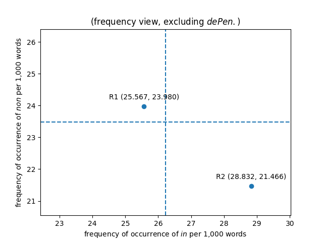
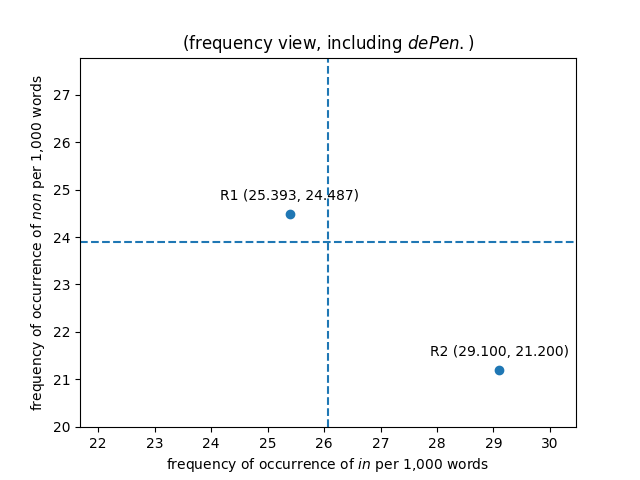
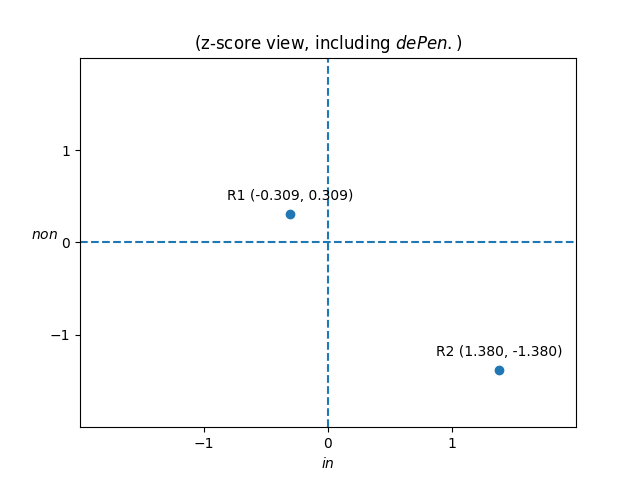

Let's take a first look at how this kind of stylometric analysis
works in practice with some actual data from the first- and
second-recension *dicta*, excluding the *dicta* from *de Penitentia*.[^6]

*In* is the most frequently occurring word in the *dicta*. There
are 1,450 occurrences of *in* out of 56,713 words in the first-recension
*dicta* (2.56%). There are 411 occurrences of *in* out of 14,255
words in the second-recension *dicta* (2.88%). The mean frequency
of occurrence of *in* for the combined first- and second-recension
*dicta* is therefore 1,861 occurrences out of 70,968 words (2.62%).
*In* occurs 2.50% less frequently than the mean in the first-recension
*dicta*, but 9.95% more frequently than the mean in the second-recension
*dicta*. Because the first-recension *dicta* represent 79.9% of the
words in the combined total, we expect first-recension word frequencies
to be much closer to the mean.

*Non* is the second most frequently occurring word in the *dicta*.
There are 1,360 occurrences of *non* in the first-recension *dicta*
(2.40%). There are 306 occurrences of *non* in the second-recension
*dicta* (2.15%). The mean frequency of occurrence of *non* for the
combined first- and second-recension *dicta* is therefore 1,666
occurrences out of 70,968 words (2.35%). *Non* occurs 2.15% more
frequently than the mean in the first-recension *dicta*, but 8.56%
less frequently than the mean in the second-recension *dicta*.

**Fix: 13% for *in* and 12% for *non* are significant variations
for such common words---it's not like we're talking about low-frequency
words where a small difference in the count can make for a big
difference in percentage.**

We could graph the number of occurrences of *in* and *non* per 1,000
words of the two samples (from the first- and second-recension
*dicta*), with the frequency of *in* plotted along the horizontal
axis, and the frequency of *non* plotted along the vertical axis,
and we would have a simplified visualization of the total variation
between the two samples. 

Figure 0a introduces several conventions common to 2-dimensional
graphical representations of word frequency data that the reader
will encounter throughout this chapter. The feature (in this case
the frequency of occurrence of the word *in*) that explains more
of the variation between the samples is plotted along the horizontal
x-axis, while the feature (in this case the frequency of occurrence of
the word *non*) that explains less of the variation between the
samples is plotted along the vertical y-axis. Although this plot,
produced by the Matplotlib Python 2-dimensional plotting library,
is rectangular and the axes are approximately to scale, most of the
figures in this chapter were generated using stylo, an R package
for stylometric analysis, which outputs square plots. The reader
should always bear in mind that the area plotted is wider than it
is tall, that is, that it displays greater variation between samples
horizontally along the x-axis than it does vertically along the
y-axis.

Figure 0a also represents the axes as orthogonal (perpendicular)
to one another. Although doing so is acceptable as a first-order
approximation in a simplified representation of this kind, plotting
the values along orthogonal axes imports an implicit assumption
that the word frequencies (in this case, of *in* and *non*) are
completely independent of one another, i.e., that there is no
correlation or covariance relationship between the words' frequency
of occurrence in the samples. This is not necessarily the case, and
more advanced tools and techniques introduced below will deal with
this problem in a more sophisticated way.

Figure 0b introduces a more statistically-informed way of measuring
the variation or distance between samples. This involves calculating
how far the value for a given feature in a sample is from the mean
value for that feature in all the samples, then dividing that
distance by the standard deviation. (Note that there will be a
different mean and standard deviation for each axis, in this case,
one for the frequency of *in* and another for the frequency of
*non*) For the purpose of this calculation, we use population (rather
than sample) standard deviation, because the data we have represents
the total known population of words attributed to Gratian. The
formula used to calculate the population standard deviation is:

$\sigma=\sqrt{\frac{1}{N}\sum_{i=1}^N(x_i-\mu)^2}$

This somewhat opaque notationally, but not that complicated. (Example
follows)

Distance from a mean divided by standard deviation is referred to
as a z-score: labels on the axes of the plot refer to standard
deviations (values of z) away from the mean (represented by the
dashed lines).

The technique of plotting word frequency data by z-score is known
as Burrows's Delta, after John F. Burrows (†.2019) of the University
of Newcastle, Australia, who first proposed it in 2001. It has the
advantage of making the statistical significance of plotted data
apparent in a way that plotting raw frequency data does not. Burrows's
Delta is one of a number of distance methods of authorship attribution,
but has the specific advantage of being widely accepted in the
scholarly literature of the field of computational linguistics.

Figure 0c not needed?

Now, we are obviously not going to make an attribution of authorship
based on the frequencies of only two function words. Note, however,
that the z-score plot for *in*/*non* frequency data including *de
Pen.* places the second-recension *dicta* (labelled R2) at the
coordinates (-1.635, -1.635). A z-score of +/- 1.645 is a critical
value that represents a 90% confidence level that the difference
is not due to random variation between the samples. So even our
first preliminary exploration of word frequency data for the *dicta*
strongly encourages us to look for, and expect to be able to find,
an author signal for the second-recension *dicta* distinguishable
from one for the one for the first-recension *dicta*.

[^6]: **Including the *dicta* from *de Penitentia* skews the results
of the analysis significantly, because out of the 10,081 words of
the vulgate version of the *de Pen.* *dicta*, only 556 were added
or changed between the first and second recensions of the *Decretum*.**

    *In* is the most frequently occurring word in the *dicta*.
    There are 1,682 occurrences of *in* out of 66,238 words in the
    first-recension *dicta* (2.54%). There are 431 occurrences of
    *in* out of 14,811 words in the second-recension *dicta* (2.91%).
    *In* therefore occurs 14.6% more frequently in the second-recension
    *dicta* than it does in the first-recension *dicta*.

    *Non* is the second most frequently occurring word in the
    *dicta*. There are 1,622 occurrences of *non* in the first-recension
    *dicta* (2.45%). There are 314 occurrences of *non* in the
    second-recension *dicta* (2.12%). *Non* therefore occurs 15.5%
    more frequently in the first-recension *dicta* than in the
    second-recension *dicta*.

