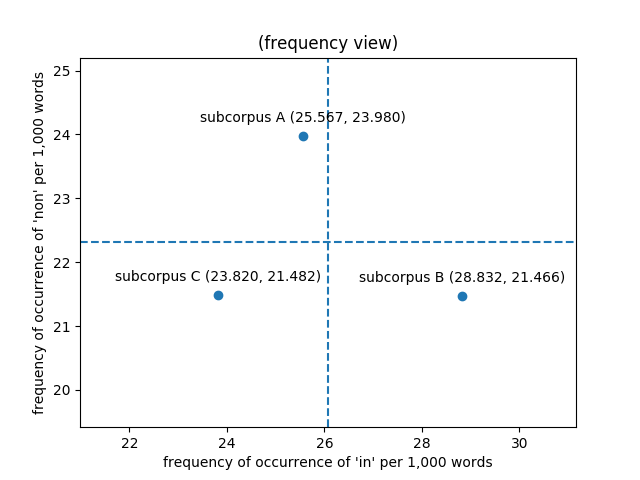
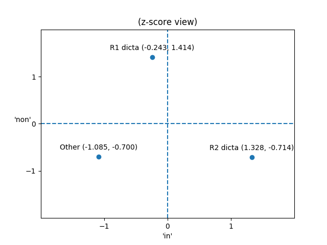

Visualizing data from the *dicta* in a simplified two-dimensional
form is a useful first step toward understanding how stylometric
analysis works in practice. For the purpose of the following
discussion, the *dicta* will be divided into four samples:

+ the hypothetical case statements (*dicta initiales* or *themata*) that introduce the thirty-six cases in Part II of the *Decretum*,
+ the first-recension *dicta* from Parts I and II of the *Decretum*,
+ the first- and second-recension *dicta* from *de Penitentia*, and
+ the second-recension *dicta* from Parts I and II of the *Decretum*.

In the following code, tables, and plots, these four samples will
be labelled Gratian0, Gratian1, dePen, and Gratian2. The Gratian1
and Gratian2 samples, representing the first- and second-recension
*dicta* from Parts I and II of the *Decretum*, were generated
according to the procedure detailed in the preceding section on
corpus preparation.

Although it is theoretically possible to split the text of the
hypothetical case statements (*themata*) and the *dicta* from *de
Penitentia* into separate first- and second-recension samples
following the same procedure used to produce the Gratian1 and
Gratian2 samples, as a practical matter it is not useful to do so.
The only case statement (*thema*) for which Winroth's appendix notes
a textual difference is C.19 d.init.[@winroth_making_2000, 216] The
first-recension version of the text of C.19 d.init. omits a 13-word
clause added to the second recension version, seemingly for the
purpose of piling up descriptive detail. (*unus relicta propria
ecclesia eo inuito, alter dimissa regulari canonica cenobio se
contulit*). Gratian0, the sample containing the cases statements,
is therefore made up of 99.6% first-recension text. Similarly, the
number of words added to the *dicta* in *de Penitentia* between the
first and second recensions is relatively minimal, 556 words out
of a total of 10,081 words; dePen, the sample containing the *dicta*
from *de Penitentia*, is therefore made up of 94.5% first-recension
text.

In addition to plotting a two-dimensional visualization of word
frequency data from the *dicta*, this section will set the stage
for a subsequent one, which introduces an authorship attribution
technique known as Burrows's Delta. Burrows's algorithm calculates
a metric for the distance between a sample of unknown authorship
with a corpus of samples of known authorship. In that discussion,
Gratian0, the sample containing the hypothetical case statements
(*themata*), will be treated as the sample of unknown authorship.
Therefore, the values for means and standard deviations that provide
the basis of comparison between the unattributed sample and the
attributed corpus have to be calculated without taking the values
from Gratian0 into account.

*In* is the most frequently occurring word in the *dicta*. There
are 1,450 occurrences of *in* out of 56,713 words in the first-recension
*dicta* (25.5673 occurrences per 1,000 words), 252 occurrences of
*in* out of 10,081 words in the *dicta* from *de Penitentia* (24.9975
per 1,000), and 411 occurrences of *in* out of 14,255 words in the
second-recension *dicta* (28.8320 per 1,000). It is more convenient
to characterize word frequencies in units of occurrences per 1,000
words than percentage, since at that scale most of the values we
are concerned with are greater than 1.0. The overall mean frequency
of occurrence of *in* for the combined *dicta* from the first
recension, *de Penitentia*, and the second recension is therefore
2,113 occurrences out of 81,049 words or 26.0706 per 1,000. It is
common, however, for authorship attribution algorithms to use the
mean of the mean frequencies of occurrence for each of the samples
rather than the overall mean frequency of occurrence in the corpus
made up of all of the samples. The motivation for using the mean
of means for the individual samples rather than the overall mean
frequency of occurrence is to ensure that largest sample does not
dominate the result. The value for the mean frequency of occurrence
of *in* that will be required at subsequent stages of this
demonstration, then, is the mean of 25.5673, 24.9975, and 28.8320, or
26.4656 occurrences per 1,000.

*Non* is the second most frequently occurring word in the *dicta*.
There are 1,360 occurrences of *non* out of 56,713 words in the
first-recension *dicta* (23.9804 occurrences per 1,000 words), 270
occurrences of *non* out of 10,081 words in the *dicta* from *de
Penitentia* (26.7831 per 1,000), and 306 occurrences of *non* out
of 14,255 words in the second-recension *dicta* (21.4662 per 1,000).
The overall mean frequency of occurrence of *non* for the combined
*dicta* from the first recension, *de Penitentia*, and the second
recension is therefore 1,936 occurrences out of 81,049 words or
23.8868 per 1,000. The mean of the mean frequencies of occurrence
of *non* for each of the samples is the mean of 23.9804, 26.7831,
and 21.4662, or 24.0765 occurrences per 1,000.

---

*In* occurs 2.50% less frequently than the mean in the first-recension
*dicta*, but 9.95% more frequently than the mean in the second-recension
*dicta*. 

*Non* occurs 2.15% more
frequently than the mean in the first-recension *dicta*, but 8.56%
less frequently than the mean in the second-recension *dicta*.

*In* occurring 9.95% more frequently than the mean and *non* occurring
8.56% less frequently than the mean in the second-recension *dicta*
are unexpectedly large variations for such common words. (Such large
variations would be less surprising with uncommon words for which
small differences in count could result in a large differences in
percentage.)

We can graph the number of occurrences of *in* and *non* per 1,000
words in the first- and second-recension *dicta*, with the frequency
of *in* plotted along the horizontal x-axis, and the frequency of
*non* plotted along the vertical y-axis, to produce a simplified
visualization of the total variation between the two. Means are
provided for context: the vertical dashed line represents the mean
for the horizontal (*in*) axis, and the horizontal dashed line
represents the mean for the vertical (*non*) axis.

Figure 0a introduces several conventions common to two-dimensional
graphical representations of word frequency data that readers will
encounter repeatedly throughout this chapter. The feature (in this
case the frequency of occurrence of the word *in*) that explains
more of the variation between the samples is plotted along the
horizontal x-axis, while the feature (in this case the frequency
of occurrence of the word *non*) that explains less of the variation
between the samples is plotted along the vertical y-axis. Although
this plot, produced by the Matplotlib Python two-dimensional plotting
library, is rectangular and the axes are approximately to scale,
most of the figures in this chapter were generated using stylo, an
R package for stylometric analysis, which outputs square plots.
Regardless of appearance, readers should bear in mind that the area
plotted is wider than it is tall, that is, that it always displays
greater variation between samples horizontally along the x-axis
than it does vertically along the y-axis.

Figure 0a plots the first- and second-recension values (labelled
R1 and R2 respectively), as well as the means (indicated by the
dashed lines), for the frequencies of *in* and *non* per 1,000
words. It is more statistically meaningful, however, to measure and
plot the differences between values and means in units of standard
deviations rather than frequency per 1,000 words. The difference
of a value from the mean divided by standard deviation is referred
to as the value's z-score. A value that has a difference of one
standard deviation from the mean is said to have a z-score of 1.0
or -1.0 depending on whether the value is greater or lesser than
the mean. It is appropriate in this context to use the formula for
population rather than sample standard deviation,[^8] because the
data we have represents the totality of known words attributed to
Gratian. The formula used to calculate the population standard
deviation is:[^a]

$\sigma=\sqrt{\frac{1}{N}\sum_{i=1}^N(x_i-\mu)^2}$

The formula is somewhat daunting notationally, but it is not difficult
to calculate the result. First, we calculate the squared deviations
from the mean for the frequency of *in* in the first-recension
*dicta*:

$(x_1-\mu)^2 = (25.5673 - 26.2231)^2 = (-0.6558)^2 = 0.4300$,

and for the frequency of *in* in the second-recension *dicta*:

$(x_2-\mu)^2 = (28.8320 - 26.2231)^2 = (2.6089)^2 = 6.8064$.

We then sum (as indicated by $\sum$) the two squared deviations
from the mean, divide the sum by their number ($N = 2$), and take
the square root of the quotient:

$\sigma =
\sqrt{\frac{1}{2}(0.4300 + 6.8064)} =
\sqrt{\frac{1}{2}(7.2364)} =
\sqrt{3.6182} =
1.9022$

The units of $\sigma$ are the same as those used to calculate the
mean, in this case, the frequency of occurrence of a word per 1,000
words.

For the frequency of *in* in the first-recension *dicta*:

$z =
\frac{x_1 - \mu}{\sigma} =
\frac{25.5673 - 26.2231}{1.9022} =
\frac{-0.6558}{1.9022} =
-0.3447$

and for the frequency of *in* in the second-recension *dicta*:

$z =
\frac{x_2 - \mu}{\sigma} =
\frac{28.8320 - 26.2231}{1.9022} =
\frac{2.6089}{1.9022} =
1.3716$

Labels on the axes of the plot refer to standard deviations (values
of z) away from the mean (represented by the dashed lines).

The technique of plotting word frequency data by z-score is known
as Burrows's Delta, after John F. Burrows (d.2019) of the University
of Newcastle, Australia, who first proposed the metric in 2001. It
has the advantage of making the statistical significance of plotted
data apparent in a way that plotting raw frequency data does not.
Burrows's Delta is one of a number of distance methods of authorship
attribution, but has the particular advantage of being widely
accepted in the scholarly literature of the field of computational
linguistics.

Figures 0a and 0b represents the axes as orthogonal (perpendicular)
to one another. Although doing so is acceptable as a first-order
approximation in a simplified representation of this kind, plotting
the values along orthogonal axes invokes an implicit assumption
that the word frequencies (in this case, of *in* and *non*) are
completely independent of one another, i.e., that there is no
correlation or covariance relationship between the words' frequency
of occurrence in the samples. This is not necessarily the case, and
an advanced technique introduced below, principal component analysis
(PCA), handles this problem in a more sophisticated way.

Now, we are obviously not going to make an attribution of authorship
based on the frequencies of only two function words.

[^8]: The formula for sample standard deviation is:

    $s=\sqrt{\frac{1}{N-1}\sum_{i=1}^N(x_i-\bar{x})^2}$

[^a]: As of 10 February 2020, there is a bug in the `pstdev()` function
in the standard Python 3 statistics library such that the optional
`mu =` keyword argument to override the value of mean does not work.
Thanks to Saturnino Garcia (University of San Diego Department of
Computer Science) and James Krooskos (UC San Diego Alzheimer's
Disease Cooperative Study) for help reproducing this bug.

    ~~~ {python}
    import math
    import statistics
    def pstdev(data, **kwargs):
        '''Temporary replacement for statistics.pstdev()'''
        mu = None
        if 'mu' in kwargs: mu = kwargs['mu'] # type check: int, float, or None
        if mu == None: mu = statistics.mean(data)
        sum = 0
        for i in range(len(data)):
            sum += (data[i] - mu) ** 2
        return(math.sqrt(sum / len(data)))
    ~~~

