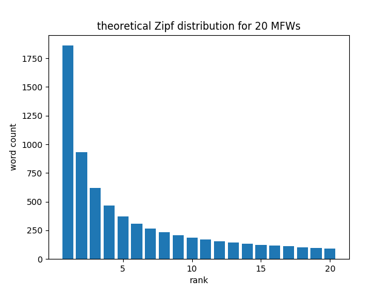
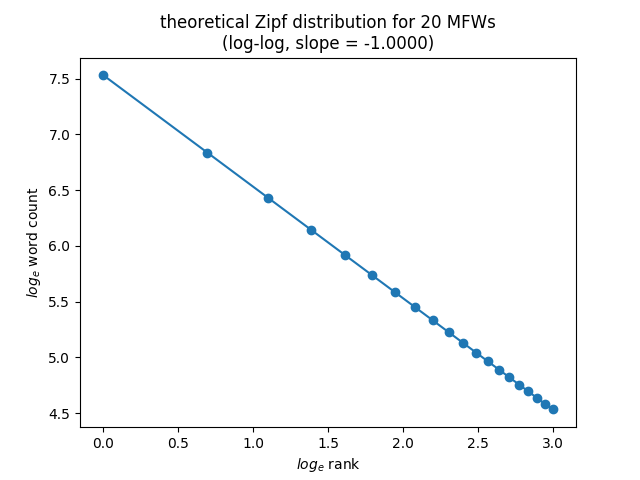
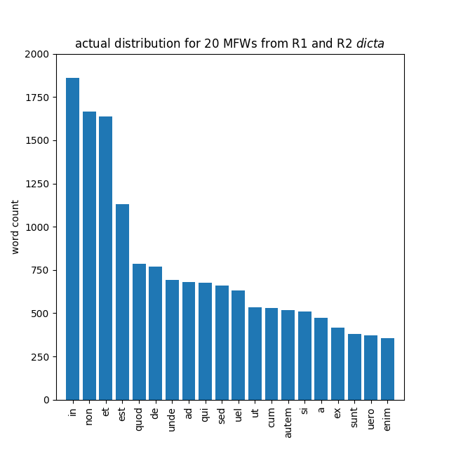
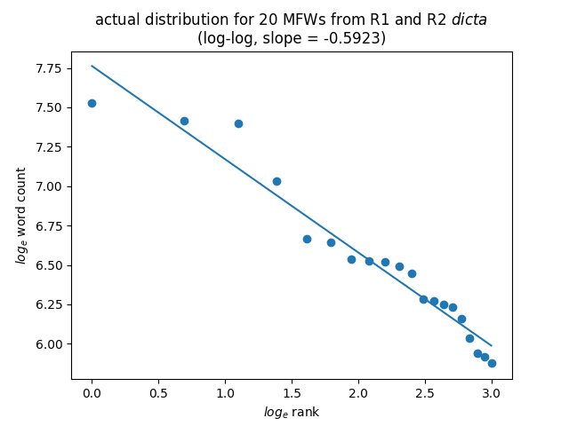

Visualizing data from the first- and second- recension *dicta*
(excluding the *dicta* from *de Penitentia*) in a simplified
two-dimensional form is a useful first step toward understanding
how this kind of stylometric analysis works in practice.[^6]

*In* is the most frequently occurring word in the *dicta*. There
are 1,450 occurrences of *in* out of 56,713 words in the first-recension
*dicta* (2.56%). There are 411 occurrences of *in* out of 14,255
words in the second-recension *dicta* (2.88%). The mean frequency
of occurrence of *in* for the combined first- and second-recension
*dicta* is therefore 1,861 occurrences out of 70,968 words (2.62%).
*In* occurs 2.50% less frequently than the mean in the first-recension
*dicta*, but 9.95% more frequently than the mean in the second-recension
*dicta*. Because the first-recension *dicta* represent 79.9% of the
words in the combined total, we expect first-recension word frequencies
to be much closer to the mean.

*Non* is the second most frequently occurring word in the *dicta*.
There are 1,360 occurrences of *non* in the first-recension *dicta*
(2.40%). There are 306 occurrences of *non* in the second-recension
*dicta* (2.15%). The mean frequency of occurrence of *non* for the
combined first- and second-recension *dicta* is therefore 1,666
occurrences out of 70,968 words (2.35%). *Non* occurs 2.15% more
frequently than the mean in the first-recension *dicta*, but 8.56%
less frequently than the mean in the second-recension *dicta*.

*In* occurring 9.95% more frequently than the mean and *non* occurring
8.56% less frequently than the mean in the second-recension *dicta*
are unexpectedly large variations for such common words. (Such large
variations would be less surprising with uncommon words for which
small differences in count could result in a large differences in
percentage.)

We can graph the number of occurrences of *in* and *non* per 1,000
words in the first- and second-recension *dicta*, with the frequency
of *in* plotted along the horizontal x-axis, and the frequency of
*non* plotted along the vertical y-axis, to produce a simplified
visualization of the total variation between the two. Means are
provided for context: the vertical dashed line represents the mean
for the horizontal (*in*) axis, and the horizontal dashed line
represents the mean for the vertical (*non*) axis.

Figure 0a introduces several conventions common to two-dimensional
graphical representations of word frequency data that readers will
encounter repeatedly throughout this chapter. The feature (in this
case the frequency of occurrence of the word *in*) that explains
more of the variation between the samples is plotted along the
horizontal x-axis, while the feature (in this case the frequency
of occurrence of the word *non*) that explains less of the variation
between the samples is plotted along the vertical y-axis. Although
this plot, produced by the Matplotlib Python two-dimensional plotting
library, is rectangular and the axes are approximately to scale,
most of the figures in this chapter were generated using stylo, an
R package for stylometric analysis, which outputs square plots.
Regardless of appearance, readers should bear in mind that the area
plotted is wider than it is tall, that is, that it always displays
greater variation between samples horizontally along the x-axis
than it does vertically along the y-axis.

Figure 0a plots the first- and second-recension values (labelled
R1 and R2 respectively), as well as the means (indicated by the
dashed lines), for the frequencies of *in* and *non* per 1,000
words. It is more statistically meaningful, however, to measure and
plot the differences between values and means in units of standard
deviations rather than frequency per 1,000 words. The difference
of a value from the mean divided by standard deviation is referred
to as the value's z-score. A value that has a difference of one
standard deviation from the mean is said to have a z-score of 1.0
or -1.0 depending on whether the value is greater or lesser than
the mean. It is appropriate in this context to use the formula for
population rather than sample standard deviation,[^a] because the data
we have represents the totality of known words attributed to Gratian.
The formula used to calculate the population standard deviation is:

$\sigma=\sqrt{\frac{1}{N}\sum_{i=1}^N(x_i-\mu)^2}$

The formula is somewhat daunting notationally, but it is not difficult
to calculate the result. First, we calculate the squared deviations
from the mean for the frequency of *in* in the first-recension
*dicta*:

$(x_1-\mu)^2 = (25.5673 - 26.2231)^2 = (-0.6558)^2 = 0.4300$,

and for the frequency of *in* in the second-recension *dicta*:

$(x_2-\mu)^2 = (28.8320 - 26.2231)^2 = (2.6089)^2 = 6.8064$.

We then sum (as indicated by $\sum$) the two squared deviations
from the mean, divide the sum by their number ($N = 2$), and take
the square root of the quotient:

$\sigma =
\sqrt{\frac{1}{2}(0.4300 + 6.8064)} =
\sqrt{\frac{1}{2}(7.2364)} =
\sqrt{3.6182} =
1.9022$

The units of $\sigma$ are the same as those used to calculate the
mean, in this case, the frequency of occurence of a word per 1,000
words.

For the frequency of *in* in the first-recension *dicta*:

$z =
\frac{x_1 - \mu}{\sigma} =
\frac{25.5673 - 26.2231}{1.9022} =
\frac{-0.6558}{1.9022} =
-0.3447$

and for the frequency of *in* in the second-recension *dicta*:

$z =
\frac{x_2 - \mu}{\sigma} =
\frac{28.8320 - 26.2231}{1.9022} =
\frac{2.6089}{1.9022} =
1.3716$

![Figure 0b updated 10 Feb 2020[^b]](PNGs/Figure_0_z-score_excluding_de_Pen.png)

Labels on the axes of the plot refer to standard deviations (values
of z) away from the mean (represented by the dashed lines).

The technique of plotting word frequency data by z-score is known
as Burrows's Delta, after John F. Burrows (†.2019) of the University
of Newcastle, Australia, who first proposed the metric in 2001. It
has the advantage of making the statistical significance of plotted
data apparent in a way that plotting raw frequency data does not.
Burrows's Delta is one of a number of distance methods of authorship
attribution, but has the particular advantage of being widely
accepted in the scholarly literature of the field of computational
linguistics.

Figures 0a and 0b represents the axes as orthogonal (perpendicular)
to one another. Although doing so is acceptable as a first-order
approximation in a simplified representation of this kind, plotting
the values along orthogonal axes invokes an implicit assumption
that the word frequencies (in this case, of *in* and *non*) are
completely independent of one another, i.e., that there is no
correlation or covariance relationship between the words' frequency
of occurrence in the samples. This is not necessarily the case, and
an advanced technique introduced below, principal component analysis
(PCA), handles this problem in a more sophisticated way.

Now, we are obviously not going to make an attribution of authorship
based on the frequencies of only two function words.

Increasing the number of function words one collects data for
increases the accuracy of the stylometric analysis (up to a point).
The reason that there is a limit to the marginal value of each
additional word included in the analysis is that word frequencies
in a sample of text fall off approximately according to an observed
empirical relationship know as Zipf's law. If the words in a sample
are rank-ordered from most to least frequent, Zipf's laws postulates
that, as a first-order approximation, the frequency of each word
will be 1/N times that of the most frequent word, where N is the
rank.[^7]

[^6]: Including the *dicta* from *de Penitentia* distorts the results
of the analysis, because out of the 10,081 words of the vulgate
version of the *de Pen.* *dicta*, only 556 were added or changed
between the first and second recensions of the *Decretum*.

[^a]: The formula for sample standard deviation is:

    $s=\sqrt{\frac{1}{N-1}\sum_{i=1}^N(x_i-\bar{x})^2}$

[^b]: Is standard deviation measuring anything here other than the
fact that the R1 sample is 3.9785 times the size of the R2 sample?

    $0.3447\times\frac{56713}{14255} = 0.3447\times3.9785 = 1.3756$

[^7]: **Footnote Zipf's law. Provide examples with numbers that
agree with the data for *in* and *non* above. In reality, the word
frequencies for the *dicta* do not appear to drop off nearly as
sharply as Zipf's law (1/N) would predict. I also need to address
the issue that as the wordlist extends downward, the mix shifts
from disproportionately function words to disproportionately content
word. 16 of the first 20 words are function words usable for analysis
(even if I discard *si* for other reasons), but I have to go all
the way down to 240 to get somewhere in the neighborhood of 50
suitable function words for analysis.**

