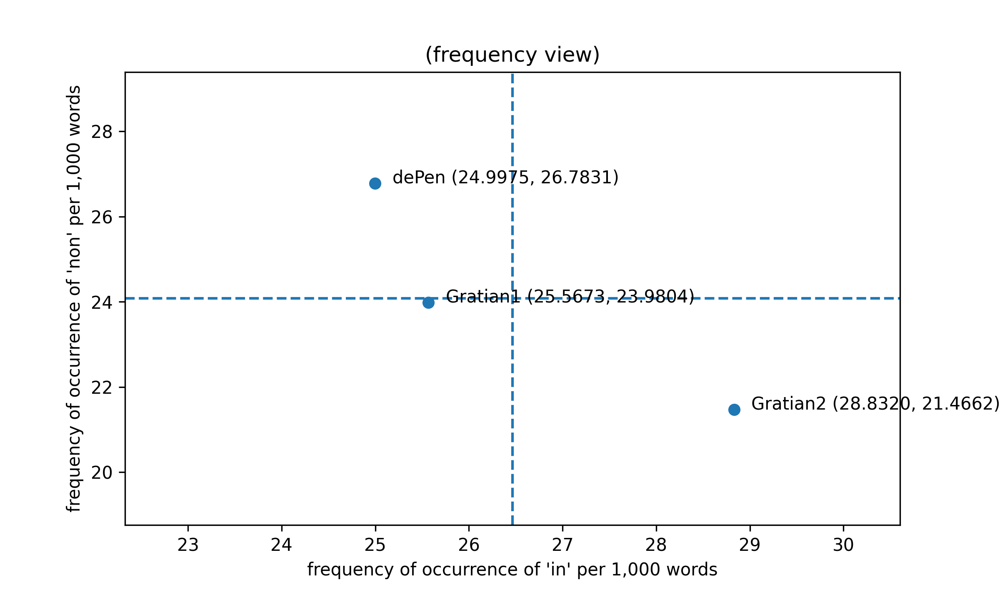

Visualizing data from the *dicta* in a simplified two-dimensional
form is a useful first step toward understanding how stylometric
analysis works in practice. For the purpose of the following
discussion, the *dicta* will be divided into four samples:

+ the hypothetical case statements (*dicta initiales* or *themata*) that introduce the thirty-six cases in Part II of the *Decretum*,
+ the first-recension *dicta* from Parts I and II of the *Decretum*,
+ the first- and second-recension *dicta* from *de Penitentia*, and
+ the second-recension *dicta* from Parts I and II of the *Decretum*.

In the following code, tables, and plots, these four samples will
be labelled Gratian0, Gratian1, dePen, and Gratian2. The Gratian1
and Gratian2 samples, representing the first- and second-recension
*dicta* from Parts I and II of the *Decretum*, were generated
according to the procedure detailed in the preceding section on
corpus preparation.

Although it is theoretically possible to split the text of the
hypothetical case statements (*themata*) and the *dicta* from *de
Penitentia* into separate first- and second-recension samples
following the same procedure used to produce the Gratian1 and
Gratian2 samples, as a practical matter it is not useful to do so.
The only case statement (*thema*) for which Winroth's appendix notes
a textual difference is C.19 d.init.[@winroth_making_2000, 216] The
first-recension version of the text of C.19 d.init. omits a 13-word
clause added to the second recension version, seemingly for the
purpose of piling up descriptive detail. (*unus relicta propria
ecclesia eo inuito, alter dimissa regulari canonica cenobio se
contulit*). Gratian0, the sample containing the cases statements,
is therefore made up of 99.6% first-recension text. Similarly, the
number of words added to the *dicta* in *de Penitentia* between the
first and second recensions is relatively minimal, 556 words out
of a total of 10,081 words; dePen, the sample containing the *dicta*
from *de Penitentia*, is therefore made up of 94.5% first-recension
text.

In addition to plotting a two-dimensional visualization of word
frequency data from the *dicta*, this section will set the stage
for a subsequent one, which introduces an authorship attribution
technique known as Burrows's Delta. Burrows's algorithm calculates
a metric for the distance between a sample of unknown authorship
with a corpus of samples of known authorship. In that discussion,
Gratian0, the sample containing the hypothetical case statements
(*themata*), will be treated as the sample of unknown authorship.
Therefore, the values for means and standard deviations that provide
the basis of comparison between the unattributed sample and the
attributed corpus have to be calculated without taking the values
from Gratian0 into account.

*In* is the most frequently occurring word in the *dicta*. There
are 1,450 occurrences of *in* out of 56,713 words in the first-recension
*dicta* (25.5673 occurrences per 1,000 words), 252 occurrences of
*in* out of 10,081 words in the *dicta* from *de Penitentia* (24.9975
per 1,000), and 411 occurrences of *in* out of 14,255 words in the
second-recension *dicta* (28.8320 per 1,000). It is more convenient
to characterize word frequencies in units of occurrences per 1,000
words than percentage, since at that scale most of the values we
are concerned with are greater than 1.0. The overall mean frequency
of occurrence of *in* for the combined *dicta* from the first
recension, *de Penitentia*, and the second recension is therefore
2,113 occurrences out of 81,049 words or 26.0706 per 1,000. It is
common, however, for authorship attribution algorithms to use the
mean of the mean frequencies of occurrence for each of the samples
rather than the overall mean frequency of occurrence in the corpus
made up of all of the samples. The motivation for using the mean
of means for the individual samples rather than the overall mean
frequency of occurrence is to ensure that largest sample does not
dominate the result. The value for the mean frequency of occurrence
of *in* that will be required at subsequent stages of this
demonstration, then, is the mean of 25.5673, 24.9975, and 28.8320,
or 26.4656 occurrences per 1,000.

*Non* is the second most frequently occurring word in the *dicta*.
There are 1,360 occurrences of *non* out of 56,713 words in the
first-recension *dicta* (23.9804 occurrences per 1,000 words), 270
occurrences of *non* out of 10,081 words in the *dicta* from *de
Penitentia* (26.7831 per 1,000), and 306 occurrences of *non* out
of 14,255 words in the second-recension *dicta* (21.4662 per 1,000).
The overall mean frequency of occurrence of *non* for the combined
*dicta* from the first recension, *de Penitentia*, and the second
recension is therefore 1,936 occurrences out of 81,049 words or
23.8868 per 1,000. The mean of the mean frequencies of occurrence
of *non* for each of the samples is the mean of 23.9804, 26.7831,
and 21.4662, or 24.0765 occurrences per 1,000.

Comparing the frequencies of occurrence of *in* and *non* in the
two outlying samples, dePen and Gratian2, reveals unexpectedly large
variations for such common words. (Large variations would be less
surprising with uncommon words for which small differences in number
could result in a large difference in percentage.) *In* occurs 15.3%
more frequently in Gratian2 than in dePen, and 13.3% less frequently
in dePen than in Gratian2. *Non* occurs 24.8% more frequently in
dePen than in Gratian2, and 19.9% less frequently in Gratian2 than
in dePen. Even compared to the mean, *non*, for example, occurs
11.2% more frequently in dePen and 10.8% less frequently in Gratian2
than the mean of means. It is clear then that against an overall
background of "orderliness" (Zipf) in the word-frequency distribution,
individual samples can display striking and potentially significant
levels of variation.

We can graph the number of occurrences of *in* and *non* per 1,000
words in the *dicta*, with the frequency of *in* plotted along the
horizontal x-axis, and the frequency of *non* plotted along the
vertical y-axis, to produce a simplified visualization of the total
variation between the three samples. Means are provided for context:
the vertical dashed line represents the mean of means for the
horizontal (*in*) axis, and the horizontal dashed line represents
the mean of means for the vertical (*non*) axis.

Figure 0a introduces several conventions common to two-dimensional
graphical representations of word frequency data that readers will
encounter repeatedly throughout this chapter. The feature (in this
case the frequency of occurrence of the word *in*) that explains
more of the variation between the samples is plotted along the
horizontal x-axis, while the feature (in this case the frequency
of occurrence of the word *non*) that explains less of the variation
between the samples is plotted along the vertical y-axis. Although
this plot, produced by the Matplotlib Python two-dimensional plotting
library, is rectangular and the axes are approximately to scale,
most of the figures in this chapter were generated using stylo, an
R package for stylometric analysis, which outputs square plots.
Regardless of appearance, however, readers should bear in mind that
the area plotted is always wider than it is tall, that is, that it
displays greater variation between samples horizontally along the
x-axis than it does vertically along the y-axis.

Figure 0a plots the values for the first-recension *dicta*, the
second-recension *dicta*, the *dicta* from *de Penitentia*, the
second-recension *dicta*, and (labelled Gratian1, dePen, and Gratian2
respectively), as well as the means (indicated by the dashed lines),
for the frequencies of *in* and *non* per 1,000 words. It is more
statistically meaningful, however, to measure and plot the differences
between values and means in units of standard deviations rather
than frequency per 1,000 words. The difference of a value from the
mean divided by standard deviation is referred to as the value's
z-score. A value that has a difference of one standard deviation
from the mean is said to have a z-score of 1.0 or -1.0 depending
on whether the value is greater or lesser than the mean. The formula
used to calculate the sample standard deviation is:

$s=\sqrt{\frac{1}{N - 1}\sum_{i=1}^N(x_i-\bar{x})^2}$

The formula is slightly daunting notationally, but it is not difficult
to use it to calculate the desired results. The example immediately
below shows all of the intermediate steps involved in using the
formula to compute the sample standard deviation of the frequency
of occurrence of the word *in* in the Gratian1, dePen, and Gratian2
samples. (The motivated reader can use a calculator to repeat the
process for the frequency of occurrence of the word *non*.) Remember
that for the purpose of calculating sample standard deviation, the
value of the mean ($\bar{x}$) is **not** the overall mean frequency
of occurrence of the word *in* across all of the samples, but the
mean of the frequencies for each of the samples individually (the
mean of means).

First, calculate the squared deviations from the mean of means for
the frequency of *in* in the first-recension *dicta* (Gratian1):

$(x_1-\bar{x})^2 = (25.5673 - 26.4656)^2 = (-0.8983)^2 = 0.8069$,

for the frequency of *in* in the *dicta* from *de Penitentia* (dePen):

$(x_2-\bar{x})^2 = (24.9975 - 26.4656)^2 = (-1.4681)^2 = 2.1553$,

and for the frequency of *in* in the second-recension *dicta* (Gratian2):

$(x_3-\bar{x})^2 = (28.8320 - 26.4656)^2 = (2.3664)^2 = 5.5998$.

Then, as indicated by the summation operator $\sum$, sum the three
squared deviations from the mean of means, divide the sum by their
number ($N = 3$) minus one, and take the square root of the quotient:

$s =
\sqrt{\frac{1}{2}(0.8069 + 2.1553 + 5.5998)} =
\sqrt{\frac{1}{2}(8.5620)} =
\sqrt{4.2810} =
2.0691$

The units of s are the same as those used to calculate the mean,
in this case, the frequency of occurrence of a word per 1,000 words.

|     |    std |
|:----|-------:|
| in  | 2.0691 |
| non | 2.6598 |
| et  | 1.4970 |
| est | 3.3997 |

The formula used to calculate the z-score is:

$z=\frac{x - \bar{x}}{s}$

For the frequency of *in* in the first-recension *dicta* (Gratian1):

$z =
\frac{x - \bar{x}}{s} =
\frac{25.5673 - 26.4656}{2.0691} =
\frac{-0.8983}{2.0691} =
-0.4342$,

for the frequency of *in* in the *dicta* from *de Penitentia* (dePen):

$z =
\frac{x - \bar{x}}{s} =
\frac{24.9975 - 26.4656}{2.0691} =
\frac{-1.4681}{2.0691} =
-0.7095$,

and for the frequency of *in* in the second-recension *dicta* (Gratian2):

$z =
\frac{x - \bar{x}}{s} =
\frac{28.8320 - 26.4656}{2.0691} =
\frac{2.3664}{2.0691} =
1.1437$.

Labels on the axes of the plot refer to standard deviations (values
of z) away from the mean of means (represented by the dashed lines).

Figures 0a and 0b represents the axes as orthogonal (perpendicular)
to one another. Although doing so is acceptable as a first-order
approximation in a simplified representation of this kind, plotting
the values along orthogonal axes invokes an implicit assumption
that the word frequencies (in this case, of *in* and *non*) are
completely independent of one another, i.e., that there is no
correlation or covariance relationship between the words' frequency
of occurrence in the samples. This is not necessarily the case, and
an advanced technique introduced below, principal component analysis
(PCA), handles this problem in a more mathematically sophisticated
way.

[^a]: The formula used to calculate the population standard
deviation is:

    $\sigma=\sqrt{\frac{1}{N}\sum_{i=1}^N(x_i-\mu)^2}$

    As of 10 February 2020, there is a bug in the `pstdev()` function
    in the standard Python 3 statistics library such that the optional
    `mu =` keyword argument to override the value of mean does not work.
    Thanks to Saturnino Garcia (University of San Diego Department of
    Computer Science) and James Krooskos (UC San Diego Alzheimer's
    Disease Cooperative Study) for help reproducing this bug.

    ~~~ {python}
    import math
    import statistics
    def pstdev(data, **kwargs):
        '''Temporary replacement for statistics.pstdev()'''
        mu = None
        if 'mu' in kwargs: mu = kwargs['mu'] # type check: int, float, or None
        if mu == None: mu = statistics.mean(data)
        sum = 0
        for i in range(len(data)):
            sum += (data[i] - mu) ** 2
        return(math.sqrt(sum / len(data)))
    ~~~

