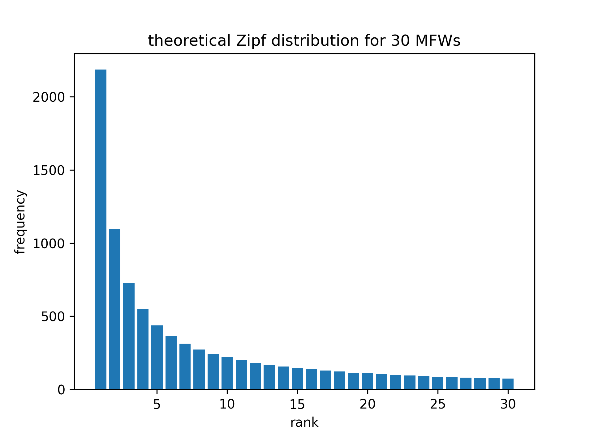
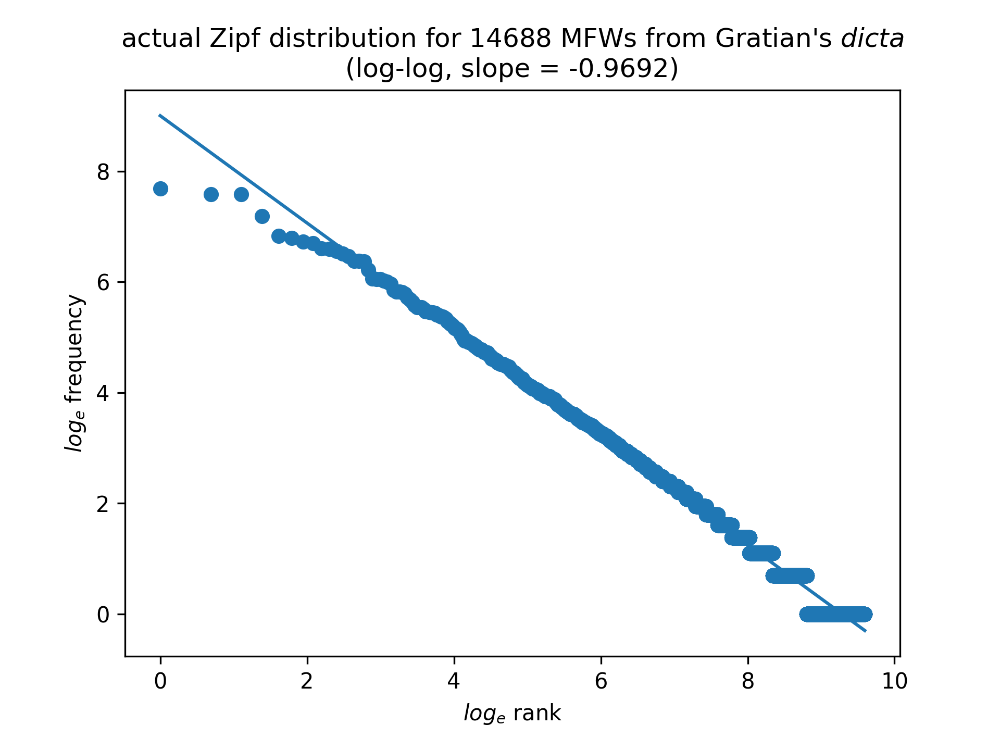
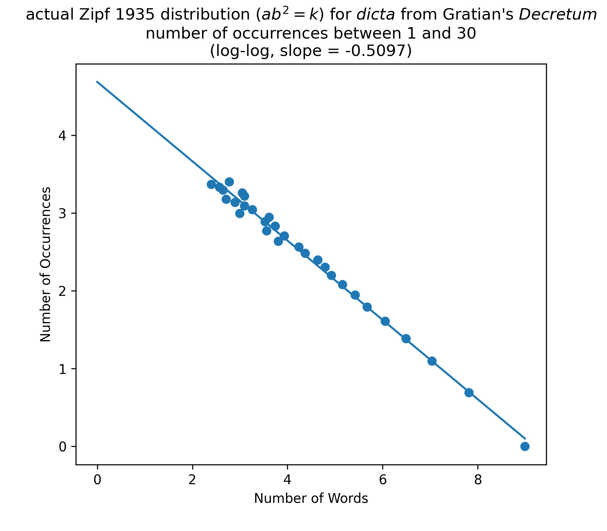

Now, we are obviously not going to make an attribution of authorship
based on the frequencies of only two function words. Increasing the
number of function words for which one collects frequency data
increases the accuracy of stylometric analysis, up to a point. There
is, however, a limit to the marginal value of each additional word
included in an analysis, for two reasons. The first reason is that
the frequency of each word in a corpus of text tails off inversely
as the word's rank, a relationship (approximately) described by the
equation r × f = C. (The rank of the most frequent word is defined
as 1, that of the second most frequent word as 2, and so on.) As a
consequence, assuming words are weighted in proportion to their
frequency of occurrence in the corpus, every marginal word has less
value as evidence than the word before it. Some stylometric techniques,
such as Burrows's Delta, weight each word from a corpus of texts
equally, but such choices need to be made with an informed awareness
of the trade-offs involved. The second reason is that every marginal
word is less likely to be a function word, and more likely to be a
content word. Twenty-four out of the thirty most frequent words
from Gratian's *dicta* are function words potentially suitable for
use in stylometric analysis, but only 64 out of the 250 most frequent
words.

### Zipf's law

The observed empirical relationship that word frequencies in a
corpus of text tail off inversely as the rank is known as Zipf’s
law, after American quantitative linguist George Kingsley Zipf
(d.1950). Though he does not seem to have claimed discovery, Zipf
published the first extended discussions of the phenomenon.[^z1]
**The rank-frequency distribution of words in a corpus of any
language is not merely a curiosity, but rather provides a general
background of what Zipf characterized as "orderliness" against which
variations in frequency of occurrence of individual words are both
detectable and meaningful. Thus it is worthwhile to discuss theoretical
predictions about the rank-frequency distribution of words in a
corpus, and to demonstrate that Gratian's *dicta* display the
expected orderliness of word distribution.**

If the words in a corpus of text are rank-ordered from most to least
frequent, Zipf’s laws posits that, as a first-order approximation,
the frequency of the Nth word will be 1/N times that of the most
frequent word.[^z2] In other words, the theoretical Zipf distribution
predicts that the frequency of the second most frequent word in a
corpus of text should be one half that of the most frequent word,
the frequency of the third most frequent word should be one third
that of the most frequent word, and so on. (See Figure Za below.)

Zipf tried several different approaches to the quantitative analysis
of the distribution of words in corpora. His initial attempt, in
1935, sought to characterize the orderliness of word distributions
by the relationship between the number of occurrences of a word,
*b*, and the number of words *a*, a relationship Zipf expressed as
$ab^2 = k$. For example, in Gratian's *dicta* there are 8,028 words
(*a*) for which there is 1 (*b*) occurrence, 2,462 words (*a*) for
which there are 2 (*b*) occurrences, 1,135 words (*a*) for which
there are 3 (*b*) occurrences, and 660 words (*a*) for which there
are 4 (*b*) occurrences. Plugging these values for *a* and *b* into
the formula $ab^2 = k$ yields 8,028, 9,848, 10,215, and 10,560
respectively as values for the "constant" *k*. As the number of
occurrences *b* increases, values of *k* for Gratian's *dicta*
remain fairly stable, mostly falling between 10,000 and 11,000. As
this example suggests, the explanatory power of the formula $ab^2
= k$ to characterize a word distribution is greatest for words that
have a low number of occurrences. Zipf ultimately judged the formula
$ab^2 = k$ to be a less than satisfactory model for the full spectrum
of word distribution in a corpus, in part because it implied
fractional values of *a* for the most frequent words.[^z3] Zipf had
a vivid awareness, ahead of its time for the pre-digital age in
which he lived, of the fact that the variables in the formulas by
which he sought to express these relationships represent discrete
rather than continuous quantities.[^z4] **Zipf also noted that value
of the exponent of b is likely to differ from 2 depending on the
size of the corpus (Zipf 1935, 43).**

Zipf's final attempt, in 1949, to give a quantitative account of
the distribution of words in a corpus characterized the distribution
in terms of rank and frequency as r × f = C. Values for the constant
C differ between corpora, depending, among other things, on corpus
size. As an example, the theoretical Zipf distribution plotted in
Figures Za and Zb has been scaled to facilitate direct comparison
with actual data from Gratian's *dicta* plotted in Figures Zc and
Zd. In all four plots, the first data point has a rank of 1 and a
frequency of 2187, corresponding to the 2,187 occurrences of the
most frequent word *in* in the *dicta*. This scaling is equivalent
to setting the value of C to 2187, and letting r × f = 2187.

Both the $ab^2 = k$ and r × f = C interpretations of Zipf's law can
be restated with greater mathematical generality by noting that if
the variables are plotted logarithmically, their relationships are
linear, with the slope determined by the power (exponent) relationships
involved. In the equation $ab^2 = k$, the number of occurrences *b*
varies inversely as the square root of the number of words *a* (as
$\frac{1}{\sqrt{a}}$ , or equivalently as *a* ^-1/2^). The relationship
of the logarithm of the number of occurrences to the number of words
is linear, with a slope of -1/2 corresponding to the exponent (-1/2)
of the number of words. (See Figure Zy in the appendix at the end
of this section for actual data from Gratian's *dicta* for values
of *b* [Number of Occurrences] from 1 to 30. The actual slope is
-0.5097, quite close to the predicted theoretical value of -0.5.)

Similarly, in the equation r × f = C, the frequency *f* varies
inversely as the rank *r* (as 1/r, or equivalently as *r* ^-1^).
The relationship of the logarithm of frequency to the logarithm of
rank is linear, with a slope of -1 corresponding to the exponent
(-1) of the rank. (See Figure Zb below.) Note that the base of the
logarithms does not matter, as long as the bases are the same for
both axes. Regardless of whether we take base *e* (natural) or base
10 logarithms of rank and frequency, for example, the slopes will
be the same: -1.0 for the theoretical Zipf distribution of word
frequencies in Figure Zb, and -0.6518 for the actual frequencies
of the thirty most frequent words in Gratian's *dicta* in Figure
Zd.

Figure Zc below plots the actual rank-frequency distribution of the
thirty most frequent words (MFWs) in Gratian's *dicta*: *in* (2187),
*et* (1968), *non* (1960), *est* (1327), *de* (925), *quod* (888),
*ad* (832), *qui* (812), *sed* (736), *unde* (732), *uel* (705),
*si* (669), *ut* (641), *cum* (589), *a* (588), *autem* (582), *ex*
(501), *sunt* (428), *enim* (424), *que* (423), *uero* (411), *etiam*
(405), *ab* (391), *ait* (349), *esse* (339), *ergo* (338), *quia*
(336), *item* (327), *per* (304), *nec* (293).

Zipf used word frequencies hand-tabulated from James Joyce's *Ulysses*
as the data set for his exploration of the rank-frequency relationship,
and it turns out that for English, the r × f = C formulation holds
up reasonably well.[^z5] The rank-frequency relationship does not
on first inspection appear to hold up as well for Gratian's Latin
as it does for Joyce's English, since the frequencies for the thirty
most frequent words of the *dicta* do not drop off quite as sharply
as the r × f = C formulation of Zipf's law would predict. The
frequency of *et*, the second most frequent word in Gratian's *dicta*
is 0.8999 times that of *in*, the most frequent word, rather than
0.5 as Zipf's law would predict; and the frequency of *non*, the
third most frequent word, is 0.8962 rather than 0.3333.

Plotting the data from Figure Zc on logarithmic axes and performing
least-squares linear regression analysis lets us calculate the
slope, -0.6518, for the rank-frequency tail-off of the thirty most
frequent words from Gratian's *dicta*.[^z6] (See Figure Zd below.)
Transposing that result back into the linear (as opposed to
logarithmic) frame of reference used in Figure Zc, the expression
1/r ^0.6518^ yields a better (though not perfect) fit to the actual
rank-frequency data.

### Zipf's law (appendix)

[^z1]: @zipf_psycho-biology_1935, 39-48; and @zipf_human_1949, 73-131.
Zipf referred to the relationship as "the law of diminishing returns
of words" (1949). He expressed the relationship as $ab^2 = k$ (1935)
and r × f = C (1949).

[^z2]: **In Digital Humanities courses, 1/N is typically presented
*as* Zipf's law. The reductionist 1/N representation of the
rank-frequency relationship is misleading insofar as it ignores
scaling considerations, and elides the discrete rather than continuous
nature of the variables representing rank and frequency.**

[^z3]: "Hence the $ab^2 = k$ relationship is valid only for the
less frequently occurring words which, however, represent the greater
part of the vocabulary in use, though not always a great majority
of the occurrences." ... "It is perhaps worth pointing out that the
$ab^2 = k$ relationship which appears valid for the frequency
distribution of the less frequent words would demand fractional
words when applied to the speech-elements of highest occurrence,
such as *the* in English." @zipf_psycho-biology_1935, 42-43.

[^z4]: Zipf used the term "integrality" to describe the discrete,
discontinuous, nature of frequency and rank. @zipf_human_1949, 31,
35.

[^z5]: "we have found a clearcut correlation between the number of
different words in the *Ulysses* and the frequency of their usage,
in the sense that they approximate the simple equation of an
equilateral hyperbola: r × f = C in which *r* refers to the word's
rank in the *Ulysses* and *f* to its frequency of occurrence (as
we ignore for the present the size of C)." @zipf_human_1949, 24.
See @zipf_human_1949, 23-52, for Zipf's extended discussion of the
rank-frequency distribution of words in Joyce's *Ulysses*.

[^z6]: $m = \frac{\sum{x_iy_i - n\bar{xy}}}{\sum{x_i^2 - n\bar{x}^2}}$
or:

    ~~~ {.python}
    def regression_slope(data_points):
        n = len(data_points)
        x_values, y_values = zip(*data_points)
        x_bar = statistics.mean(x_values)
        y_bar = statistics.mean(y_values)
        xy_sum = 0
        x_squared_sum = 0
        for i in range(n):
            xy_sum += x_values[i] * y_values[i]
            x_squared_sum += x_values[i] ** 2
        return (xy_sum - n * x_bar * y_bar) / (x_squared_sum - n * x_bar ** 2)
    ~~~

