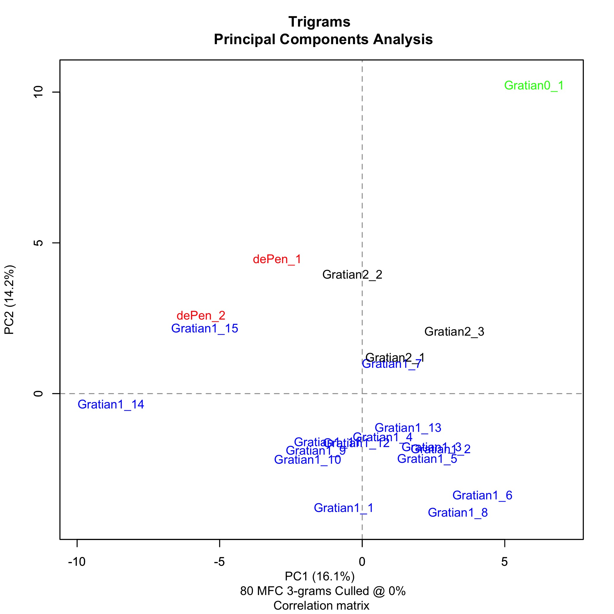

Principal component analysis (PCA) on the basis of character n-gram
frequencies is an alternative to PCA on the basis of word or lemma
frequencies. This technique involves breaking words down into
constituent substrings of fixed length (n-grams), typically two or
three letters (bigrams or trigrams). The string "Gratian" broken
down into bigrams would be "gr", "ra", "at", "ti", "ia", "an", and
broken down into trigrams would be "gra", "rat", "ati", "tia", "ian"
(strings are lower-cased before being split into bigrams or trigrams).
After breaking the text down into character bigrams or trigrams,
PCA is then performed on the frequencies of the bigrams or trigrams
in exactly the same way as it would be on word or frequencies. Some
practitioners of stylometric analysis have conjectured that PCA on
the basis of n-grams may be particularly effective at capturing
stylistic features (e.g., word endings) of highly inflected languages
like Latin.[^1]

There is justification in the academic literature of psycholinguistics
to give an account for why stylometry based on the frequencies of
function words works, i.e., the claim, supported by experimental
evidence, that both writers and readers process function words at
a subconscious level. There is on the other hand no good theoretical
justification for stylometric analysis on the basis of bigrams and
trigrams Traditional scholars who are dubious at best about the
methodological justifiability of principal component analysis (PCA)
on the basis of word or lemma frequencies are therefore unlikely
to be persuaded by an attribution of authorship of a text exclusively
on the basis of character n-gram frequencies.

The absence of theoretical justification notwithstanding, there has
been at least one notable and well-received attribution of authorship
of a medieval text, *Beowulf*, based on PCA of n-gram frequencies.
In a 2019 paper, Neidorf, Krieger, and Yakubek present the statistical
frequency of character bigrams in the text as stylometric evidence
"consistent with the unitary authorship of *Beowulf*."[^2] The
article's finding that *Beowulf* is the product of unitary authorship
supported an argument advanced by J.R.R. Tolkien in the twentieth
century, and the study therefore attracted a significant amount of
coverage from non-specialist publications in addition to scholarly
attention.

Kestemont, *et al.*, avoided using character n-grams in their
analysis of the letters of Hildegard of Binge, Guibert of Gembloux,
and Bernard of Clairvaux on the grounds that the method is highly
sensitive to orthographic inconsistencies in the sample texts. This
concern does not arise in the analysis of the *dicta* from Gratian's
*Decretum*, since all of the text samples are the work of a single
editor, Emil Friedberg, and are therefore highly (although not
absolutely perfectly) consistent with respect to orthography.

Figure 1 and Figure 2 below represent PCA results for the 80 most
frequent bi- and trigrams, but the following qualitative observations
are also valid at values for the number of features (n-grams)
analysed between 20 and 100. In all cases, the values for PC1 and
PC2 are high enough (PC1 > 10%, PC2 > 5%) to indicate that the
results are statistically significant.

- the case statements are well-separated from the clusters representing
the other samples, consistent with the finding that they were not
written by the authors of either the first- or second-recension
*dicta*.

- the *dicta* from *de Penitentia* are on the edges of, but not
distinctly separated from, the clusters representing the first- and
second-recension *dicta*.

- the cluster representing the first-recension *dicta* is more
diffuse than might be expected in the case of a text unambiguously
associated with a single author.

- the relationship between the clusters representing the first- and
second- recension *dicta* appears somewhat differently in the bigram
and trigram analyses.  In the bigram analysis, the second-recension
*dicta* seem to be within the boundaries of presumably collaborative
authorship of the first-recension *dicta*. This would imply that
the second-recension *dicta* were written by a subset of the original
authors of the first-recension *dicta*. In the trigram analysis on
the other hand, the cluster representing the second-recension *dicta*
is in the same relationship with the cluster representing the
first-recension *dicta* as the cluster representing the *dicta*
from *de Penitentia* is. In other words, it is close, but not
unambiguously the work of the same author.

### quoteless vs. quoteful samples

(**include quoteless versions of bi- and tri-gram analyses**)

I did not make any attempt to eliminate quotations from the samples
for the either the *Rem non novam* or ICMCL presentation. The
question of whether or not quotations within Gratian's *dicta*
effected PCA results only came to my attention when I started working
with the XML text of Peter Lombard's *Sentences* provided by the
Scholastic Commentaries and Texts Archive (SCTA), in which quotations
were explicitly tagged. Excluding quotations from Gratian's *dicta*
however did not make any substantive difference in PCA results based
on function word frequencies. (**What about lemmas?**) The *dicta*,
especially in the first recension, contain numerous biblical passages,
likely quoted from memory. Such quotation from memory would tend
to preserve the authorial signal produced by the selection of
function words at a subconscious level.

[^1]: Spaces between words count for the purpose of decomposing a
sample of text into its constituent n-grams. It is therefore
immediately apparent which n-grams represent inflectional endings
in a sample of Latin text. "um ", "us ", "is ", "tur", "ur ", "et
", "em ", "it ", "am ", and "ent" are all in the top twenty n-grams
generated by the decompostion of the *dicta* from Gratian's *Decretum*
into trigrams.

[^2]: Neidorf, L., Krieger, M.S., Yakubek, M. et al. Large-scale
quantitative profiling of the Old English verse tradition. Nat Hum
Behav 3, 560–567 (2019). https://doi.org/10.1038/s41562-019-0570-1

