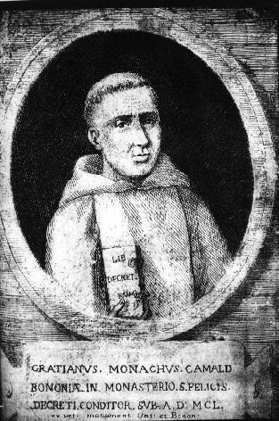

# the Gratian project

## Dissertation

### Chapters

Dates indicate most recent (even minor) changes to markdown files.
Most of the chapters have been substantially complete for many
years: the principal component analysis section of chapter 4 since
2016, chapter 1 and most of chapter 2 since 2017, and chapter 0
since 2018. Chapter 4 was completed in 2020 and chapter 3 in 2021.

- [Chapter 0: Introduction](Chapter0/chapter0.markdown) (4 August 2021) 21 pages [(PDF)](Chapter0/chapter0.pdf)\
Reviewed by Stan Chodorow, 17 August 2018
- [Chapter 1: Background](Chapter1/chapter1.markdown) (2 August 2021) 24 pages [(PDF)](Chapter1/chapter1.pdf)\
Reviewed by Stan Chodorow, 6 November 2017\
(including pages 1-22 of chapter 2)
- [Chapter 2: The *Decretum*](Chapter2/chapter2.markdown) (5 August 2021) 43 pages [(PDF)](Chapter2/chapter2.pdf)\
Presentation and organization sections (pages 22-41) reviewed by Stan Chodorow, 31 July 2021
- [Chapter 3: Authority, Author, Authorship](Chapter3/chapter3.markdown) (6 August 2021) 45 pages [(PDF)](Chapter3/chapter3.pdf)\
Reviewed by Stan Chodorow, 29 July 2021
- [Chapter 4: Stylometry](Chapter4/chapter4.markdown) (6 August 2021) 82 pages [(PDF)](Chapter4/chapter4.pdf)\
Reviewed by Stan Chodorow, 12 July 2020\
Reviewed by Mike Kestemont, 13 July 2021\
The principal component analysis (PCA) section of chapter 4 was presented as:
  - "Can Computational Linguistics Provide New Evidence about the
  Identity of Gratian 1 and Gratian 2?" at
  [*Rem non novam*](https://sites.google.com/site/remnonnovam/),
  Yale Law School, 21 May 2015, and as:
  - "New evidence for the authorship of case statements and *dicta*
  in Gratian's *Decretum*" at the
  15th International Congress of Medieval Canon Law, Paris, 20 July 2016
  [(PDF)](Talks/ICMCL.pdf).
- [Conclusion](Conclusion/conclusion.markdown) (25 July 2021) 12 pages\
Rough draft
- [Bibliography](bib/biblio.markdown) (31 July 2021) 13 pages [(PDF)](bib/biblio.pdf)

### Appendices

- [Appendix 1](Appendix/appendix1.markdown)
- [Appendix 2](Appendix/appendix2.markdown)
- [Appendix 3](Appendix/appendix3.markdown) (18 May 2021)

### *Extravagantes*

- [Causa 4](Extra/causa4.markdown)
- [N-grams](Extra/n-grams.markdown)
- [Sg case statements](Extra/sg.markdown)
- [*Correctores*](Extra/correctores.markdown)

### Notebooks

- [2-dimensional visualization](Notebooks/Burrows/Visualization.ipynb) (24 May 2020)
- [Zipf's law (1935)](Notebooks/Zipf/Zipf35.ipynb) (27 May 2020)
- [Zipf's law (1949)](Notebooks/Zipf/Zipf49.ipynb) (27 May 2020)
- [Burrows's delta](Notebooks/Burrows/Burrows.ipynb) (26 July 2021)
